# **COURSE PROJECT**

  

<strong>Universidad Peruana de Ciencias Aplicadas</strong>

<strong>Ingeniería de Software</strong> 
Aplicaciones Web - SW52  
Ciclo: 5to  
<strong>Profesor:</strong> Juan Carlos Tinoco Licas

<h2 align="center">INFORME</h2>

<h3 align="center">Startup:</h3>

<strong>Producto:</strong>

<h3 align="center">Team Members:</h3>

| **Member**                    | **Code**     |
|-------------------------------|--------------|
| Loechle Arias Mateo Italo     | U202223990   |
| Rodrigo Liberato Saldaña      | U202215623   |
| Samuel Elias Molina Asencios  | U20191A456   |
| Omar Harold Rivera Ticllacuri | U202214214   |
| Diego Ulises Soto Quispe      | U202214477   |

<strong>Agosto 2024</strong>

---

# Registro de Versiones del Informe

| Versión | Fecha       | Autor(es)                                                                                                  | Descripción de la modificación                                                                                                                                                       |
|---------|-------------|------------------------------------------------------------------------------------------------------------|---------------------------------------------------------------------------------------------------------------------------------------------------------------------------------------|
| TB1     | 12/09/2024  | Loechle Arias Mateo Italo  Rodrigo Liberato Saldaña  Samuel Elias Molina Asencios  Omar Harold Rivera Ticllacuri  Diego Ulises Soto Quispe | Se agregó el contenido del capítulo 1 (apartados 1.1, 1.2 y 1.3); el contenido del capítulo 2 (apartados 2.1, 2.2, 2.3, 2.4); el contenido del capítulo 3 (apartados 3.1, 3.2, 3.3 y 3.4); el contenido del capítulo 4 (apartados 4.1, 4.2, 4.3, 4.4, 4.5, 4.6, 4.7 y 4.8); y el contenido del capítulo 5 (apartados 5.1 y 5.2). |
| TP1     |             | Loechle Arias Mateo Italo  Rodrigo Liberato Saldaña  Samuel Elias Molina Asencios  Omar Harold Rivera Ticllacuri  Diego Ulises Soto Quispe |                                                                                                                                                                                       |
| TB2     |             | Loechle Arias Mateo Italo  Rodrigo Liberato Saldaña  Samuel Elias Molina Asencios  Omar Harold Rivera Ticllacuri  Diego Ulises Soto Quispe |                                                                                                                                                                                       |
| TF1     |             | Loechle Arias Mateo Italo  Rodrigo Liberato Saldaña  Samuel Elias Molina Asencios  Omar Harold Rivera Ticllacuri  Diego Ulises Soto Quispe |                                                                                                                                                                                       |
# Project Report Collaboration Insights

TB1: Las tareas asignadas para la entrega TB1 se han completado y están documentadas en el siguiente repositorio de GitHub perteneciente a la organización del equipo: [Repositorio GitHub](#).

Durante la preparación del informe, se llevaron a cabo las siguientes actividades:

- Se escribieron y diagramaron los contenidos asignados a cada miembro en formato Markdown, seguido de commits para asegurar el progreso en el repositorio.
- Se crearon los artefactos necesarios utilizando las herramientas recomendadas y se obtuvieron enlaces de imagen a través de la carpeta `imagenes` en la rama `desarrollo` del repositorio del informe.
- Se organizaron reuniones para coordinar el progreso de los elementos del informe y para comunicar los avances del Sprint 1, que se enfoca en la Landing Page.
  
  ---

  # Student Outcome
| Criterio específico                                                                                 | Acciones realizadas | Conclusiones |
|------------------------------------------------------------------------------------------------------|---------------------|--------------|
| **Trabaja en equipo para proporcionar liderazgo en forma conjunta.**                                          |              |
| **Crea un entorno colaborativo e inclusivo, establece metas, planifica tareas y cumple objetivos.**                           |                     |              |
                      
  
# Contenido

## Tabla de contenidos

### [Registro de versiones del informe](#registro-de-versiones-del-informe)
### [Project Report Collaboration Insights](#project-report-collaboration-insights)
### [Student Outcome](#student-outcome)

- [**COURSE PROJECT**](#course-project)
- [Registro de Versiones del Informe](#registro-de-versiones-del-informe)
- [Project Report Collaboration Insights](#project-report-collaboration-insights)
- [Student Outcome](#student-outcome)
- [Contenido](#contenido)
  - [Tabla de contenidos](#tabla-de-contenidos)
    - [Registro de versiones del informe](#registro-de-versiones-del-informe-1)
    - [Project Report Collaboration Insights](#project-report-collaboration-insights-1)
    - [Student Outcome](#student-outcome-1)
  - [Capítulo I: Introducción](#capítulo-i-introducción)
    - [1.1. StartUp Profile](#11-startup-profile)
    - [1.1.1. Descripción de la Startup](#111-descripción-de-la-startup)
    - [1.1.2. Perfiles de integrantes del equipo](#112-perfiles-de-integrantes-del-equipo)
    - [1.2. Solution Profile](#12-solution-profile)
    - [1.2.1. Antecedentes y problemática](#121-antecedentes-y-problemática)
      - [What](#what)
      - [When](#when)
      - [Where](#where)
      - [Who](#who)
      - [Why](#why)
      - [How](#how)
      - [How much](#how-much)
    - [1.2.2. Lean UX Process](#122-lean-ux-process)
      - [1.2.2.1. Lean UX Problem Statements](#1221-lean-ux-problem-statements)
      - [1.2.2.2. Lean UX Assumptions](#1222-lean-ux-assumptions)
      - [1.2.2.3. Lean UX Hypothesis Statements](#1223-lean-ux-hypothesis-statements)
    - [1.2.2.4. Lean UX Canvas](#1224-lean-ux-canvas)
    - [1.3. Segmentos objetivo](#13-segmentos-objetivo)
  - [Capítulo II: Requirements Elicitation \& Analysis](#capítulo-ii-requirements-elicitation--analysis)
    - [2.1. Competidores](#21-competidores)
      - [2.1.1. Análisis competitivo](#211-análisis-competitivo)
      - [2.1.2. Estrategias y tácticas frente a competidores](#212-estrategias-y-tácticas-frente-a-competidores)
    - [2.2. Entrevistas](#22-entrevistas)
      - [2.2.1. Diseño de entrevistas](#221-diseño-de-entrevistas)
      - [2.2.2. Registro de entrevistas](#222-registro-de-entrevistas)
      - [2.2.3. Análisis de entrevistas](#223-análisis-de-entrevistas)
    - [2.3. Needfinding](#23-needfinding)
      - [2.3.1. User Personas](#231-user-personas)
      - [2.3.2. User Task Matrix](#232-user-task-matrix)
      - [2.3.3. User Journey Mapping](#233-user-journey-mapping)
      - [2.3.4. Empathy Mapping](#234-empathy-mapping)
      - [2.3.5. As-is Scenario Mapping](#235-as-is-scenario-mapping)
    - [2.4. Ubiquitous Language](#24-ubiquitous-language)
  - [Capítulo III: Requirements Specification](#capítulo-iii-requirements-specification)
    - [3.1. To-Be Scenario Mapping](#31-to-be-scenario-mapping)
    - [3.2. User Stories](#32-user-stories)
    - [Epics](#epics)
- [User Stories](#user-stories)
  - [3.3. Impact Mapping](#33-impact-mapping)
    - [3.4. Product Backlog](#34-product-backlog)
  - [Capítulo IV: Product Design](#capítulo-iv-product-design)
    - [4.1. Style Guidelines](#41-style-guidelines)
      - [4.1.1. General Style Guidelines](#411-general-style-guidelines)
      - [4.1.2. Web Style Guidelines](#412-web-style-guidelines)
    - [4.2. Information Architecture](#42-information-architecture)
      - [4.2.1. Organization Systems](#421-organization-systems)
      - [4.2.2. Labeling Systems](#422-labeling-systems)
      - [4.2.3. SEO Tags and Meta Tags](#423-seo-tags-and-meta-tags)
      - [4.2.4. Searching Systems](#424-searching-systems)
      - [4.2.5. Navigation Systems](#425-navigation-systems)
    - [4.3. Landing Page UI Design](#43-landing-page-ui-design)
      - [4.3.1. Landing Page Wireframe](#431-landing-page-wireframe)
      - [4.3.2. Landing Page Mock-up](#432-landing-page-mock-up)
    - [4.4. Web Applications UX/UI Design](#44-web-applications-uxui-design)
      - [4.4.1. Web Applications Wireframes](#441-web-applications-wireframes)
      - [4.4.2. Web Applications Wireflow Diagrams](#442-web-applications-wireflow-diagrams)
      - [4.4.3. Web Applications Mock-ups](#443-web-applications-mock-ups)
      - [4.4.4. Web Applications User Flow Diagrams](#444-web-applications-user-flow-diagrams)
    - [4.5. Web Applications Prototyping](#45-web-applications-prototyping)
    - [4.6. Domain-Driven Software Architecture](#46-domain-driven-software-architecture)
      - [4.6.1. Software Architecture Context Diagram](#461-software-architecture-context-diagram)
      - [4.6.2. Software Architecture Container Diagrams](#462-software-architecture-container-diagrams)
      - [4.6.3. Software Architecture Components Diagrams](#463-software-architecture-components-diagrams)
    - [4.7. Software Object-Oriented Design](#47-software-object-oriented-design)
      - [4.7.1. Class Diagrams](#471-class-diagrams)
      - [4.7.2. Class Dictionary](#472-class-dictionary)
    - [4.8. Database Design](#48-database-design)
      - [4.8.1. Database Diagram](#481-database-diagram)
  - [Capítulo V: Product Implementation, Validation \& Deployment](#capítulo-v-product-implementation-validation--deployment)
    - [5.1. Software Configuration Management](#51-software-configuration-management)
      - [5.1.1. Software Development Environment Configuration](#511-software-development-environment-configuration)
      - [5.1.2. Source Code Management](#512-source-code-management)
      - [5.1.3. Source Code Style Guide \& Conventions](#513-source-code-style-guide--conventions)
      - [5.1.4. Software Deployment Configuration](#514-software-deployment-configuration)
    - [5.2. Landing Page, Services \& Applications Implementation](#52-landing-page-services--applications-implementation)
      - [5.2.X. Sprint n](#52x-sprint-n)
        - [5.2.X.1. Sprint Planning n](#52x1-sprint-planning-n)
        - [5.2.X.2. Sprint Backlog n](#52x2-sprint-backlog-n)
        - [5.2.X.3. Development Evidence for Sprint Review](#52x3-development-evidence-for-sprint-review)
        - [5.2.X.4. Testing Suite Evidence for Sprint Review](#52x4-testing-suite-evidence-for-sprint-review)
        - [5.2.X.5. Execution Evidence for Sprint Review](#52x5-execution-evidence-for-sprint-review)
        - [5.2.X.6. Services Documentation Evidence for Sprint Review](#52x6-services-documentation-evidence-for-sprint-review)
        - [5.2.X.7. Software Deployment Evidence for Sprint Review](#52x7-software-deployment-evidence-for-sprint-review)
        - [5.2.X.8. Team Collaboration Insights during Sprint](#52x8-team-collaboration-insights-during-sprint)
    - [5.3. Validation Interviews](#53-validation-interviews)
      - [5.3.1. Diseño de Entrevistas](#531-diseño-de-entrevistas)
      - [5.3.2. Registro de Entrevistas](#532-registro-de-entrevistas)
      - [5.3.3. Evaluaciones según heurísticas](#533-evaluaciones-según-heurísticas)
    - [5.4. Video About-the-Product](#54-video-about-the-product)
  - [Conclusiones](#conclusiones)
    - [Conclusiones y recomendaciones](#conclusiones-y-recomendaciones)
    - [Video About-the-Team](#video-about-the-team)
  - [Bibliografía](#bibliografía)
  - [Anexos](#anexos)

## Capítulo I: Introducción

### 1.1. StartUp Profile

En esta sección describiremos la descripción de nuestra Startup.

### 1.1.1. Descripción de la Startup

**PARKINGNOW** es una startup tecnológica enfocada en ofrecer una solución integral para el estacionamiento en tiempo real. Nuestra plataforma digital permite a los usuarios reservar y pagar por espacios de estacionamiento utilizando la localización geográfica y un **sensor infrarrojo** para una gestión más eficiente y automatizada. Basado en un modelo de negocio independiente y sostenible, **PARKINGNOW** se adapta tanto a usuarios frecuentes como a usuarios ocasionales mediante un sistema de transacciones. La innovación de **PARKINGNOW** radica en la integración de datos en tiempo real, incluidos los datos proporcionados por un sensor infrarrojo, para garantizar la disponibilidad de espacios y optimizar las rutas hacia los estacionamientos más cercanos. Este sensor infrarrojo detecta la presencia de vehículos en los espacios de estacionamiento al percibir cuando un objeto interrumpe su señal de luz. Cuando un vehículo ocupa o deja un espacio, el sensor infrarrojo envía una señal a la plataforma para actualizar la disponibilidad en tiempo real, mejorando así la eficiencia y la experiencia del usuario.

**Misión**: Ser el puente entre conductores y propietarios de estacionamientos, optimizando la experiencia de estacionamiento en tiempo real. **PARKINGNOW** facilita el acceso a espacios de estacionamiento utilizando un sensor infrarrojo para una gestión automatizada y eficiente, contribuyendo a la rentabilidad de quienes los poseen y cubriendo así las necesidades de ambos segmentos de mercado.

**Visión**: Convertirnos en la plataforma líder en la gestión de estacionamientos urbanos en los próximos 5 años, mejorando la movilidad en las ciudades mediante soluciones tecnológicas innovadoras y sostenibles, como el uso de un sensor infrarrojo, que beneficien tanto a conductores como a propietarios de estacionamientos.

  
### 1.1.2. Perfiles de integrantes del equipo

| **Integrantes**                                              | **Descripción**                                                                                                                                                                                                                                                | **Conocimientos**                               |
|--------------------------------------------------------------|----------------------------------------------------------------------------------------------------------------------------------------------------------------------------------------------------------------------------------------------------------------|-------------------------------------------------|
|    Diego Ulises Soto Quispe | Soy estudiante de 5to ciclo en la carrera de Ingeniería de Software. Soy responsable en las labores que se asignan y puntual con los trabajos por entregar, fuera del mundo de programación, me gusta jugar basquet, salir a pasear, jugar videojuegos y manejar en bicicleta. | HTML, Base de datos en SQL Server, C++, Python, NoSQL, JSON |
|                                                              |                                                                                                                                                                                                                                                                |                                                 |
|                                                              |                                                                                                                                                                                                                                                                |                                                 |
|                                                              |                                                                                                                                                                                                                                                                |                                                 |
  |                                                                                                                                                                                                                                                                |                                                 |

### 1.2. Solution Profile

**PARKINGNOW** es una solución innovadora diseñada para transformar la experiencia de estacionamiento en las ciudades. Ofrece una plataforma digital que permite a los usuarios encontrar, reservar y pagar por espacios de estacionamiento en tiempo real, utilizando la localización geográfica y un **sensor infrarrojo**. Nuestra tecnología emplea este sensor para detectar automáticamente la presencia de vehículos en los espacios de estacionamiento al percibir cuando un objeto interrumpe su señal de luz. Esto permite actualizar en tiempo real la disponibilidad de los espacios y dirigir a los conductores hacia los estacionamientos más cercanos, optimizando sus rutas y reduciendo el tiempo de búsqueda. Esta funcionalidad mejora significativamente la experiencia de los conductores al proporcionar información precisa y en tiempo real sobre la disponibilidad de espacios. En resumen, **PARKINGNOW** ofrece una solución integral para los desafíos del estacionamiento urbano, beneficiando tanto a los conductores como a los propietarios de estacionamientos.

### 1.2.1. Antecedentes y problemática

En las ciudades con alto movimiento vehicular, es común ver vehículos estacionados de manera indebida, invadiendo veredas o interrumpiendo el flujo vehicular. Esta situación es un problema recurrente para los conductores que enfrentan la dificultad de encontrar estacionamiento, un desafío que se intensifica en áreas urbanas congestionadas. La demanda de espacios de estacionamiento es alta, y la información disponible sobre su disponibilidad suele ser limitada o desactualizada. Además, la ausencia de herramientas para reservar un espacio con anticipación agrava la frustración y aumenta el tiempo que los conductores deben invertir para encontrar un lugar donde estacionarse.

Para entender mejor las necesidades de nuestros usuarios y alinear nuestro enfoque con los principios de Lean UX, hemos realizado un análisis de antecedentes y la problemática utilizando la técnica de "5W’s & 2H’s", una herramienta esencial en Lean UX para identificar oportunidades de diseño centrado en el usuario. A continuación, se presenta la información recopilada:

#### What

**¿Cuál es el problema?**  
El principal problema que **PARKINGNOW** busca resolver es la falta de estacionamientos disponibles y adecuados, lo que lleva a los conductores a estacionarse en zonas no permitidas, generando congestión y exponiéndose a riesgos como multas o robos. Además, la falta de tecnologías avanzadas para la gestión de espacios, como los sensores infrarrojos, limita la capacidad de los estacionamientos para manejar la disponibilidad en tiempo real.

#### When

**¿Cuándo sucede el problema?**  
El problema ocurre principalmente durante las horas pico, cuando la demanda de espacios de estacionamiento es mayor y los conductores no encuentran un lugar disponible que cumpla con sus expectativas.

**¿Cuándo utiliza el cliente el producto?**  
Los clientes utilizan **PARKINGNOW** para verificar la disponibilidad de estacionamientos en tiempo real, realizar reservas, comparar tarifas y asegurarse de que el estacionamiento seleccionado cumpla con sus expectativas, gracias a la información en tiempo real proporcionada por los sensores infrarrojos.

#### Where

**¿Dónde surge el problema?**  
El problema surge en áreas urbanas congestionadas donde los estacionamientos son escasos y la información sobre su disponibilidad es limitada o inaccesible. La falta de sistemas automatizados como sensores infrarrojos contribuye a la escasez de información precisa en tiempo real.

#### Who

**¿Quiénes están involucrados?**  
Los principales involucrados en el problema son los conductores que necesitan un estacionamiento disponible, seguro y asequible, y los propietarios de estacionamientos que buscan optimizar la ocupación de sus espacios y atraer más clientes mediante tecnología avanzada como los sensores infrarrojos.

**¿A quiénes le sucede el problema?**  
El problema afecta a todos los conductores que buscan estacionamiento, independientemente de su edad, género, ubicación o tipo de vehículo.

**¿Quién utilizará el producto?**  
El producto será utilizado por personas que viajan a diario, turistas, estudiantes, y cualquier conductor que necesite estacionar su vehículo en un lugar seguro y conveniente que se ajuste a sus preferencias y presupuesto.

#### Why

**¿Por qué sucede el problema?**  
El problema surge debido a la falta de sistemas tecnológicos avanzados en los estacionamientos tradicionales, como los sensores infrarrojos, que impiden la comunicación en tiempo real sobre la disponibilidad de espacios. Esto crea una desconexión entre la oferta y la demanda.

**¿Qué llevó al usuario a esta situación?**  
La falta de información actualizada y la ausencia de herramientas eficientes para gestionar la disponibilidad de estacionamiento, como los sensores infrarrojos, conducen a situaciones en las que los conductores no encuentran espacios que satisfagan sus necesidades.

#### How

**¿En qué condiciones los clientes usan nuestro producto?**  
Los clientes pueden usar **PARKINGNOW** en diversas situaciones, como al planificar un viaje a una nueva ciudad, al buscar estacionamientos que se ajusten a sus preferencias, o durante eventos importantes donde encontrar estacionamiento puede ser más difícil. Los sensores infrarrojos proporcionan información en tiempo real, mejorando la experiencia del usuario.

**¿Cómo nos conocerán los usuarios?**  
Los usuarios nos conocerán a través de campañas publicitarias en redes sociales que destacarán los beneficios y ventajas de **PARKINGNOW**, incluyendo la tecnología avanzada como los sensores infrarrojos para una gestión de estacionamiento más eficiente.

#### How much

**¿En qué cantidad sucede el problema?**  
El problema de la falta de seguridad y disponibilidad de estacionamientos es significativo. Los constantes robos de vehículos y las multas por estacionamiento indebido son problemas comunes que afectan a muchos conductores. La falta de tecnología de detección como sensores infrarrojos agrava estos problemas.

### 1.2.2. Lean UX Process

En esta sección se realizará el proceso de Lean UX, que abarca la visión del modelo de negocio que será soportado por nuestro producto de software. Gracias a este enfoque metodológico, podemos dirigir nuestra atención hacia el diseño de nuestra solución y los problemas identificados mediante el pensamiento de diseño.

#### 1.2.2.1. Lean UX Problem Statements

A continuación, empleamos la plantilla de Business Opportunity Statements (Gothelf, 2022) para orientar a nuestro equipo de trabajo en la creación de un servicio sin restricciones que puedan limitar la creatividad y la agilidad. Este enfoque nos impulsa a pensar en nuestro trabajo en términos que respondan a las necesidades de los clientes y nos prepara para un lanzamiento exitoso de nuestra idea.

**Plantilla de Business Opportunity Statement:**

El estado actual de [domain] se ha centrado principalmente en [segments, pain points, etc.]

Lo que los productos/servicios existentes no logran abordar es [this gap].

Nuestro producto/servicio abordará esta brecha mediante [vision / strategy].

Nuestro enfoque inicial será [this segment].

Sabremos que tenemos éxito cuando veamos [these behaviors in our target audience].

**PARKINGNOW Lean UX Problem Statements:**

- El estado actual de los servicios de estacionamiento en áreas urbanas se ha centrado principalmente en la disponibilidad limitada de espacios y en la falta de opciones para reservar con anticipación, lo que lleva a la frustración de los conductores y al uso indebido de espacios de estacionamiento.

- Lo que los productos/servicios existentes no logran abordar es la falta de información en tiempo real sobre la disponibilidad de espacios y la optimización de rutas hacia los estacionamientos más cercanos.

- Nuestro producto/servicio abordará esta brecha mediante el desarrollo e implementación de una plataforma digital que utiliza la localización geográfica y datos en tiempo real proporcionados por un sensor infrarrojo para informar a los conductores sobre la disponibilidad de espacios y optimizar sus rutas de manera eficiente.

- Nuestro enfoque inicial será captar el mercado de conductores urbanos en ciudades con alta congestión vehicular, donde la necesidad de soluciones de estacionamiento eficientes es mayor.

- Sabremos que tenemos éxito cuando veamos un aumento significativo en las reservas de estacionamientos a través de nuestra plataforma y una reducción en el tiempo promedio que los conductores dedican a buscar un espacio de estacionamiento.

#### 1.2.2.2. Lean UX Assumptions

**Users:**

- Conductores urbanos que buscan estacionamiento en tiempo real en áreas urbanas congestionadas.
- Propietarios de estacionamientos que desean optimizar la ocupación de sus espacios y mejorar la comunicación con los clientes mediante el uso de sensores infrarrojos.
- Empresas y servicios de transporte que requieren soluciones rápidas y eficientes para estacionar sus flotas.

**User Outcomes:**

**Segmento de Conductores:**

- Acceder a una plataforma en línea que facilite la búsqueda y reserva de estacionamientos disponibles en tiempo real gracias al uso de sensores infrarrojos.
- Utilizar la aplicación para optimizar las rutas hacia los estacionamientos más cercanos y ahorrar tiempo.
- Verificar la disponibilidad de espacios y tarifas de estacionamiento antes de llegar a su destino.

**Segmento de Propietarios de Estacionamientos:**

- Promocionar sus espacios de estacionamiento a una audiencia más amplia de conductores.
- Gestionar todas las reservas y comunicaciones con los clientes desde una sola plataforma utilizando tecnología avanzada de sensores.
- Mejorar la tasa de ocupación de sus espacios mediante herramientas de análisis y optimización proporcionadas por la plataforma.

**Suposiciones de Negocios:**

- Creemos que existe una demanda creciente de soluciones eficientes para encontrar y reservar espacios de estacionamiento en áreas urbanas congestionadas.
- Aunque reconocemos la competencia en el sector de estacionamiento, estamos seguros de que podemos destacarnos ofreciendo una plataforma en línea que utilice datos en tiempo real proporcionados por sensores infrarrojos para mejorar la experiencia tanto para los conductores como para los propietarios de estacionamientos.
- Creemos que los usuarios valorarán la conveniencia, la transparencia y la eficiencia de una plataforma que les permita encontrar y reservar estacionamientos en tiempo real.

**Suposiciones de Usuarios:**

- **¿Quién utiliza nuestra plataforma?** Nuestra plataforma es utilizada por conductores urbanos que necesitan estacionar sus vehículos de manera segura y conveniente, así como por propietarios de estacionamientos que desean maximizar la ocupación de sus espacios.
- **¿Cómo se integra nuestro producto en la rutina diaria?** Nuestro producto se integra en la rutina diaria de los conductores al proporcionar una solución rápida y fácil de usar para encontrar y reservar estacionamientos, reduciendo así el tiempo dedicado a buscar espacios gracias al uso de sensores infrarrojos.
- **¿Cuáles son los desafíos que aborda nuestro producto?** **PARKINGNOW** aborda los desafíos de la falta de información en tiempo real sobre la disponibilidad de estacionamientos y la optimización de rutas hacia los espacios más cercanos.
- **¿Qué imagen deseamos proyectar con nuestro producto?** Deseamos proyectar una imagen de eficiencia, confiabilidad e innovación. Queremos que **PARKINGNOW** sea visto como la solución líder en la industria de estacionamiento urbano.
- **¿Cuál es el propósito fundamental de nuestra aplicación?** El propósito fundamental de **PARKINGNOW** es facilitar el proceso de búsqueda, reserva y gestión de espacios de estacionamiento para conductores urbanos y propietarios de estacionamientos.
- **¿Qué funcionalidades destacan en nuestra aplicación?** Las funcionalidades destacadas incluyen la búsqueda avanzada de estacionamientos basada en localización y disponibilidad en tiempo real, la reserva en línea de espacios, la optimización de rutas y herramientas de análisis para propietarios de estacionamientos.

#### 1.2.2.3. Lean UX Hypothesis Statements

Para la elaboración de los Hypothesis Statements se utilizó el formato Lean UX: [We believe that], [This will achieve] y [We will have demonstrated this when].

**Hipótesis 1:**

- Creemos que si simplificamos el proceso de búsqueda y reserva de espacios de estacionamiento en nuestra plataforma utilizando sensores infrarrojos, esto logrará aumentar significativamente la cantidad de usuarios recurrentes, proyectando un aumento del 30% en la tasa de clientes que regresan dentro de los primeros seis meses de implementación.

- **Sabremos que estamos en lo cierto cuando observemos** un aumento del 30% en la cantidad de reservas realizadas por usuarios recurrentes durante el mismo período.

**Hipótesis 2:**

- Creemos que si implementamos un sistema de notificación en tiempo real sobre la disponibilidad de espacios de estacionamiento mediante sensores infrarrojos, esto logrará reducir el tiempo promedio de búsqueda de estacionamiento en un 20%.

- **Sabremos que estamos en lo cierto cuando observemos** una reducción del 20% en el tiempo promedio que los usuarios pasan buscando estacionamiento después de la implementación.

**Hipótesis 3:**

- Creemos que si ofrecemos descuentos exclusivos para usuarios frecuentes, esto logrará aumentar la conversión de usuarios ocasionales a usuarios frecuentes, proyectando un aumento del 25% en la cantidad de usuarios frecuentes dentro de los primeros seis meses de implementación.

- **Sabremos que estamos en lo cierto cuando observemos** un aumento del 25% en la cantidad de usuarios que utilizan nuestra plataforma más de una vez al mes.

**Hipótesis 4:**

- Creemos que si mejoramos la función de optimización de rutas en nuestra plataforma, permitiendo a los usuarios llegar más rápidamente a los estacionamientos gracias a la información proporcionada por sensores infrarrojos, esto logrará aumentar la satisfacción del usuario y reducir la frustración durante la búsqueda de estacionamiento.

- **Sabremos que estamos en lo cierto cuando observemos** un aumento en las calificaciones de satisfacción del usuario y una reducción en las quejas relacionadas con la búsqueda de estacionamiento.

**Hipótesis 5:**

- Creemos que si implementamos un programa de fidelización que recompense a los usuarios por el uso continuo de nuestra plataforma, esto logrará aumentar la retención de clientes y el crecimiento orgánico de nuestra base de usuarios, proyectando un aumento del 30% en la retención de clientes dentro de los primeros seis meses de implementación del programa.

- **Sabremos que estamos en lo cierto cuando observemos** un aumento del 30% en la retención de clientes y un incremento en el número de usuarios que refieren a otros conductores a la plataforma.

### 1.2.2.4. Lean UX Canvas

  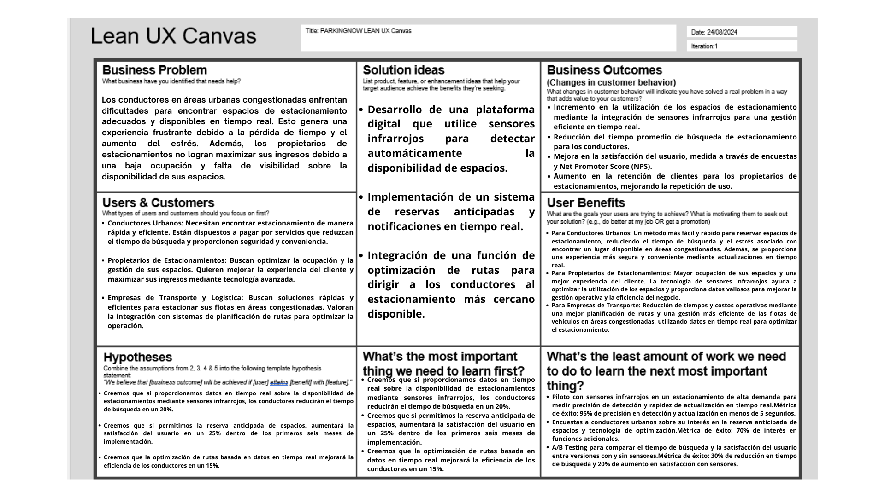

Fuente: Elaboración propia.

### 1.3. Segmentos objetivo

1. Conductores:
   - Descripción: Este segmento incluye a personas que necesitan estacionamiento regular en zonas urbanas.
   - Sexo: Masculino y femenino
   - Edades: Adultos jóvenes (18-34 años), adultos de mediana edad (35-54 años) y adultos mayores (55+)
   - Nivel socioeconómico: Clases B, C y D (media-alta, media y baja)
   - Satisfacción de Necesidades: La aplicacion web permite a estos usuarios ahorrar tiempo y reducir l eestrés al ayudar con las reservas en tiempo real, optimizando sus desplazamientos diarios. Asimismo, gracias al sensor, el usuario tendra la seguridad del estado de su carro dentro del estacionamiento.

2. Dueños de playas de estacionamientos:
    - Descripcion: El siguiente segmento incluye a las personas dueñas de playas de estacionamintos, o lugares para aparcar carros en zonas urbanas.
    - Sexo: Masculino y Femenino
    - Edades: Adultos jóvenes (18-34 años), Adultos de mediana edad (35 - 54) y adultos mayores (55+)
    - Nivel socioeconómico: Clases B y C (Media-alta y media)
    - Necesidades por satisfacer: Apoyar con el manejo de datos que sucede al momento de que los conductores urbanos frecuentes deseen un lugar para estacionar, ademas de brindar facilidad y seguridad al momento de pagar y ordenar los lugares de estacionamiento. Además, promueve la formalidad y acelera los procesos tediosos que estos negocios suelen tener.

## Capítulo II: Requirements Elicitation & Analysis

### 2.1. Competidores

**Parkimeter:**

Parkimeter es una plataforma en línea que ofrece servicios relacionados con la busqueda de estacionamiento. La plataforma permite a los usuarios buscar, comparar y reservar plazas de estacionamiento en diferentes ubicaciones. Además de la reserva de plazas de estacionamiento, Parkimeter también brinda información sobre tarifas, disponibilidad y otras características en tiempo real para ayudar a los conductores a encontrar el estacionamiento adecuado.

**ElParking**

ElParking permite a los usuarios encontrar, reservar y pagar por estacionamiento a través de su plataforma. La aplicación brinda información en tiempo real acerca de sitios de estacionamiento cercanos quitando un peso de los hombros del consumidor, los conductores. Además, tiene la increíble funcionalidad de seguimiento de multas, pagos en parquímetros, etc.

**Aparcados**

Aparcados permite a los conductores encontrar estacionamientos con ,filtros multiples para las diferentes necesidades de los usuarios optimizando así el proceso de estacionamiento en áreas urbanas. La app posee una página web, pero la versión en móviles es la más usada hasta el momento, con una interfaz llamativa para todos los usuarios.

#### 2.1.1. Análisis competitivo

| **Competitive Analysis Landscape**                              |                                                                                                                              |
|-----------------------------------------------------------------|------------------------------------------------------------------------------------------------------------------------------|
| **¿Por qué llevar a cabo este análisis?**                       | **Escriba en el recuadro la pregunta que busca responder o el objetivo de este análisis.**                                    |
|                                                                 | **Identificar cómo PARKINGNOW se posiciona frente a sus competidores en términos de servicios ofrecidos, ventajas competitivas y estrategias de mercado para mejorar nuestra propuesta de valor y captar más clientes.** |

| ***Competidor***          || ParkingNow| Parkimeter| ElParking| Aparcados|
| ------------------- | ----------------------------------------------------- | ------------------------------------------------------------------------------------------------------------------------------------------------------------------------------------------------------------------------------------------------------------------------------------------------------- |--------------------------------------------------------------------------------------------------------------------------------------------------------------------------------------------------------------------------------|-----------------------------------------------------------------------------------------------------------------------------------------------------------------------------------------------------------------------------------------------------------------------------------------------------------------------------|------------------------------------------------------------------------------------------------------------------------------------------------------------------------------------------------------------------------------------------|
| ***Logo***| | | ||
| ***Perfil***| Overview| Es una aplicacion web que brinda la posibilidad de reservar espacios de estacionamiento en múltiples ciudades ademas que brinda la conexion entre los consumidores y dueños de estacionamientos| Es una aplicacion web y movil que ofrece servicios de reserva de plazas de aparcamiento en  diversas ciudades de Europa y América Latina| Es una aplicacion web y movil que ofrece servicios de reserva de plazas de aparcamiento en  diversas ciudades de Europa y América Latina| Es una aplicacion web y movil que ofrece servicios de reserva de plazas de aparcamiento en diversas ciudades de España principalmente, pero expandiéndose alrededor del mundo|
|| ***Ventaja competitiva ¿Qué valor ofrece a los clientes?*** | Cancelación gratuita hasta con 24 horas de antelación de la reserva, inclusion de un sensor para el automovil y ser el puente entre los consumidores y dueños de playas de estacionamientos en zonas urbanas| Ofrece descuentos de hasta el 70% y no cobra gastos de gestión | Permite más que solo pagar estacionamientos, sino gestionar multas y pagar parquímetros| La app incluye geolocalización y ofrece notificaciones a tiempo real|
| ***Perfil de Marketing*** | ***Mercado objetivo***| Personas que buscaban soluciones de estacionamiento en áreas urbanas congestionadas y personas dueñas de estacionamientos de playas.| Personas que buscaban soluciones de estacionamiento en áreas urbanas congestionadas| Personas que buscaban soluciones de estacionamiento en áreas urbanas congestionadas| Personas que buscaban soluciones de estacionamiento en áreas urbanas congestionadas|
|| ***Estrategias de marketing***| Utiliza publicidad en línea a través de plataformas y redes sociales| Utiliza publicidad en línea a través de plataformas y redes sociales |Utiliza publicidad en línea, redes sociales y reciben promociones de influencers| Utiliza publicidad en línea a través de plataformas y redes sociales  |
| ***Perfil de Producto*** | ***Productos & Servicios***| Ofrece una serie de servicios relacionados con la reserva de plazas de aparcamiento en áreas urbanas y otros destinos. |Realizar servicios de parking en todo el territorio español y otras grandes ciudades del mundo | Ofrece una serie de servicios relacionados con la reserva de plazas de aparcamiento en ciudades concurridas, seguimiento de multas y pagos sencillos. | Ofrece una serie de servicios relacionados con la reserva de plazas de aparcamiento en áreas urbanas y otros destinos |
|| ***Precios & Costos***| La plataforma es gratuita, pero se debe pagar las tarifas de estacionamiento correspondientes |La plataforma es gratuita, pero se debe pagar las tarifas de estacionamiento correspondientes y las suscripciones VIP. | La plataforma es gratuita pero se debe pagar las tarifas de estacionamiento, además de la existencia de tarifas especiales o descuentos | La plataforma es gratuita, pero se debe pagar las tarifas de estacionamiento correspondientes. |
|| ***Canales de distribución (Web y/o Móvil)***| Web| Web/Móvil| Web/Móvil| Web/Movil|
| ***Análisis SWOT***       | ***Fortalezas***| Implementa sensores de estacionamiento en los estacionamientos asociados, un objetivo más amplio que otras aplicaciones y soporte en tiempo real para los consumidores| Parkimeter opera en múltiples ciudades de Europa y América Latina |ElParking implementa seguimiento de multas y pagos a parte de los estacionamientos | Aparcados opera en múltiples ciudades de Europa y Asia|
|| ***Debilidades***| La industria de reserva de estacionamientos en línea es muy competitiva . | Varias empresas que proporcionan servicios similares | La industria de reserva de estacionamientos en línea es muy competitiva. | Varias empresas que proporcionan servicios similares. |
|| ***Oportunidades***| A medida que las ciudades sigan creciendo, la demanda de servicios de reserva podría aumentar |La congestión del tráfico se vuelve más común, eso provocaría una alta demanda en la reserva de estacionamientos | En su país de origen, España, las personas en zonas urbanas van a tener que aprender más acerca de la app para poder vivir en comodidad. | Tiene grandes posibilidades de expandir su mercado aun enfocándose en la reserva de estacionamientos en América Latina |
|| ***Amenazas***| Cambios en las políticas de movilidad urbana.|Nuevas startups compitiendo por la misma base de usuarios.|Nuevas startups compitiendo por la misma base de usuarios. | Nuevas startups compitiendo por la misma base de usuarios. |

#### 2.1.2. Estrategias y tácticas frente a competidores

| ***MATRIZ FODA y C.A.M.E***|**Oportunidades:** La demanda por el servicio aumenta con el paso del tiempo  | **Amenazas:** Cambios en la politica de mobilidad urbana|
|---|---|---|
|**Fortalezas:** Ideas innovacdoras, publico objetivo amplio y soporte en tiempo real para los consumidores| La estrategia que podemos tomar en este caso seria la de dar el mejor soporte a los consumidores para que no vayan a otras aplicaciones, además que nuestra propuesta de sensores es algo poco visto que las personas encontraran llamativo y estaran dispuestos a aprender de ello. | Preveer todos estos posibles cambios en la politica gracias a un analisis más amplio de acuerdo al tema |
|**Debilidades:** Nuevos en un mercado muy competitivo | Aumentar la promocion de nuestra app y promocionar nuestra innovacion para que los usuarios puedan validarnos como la mejor opcion del mercado.  | Si bien, las politicas pueden afectarnos, a los otros competidores tambien, podemos diseñas campañas de marketing enfocadas a que lo que hacemos no necesita un cambio en la politica de la mobilidad urbana, sino, que mejoramos la gestion de esta en distintos lugares del pais.  |

### 2.2. Entrevistas

#### 2.2.1. Diseño de entrevistas

#### 2.2.2. Registro de entrevistas

#### 2.2.3. Análisis de entrevistas

### 2.3. Needfinding

#### 2.3.1. User Personas

#### 2.3.2. User Task Matrix

#### 2.3.3. User Journey Mapping

#### 2.3.4. Empathy Mapping

#### 2.3.5. As-is Scenario Mapping

### 2.4. Ubiquitous Language

## Capítulo III: Requirements Specification

### 3.1. To-Be Scenario Mapping

**To Be Scenario Mapping para Conductores Urbanos Frecuentes**

  

**To Be Scenario Mapping para Dueños de Playas de Estacionamientos**

  

### 3.2. User Stories
### Epics

| Epic / Story ID | Título                                   | Descripción                                                                                                                                                     | Criterios de Aceptación | Relacionado con (Epic ID) |
|-----------------|------------------------------------------|-----------------------------------------------------------------------------------------------------------------------------------------------------------------|-------------------------|---------------------------|
| EP01            | Gestión de Reservas de Estacionamiento    | Como **Conductor Urbano Frecuente**, quiero poder gestionar mis reservas de estacionamiento, incluyendo la capacidad de hacer, modificar o cancelar reservas, para asegurarme de tener un espacio de estacionamiento disponible cuando lo necesite. | N/A                     | N/A                       |
| EP02            | Notificaciones en Tiempo Real             | Como **Conductor Urbano Frecuente**, quiero recibir notificaciones en tiempo real sobre la disponibilidad de espacios de estacionamiento cercanos y cambios en mis reservas, para optimizar mi tiempo y asegurarme de que siempre haya un espacio disponible para mí. | N/A                     | N/A                       |
| EP03            | Sistema de Pago Seguro                    | Como **Conductor Urbano Frecuente**, quiero realizar pagos de manera segura a través de la plataforma para reservar espacios de estacionamiento, utilizando diversos métodos de pago y asegurando la protección de mis datos personales y financieros. | N/A                     | N/A                       |
| EP04            | Optimización de Rutas hacia Estacionamientos | Como **Dueño de Playa de Estacionamiento**, quiero que la aplicación proporcione rutas optimizadas hacia los estacionamientos, basándose en la disponibilidad en tiempo real, para mejorar la eficiencia del uso del espacio y aumentar la satisfacción del cliente. | N/A                     | N/A                       |
| EP05            | Integración con Sensores Infrarrojos      | Como **Dueño de Playa de Estacionamiento**, quiero integrar sensores infrarrojos para detectar automáticamente la ocupación de espacios de estacionamiento, proporcionando datos precisos en tiempo real sobre la disponibilidad de espacios, para optimizar la ocupación y gestionar mejor los espacios disponibles. | N/A                     | N/A                       |
| EP06            | Plataforma de Evaluaciones y Recomendaciones | Como **Dueño de Playa de Estacionamiento**, quiero poder recibir y gestionar reseñas y calificaciones sobre mi estacionamiento, para mejorar la calidad del servicio, atraer más clientes y fomentar una mayor lealtad del usuario. | N/A                     | N/A                       |

# User Stories

| User Story ID | Título                             | Descripción                                                                                                                                                  | Criterios de Aceptación                                                                                                                                                                                            | Relacionado con (Epic ID) |
|---------------|------------------------------------|--------------------------------------------------------------------------------------------------------------------------------------------------------------|------------------------------------------------------------------------------------------------------------------------------------------------------------------------------------------------------------------|---------------------------|
| US01          | Búsqueda de Estacionamiento         | Como Conductor Urbano Frecuente, quiero buscar espacios de estacionamiento disponibles cerca de mi ubicación para estacionar rápidamente y sin problemas.    | **Escenario 01:** Dado que un conductor necesita estacionar, cuando ingresa su ubicación en la aplicación, entonces se muestran los espacios disponibles dentro de un radio de 1 km.   **Escenario 02:** Dado que la disponibilidad cambia frecuentemente, cuando un espacio se libera, entonces el conductor recibe una notificación en tiempo real. | EP01                      |
| US02          | Reserva de Estacionamiento          | Como Conductor Urbano Frecuente, quiero reservar un espacio de estacionamiento antes de llegar a mi destino para asegurarme de que tendré un lugar disponible. | **Escenario 01:** Dado que un conductor selecciona un espacio, cuando confirma la reserva, entonces se genera una confirmación de reserva al instante.   **Escenario 02:** Dado que la reserva puede necesitar cambios, cuando el conductor decide modificarla, entonces la aplicación permite realizar modificaciones en tiempo real. | EP01                      |
| US03          | Pago Seguro por Reservas            | Como Conductor Urbano Frecuente, quiero realizar pagos seguros por cada reserva a través de la aplicación para evitar el uso de efectivo y asegurar la protección de mis datos. | **Escenario 01:** Dado que un conductor selecciona el método de pago, cuando realiza el pago, entonces la aplicación muestra una confirmación de pago exitoso.   **Escenario 02:** Dado que puede haber errores en la transacción, cuando hay una falla en el pago, entonces se muestra una alerta de error con opciones para intentar de nuevo o cambiar el método de pago. | EP03                      |
| US04          | Cancelación de Reserva              | Como Conductor Urbano Frecuente, quiero poder cancelar una reserva de estacionamiento si mis planes cambian para evitar cargos innecesarios.                 | **Escenario 01:** Dado que un conductor tiene una reserva activa, cuando decide cancelarla antes de 30 minutos de la hora de inicio, entonces no se aplican cargos.   **Escenario 02:** Dado que existen políticas de cancelación, cuando un conductor cancela después de 30 minutos, entonces se aplican los cargos correspondientes. | EP01                      |
| US05          | Notificaciones de Disponibilidad    | Como Conductor Urbano Frecuente, quiero recibir notificaciones en tiempo real sobre la disponibilidad de estacionamientos cercanos para elegir la mejor opción rápidamente. | **Escenario 01:** Dado que un conductor está cerca de una zona con estacionamientos, cuando un espacio se desocupa, entonces se envía una notificación de disponibilidad.   **Escenario 02:** Dado que los espacios pueden ocuparse rápidamente, cuando un espacio disponible es tomado, entonces el conductor recibe una alerta de actualización de disponibilidad. | EP02                      |
| US06          | Gestión de Perfil                   | Como Conductor Urbano Frecuente, quiero actualizar mi información de perfil y detalles de pago en la aplicación para mantener mis datos actualizados y seguros. | **Escenario 01:** Dado que un conductor quiere actualizar sus datos, cuando ingresa al perfil, entonces puede modificar su información personal y detalles de pago.   **Escenario 02:** Dado que los datos deben ser precisos, cuando se intenta guardar información incompleta, entonces la aplicación muestra un mensaje de error solicitando los campos obligatorios. | EP03                      |
| US07          | Histórico de Estacionamiento        | Como Conductor Urbano Frecuente, quiero acceder a un historial de mis estacionamientos pasados para revisar mis patrones de uso y gastos.                     | **Escenario 01:** Dado que un conductor accede a su perfil, cuando selecciona el historial de uso, entonces se muestra un registro de los últimos 6 meses.   **Escenario 02:** Dado que un conductor quiere revisar detalles específicos, cuando filtra por fechas y ubicaciones, entonces se muestra el historial correspondiente. | EP01                      |
| US08          | Opiniones de Estacionamiento        | Como Conductor Urbano Frecuente, quiero dejar opiniones y calificaciones sobre los espacios de estacionamiento utilizados para ayudar a mejorar el servicio.   | **Escenario 01:** Dado que un conductor ha completado un estacionamiento, cuando califica el espacio, entonces se registra la opinión en la base de datos.   **Escenario 02:** Dado que se ofrecen recompensas, cuando un conductor deja una opinión detallada, entonces recibe puntos de fidelidad. | EP06                      |
| US09          | Preferencias de Notificación        | Como Conductor Urbano Frecuente, quiero configurar mis preferencias de notificación para recibir solo alertas importantes relacionadas con mis reservas y estacionamientos. | **Escenario 01:** Dado que un conductor quiere personalizar alertas, cuando accede a la configuración, entonces puede seleccionar los tipos de notificación.   **Escenario 02:** Dado que las preferencias afectan la experiencia, cuando un conductor guarda sus opciones, entonces la aplicación confirma las preferencias actualizadas. | EP02                      |
| US10          | Integración con Calendario          | Como Conductor Urbano Frecuente, quiero que la aplicación sincronice mis reservas con mi calendario personal para gestionar mejor mi tiempo y compromisos.      | **Escenario 01:** Dado que un conductor ha vinculado su calendario, cuando hace una nueva reserva, entonces se agrega automáticamente a su calendario.   **Escenario 02:** Dado que hay un conflicto de eventos, cuando la reserva coincide con otro evento, entonces la aplicación muestra una alerta. | EP01                      |
| US11          | Soporte y Ayuda en la Aplicación    | Como Conductor Urbano Frecuente, quiero acceder a una sección de soporte dentro de la aplicación para resolver dudas y problemas rápidamente.                 | **Escenario 01:** Dado que un conductor tiene una duda, cuando accede a la sección de ayuda, entonces puede utilizar el chat en vivo o leer las FAQs.   **Escenario 02:** Dado que un conductor necesita más asistencia, cuando no encuentra solución en las FAQs, entonces puede solicitar asistencia técnica directa. | EP03                      |
| US12          | Confirmación de Entrada y Salida    | Como Dueño de Playa de Estacionamiento, quiero recibir confirmación al ingresar y salir de un estacionamiento para asegurarme de que la gestión de espacios se ha realizado correctamente. | **Escenario 01:** Dado que un vehículo ingresa a un estacionamiento reservado, cuando el sensor infrarrojo detecta el vehículo, entonces se envía una notificación de entrada al dueño.   **Escenario 02:** Dado que un vehículo sale del estacionamiento, cuando el sensor detecta la salida, entonces se envía una notificación de salida. | EP05                      |
| US13          | Acceso para Usuarios con Discapacidad | Como Conductor Urbano Frecuente, quiero asegurarme de que los espacios accesibles estén claramente marcados y disponibles para reservar en la aplicación.     | **Escenario 01:** Dado que hay espacios accesibles disponibles, cuando un conductor realiza una búsqueda, entonces se resaltan los espacios accesibles en la lista.   **Escenario 02:** Dado que la accesibilidad es prioritaria, cuando un espacio accesible se reserva, entonces se actualiza la disponibilidad inmediatamente. | EP05                      |
| US14          | Optimización de Rutas para Conductores | Como Conductor Urbano Frecuente, quiero que la aplicación actualice automáticamente las rutas hacia el estacionamiento más cercano en caso de cambios de tráfico para reducir el tiempo de viaje. | **Escenario 01:** Dado que hay un cambio en el tráfico, cuando un conductor está en ruta, entonces la aplicación ajusta la ruta para optimizar el tiempo de llegada.   **Escenario 02:** Dado que el tráfico puede variar, cuando la aplicación detecta una ruta más rápida, entonces notifica al conductor para cambiar de ruta. | EP04                      |
| US15          | Gestión de Evaluaciones y Calificaciones | Como Dueño de Playa de Estacionamiento, quiero poder gestionar las evaluaciones y calificaciones recibidas para mejorar la calidad del servicio y atraer más clientes. | **Escenario 01:** Dado que un dueño recibe una nueva evaluación, cuando revisa la evaluación, entonces puede responder o ajustar su servicio en consecuencia.   **Escenario 02:** Dado que una evaluación negativa puede impactar la reputación, cuando recibe críticas constructivas, entonces puede implementar mejoras específicas. | EP06                      |
| US16          | Modo de Seguridad Nocturna          | Como Dueño de Playa de Estacionamiento, quiero activar un modo de seguridad nocturna para recibir alertas adicionales y monitoreo durante la noche.           | **Escenario 01:** Dado que el dueño activa el modo nocturno, cuando se detecta movimiento sospechoso cerca del vehículo, entonces se envía una alerta inmediata.   **Escenario 02:** Dado que el modo nocturno está activado, cuando un vehículo entra o sale del espacio, entonces se solicita confirmación para evitar accesos no autorizados. | EP05                      |
| US17          | Feedback de Conductores Post-Estacionamiento | Como Dueño de Playa de Estacionamiento, quiero recibir feedback de los conductores después de cada uso de estacionamiento para mejorar la calidad del servicio. | **Escenario 01:** Dado que un conductor completa una reserva, cuando sale del estacionamiento, entonces se solicita una breve encuesta de satisfacción al conductor.   **Escenario 02:** Dado que el feedback es crítico para la mejora continua, cuando el conductor proporciona comentarios negativos, entonces el dueño recibe sugerencias para mejorar. | EP06                      |
| US18          | Alertas de Seguridad y Emergencia   | Como Dueño de Playa de Estacionamiento, quiero recibir alertas de seguridad y emergencia en la aplicación para actuar rápidamente en caso de situaciones peligrosas. | **Escenario 01:** Dado que el sistema detecta un problema de seguridad, cuando un incidente ocurre, entonces el dueño recibe una alerta de emergencia.   **Escenario 02:** Dado que el dueño necesita actuar rápidamente, cuando presiona el botón de emergencia, entonces la aplicación conecta con soporte de seguridad o servicios de emergencia locales. | EP05                      |
| US19          | Revisión de Espacios Recomendados   | Como Conductor Urbano Frecuente, quiero ver recomendaciones basadas en mis patrones de uso para elegir los mejores espacios de estacionamiento.                | **Escenario 01:** Dado que un conductor ha usado frecuentemente ciertos espacios, cuando abre la aplicación, entonces se muestran recomendaciones personalizadas.   **Escenario 02:** Dado que las recomendaciones mejoran la eficiencia, cuando un conductor sigue las sugerencias, entonces se proporciona feedback para ajustar futuras recomendaciones. | EP06                      |
| US20          | Integración con Servicios de Terceros | Como Conductor Urbano Frecuente, quiero que la aplicación se integre con servicios de terceros, como mapas o asistentes de voz, para mejorar mi experiencia de uso. | **Escenario 01:** Dado que un conductor utiliza un asistente de voz compatible, cuando solicita información sobre estacionamientos, entonces el asistente proporciona detalles en tiempo real.   **Escenario 02:** Dado que los servicios de mapas mejoran la navegación, cuando un conductor selecciona una ruta, entonces se sincroniza automáticamente con PARKINGNOW. | EP04                      |

## 3.3. Impact Mapping

  <strong>Conductor Urbano Frecuente</strong>

  

  <strong>Dueño de Playa de Estacionamiento</strong>

  

### 3.4. Product Backlog

Utilizamos la escala de Fibonacci para la estimación de los Story Points.

| Orden | User Story Id | Título                             | Descripción                                                                                                                                                  | Story Points (1/2/3/5/8) |
|-------|---------------|------------------------------------|--------------------------------------------------------------------------------------------------------------------------------------------------------------|---------------------------|
| 1     | US01          | Búsqueda de Estacionamiento         | Como Conductor Urbano Frecuente, quiero buscar espacios de estacionamiento disponibles cerca de mi ubicación para estacionar rápidamente y sin problemas.    | 8                         |
| 2     | US12          | Confirmación de Entrada y Salida    | Como Dueño de Playa de Estacionamiento, quiero recibir confirmación al ingresar y salir de un estacionamiento para asegurarme de que la gestión de espacios se ha realizado correctamente. | 8                         |
| 3     | US03          | Pago Seguro por Reservas            | Como Conductor Urbano Frecuente, quiero realizar pagos seguros por cada reserva a través de la aplicación para evitar el uso de efectivo y asegurar la protección de mis datos. | 5                         |
| 4     | US15          | Gestión de Evaluaciones y Calificaciones | Como Dueño de Playa de Estacionamiento, quiero poder gestionar las evaluaciones y calificaciones recibidas para mejorar la calidad del servicio y atraer más clientes. | 5                         |
| 5     | US05          | Notificaciones de Disponibilidad    | Como Conductor Urbano Frecuente, quiero recibir notificaciones en tiempo real sobre la disponibilidad de estacionamientos cercanos para elegir la mejor opción rápidamente. | 3                         |
| 6     | US16          | Modo de Seguridad Nocturna          | Como Dueño de Playa de Estacionamiento, quiero activar un modo de seguridad nocturna para recibir alertas adicionales y monitoreo durante la noche.           | 3                         |
| 7     | US07          | Histórico de Estacionamiento        | Como Conductor Urbano Frecuente, quiero acceder a un historial de mis estacionamientos pasados para revisar mis patrones de uso y gastos.                     | 2                         |
| 8     | US13          | Acceso para Usuarios con Discapacidad | Como Conductor Urbano Frecuente, quiero asegurarme de que los espacios accesibles estén claramente marcados y disponibles para reservar en la aplicación.     | 1                         |

## Capítulo IV: Product Design

### 4.1. Style Guidelines

#### 4.1.1. General Style Guidelines

#### 4.1.2. Web Style Guidelines

### 4.2. Information Architecture

#### 4.2.1. Organization Systems

#### 4.2.2. Labeling Systems

#### 4.2.3. SEO Tags and Meta Tags

Los SEO Tag y Meta Tags ayudaran a que la pagina estatica y la aplicacion web sea posible de analizar facilmente y se pueda gestionar de manera eficiente y optima.

**Titulo**

``<title> PARKINGNOW </title>``

**Description**

``<meta name="description" content="ParkingNow es una aplicacion que ayudara a los usuarios a reservar lugares de estacionamiento"/>``

**Keywords**

``<meta name="viewport" content="width=device-width, initial-scale=1.0">``

**Author**

``<meta name="copyright" content="© 2024 PARKINGNOW. Todos los derechos reservados"./``

#### 4.2.4. Searching Systems

Estos metodos de busqueda ayudaran a los usuarios a navegar por nuestra aplicacion web con mas facilidad y podran encontrar lo que estan buscando de forma intuitiva. Los metodos de busqueda para nuestra aplicacion web seran las siguientes:

**Busqueda por caracteres:** Los usuarios podran buscar sus establecimientos por medio del nombre o dueño en la barra de busqueda de playa de estacionamiento.

**Busqueda por mapa:** Para hacerlo de forma mas intuitiva, decidimos que los usuarios tambien puedan usar el mapa para buscar locales lejanos o cercanos a su ubicacion, además de usar direcciones para poder encontrar el lugar que desean.

#### 4.2.5. Navigation Systems

El método de navegación para los usuarios en nuestra aplicación web será simple e intuitivo, permitiendo que puedan realizar acciones fácilmente, como iniciar sesión, registrarse, hacer una reserva o consultar las estadísticas de sus establecimientos. Los colores llamativos guiarán al usuario en cada paso. Además, la búsqueda de playas de estacionamiento será ágil y sin interrupciones para asegurar una experiencia fluida.

### 4.3. Landing Page UI Design

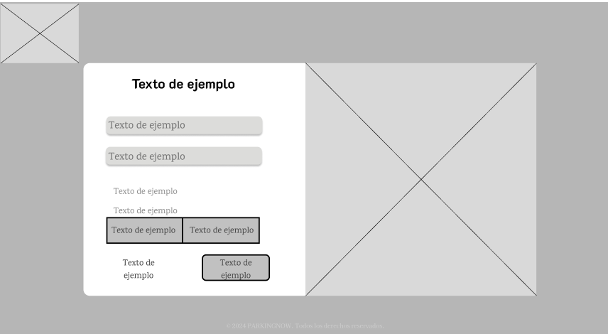

#### 4.3.2. Landing Page Mock-up

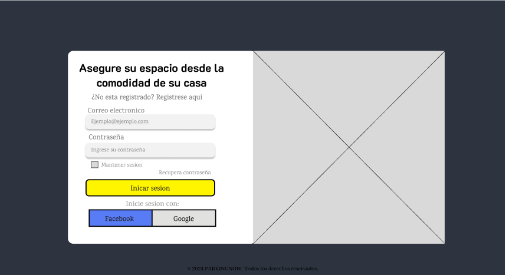

### 4.4. Web Applications UX/UI Design

#### 4.4.1. Web Applications Wireframes

Link: [Figma](https://www.figma.com/design/qb02D1snVoDtoLfT0qdkRV/Parking-now?node-id=0-1&t=dsT3kQGDkndD6UwX-1)

En estas imagenes, podemos ver el wireframde la home page, donde da la bienvenida al suauri y brinda informacion sobre quienes somos y que es lo queremos. En la parte de la derecha podemos ver el Inicio de Sesion, y las formas en que los usuarios se pueden registrar en la aplicacion web, es decir, como conductor o dueño de una playa de estacionamiento

En estas imagenes se puede ver donde el usuario selecciona si es que es un conductor o el dueño de una playa de estacionamiento. Asimismo, se pueden ver las pantallas de confirmarcion de reservas, registro y de opinion enviada.

En estas imagenes se peuden ver la forma en que se vera al momento de buscar un lugar para la reserva, de esta manera el usuario podra ver el nombre del establecimiento, las reseñas, descripcion, fotos del estacionamient, podra dejar una reseña o reservar en el establecimiento.

Además en la segunda imagen podra ver su historial y revisar sus lugares marcados como favoritos.

En las siguientes imagenes lo que se puede ver es el Dashboard del dueño de playas de estacionamiento, donde tendra las siguientes opciones: Inicio, registro de locales, reservas, monitoreo de Automoviles y alarmas de los locales, las configuraciones, notificaciones que llegaran a la aplicacion dependiendo de las preferencias del usuario y por ultimo, cerrar sesion.

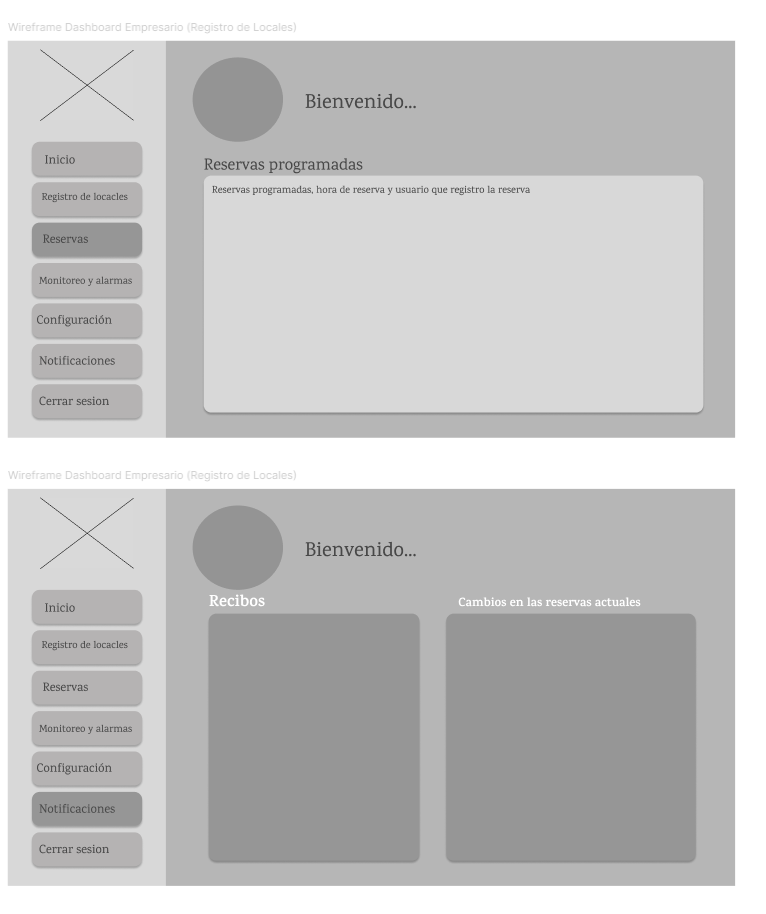

En las siguientes imagenes lo que se puede ver es el Dashboard de los condutores, donde tendra las siguientes opciones: Inicio, reservas, soporte a tiempo real,seguimiento y alarmas del automovil que posea el escaner, las configuraciones, notificaciones que llegaran a la aplicacion dependiendo de las preferencias del usuario y por ultimo, cerrar sesion.

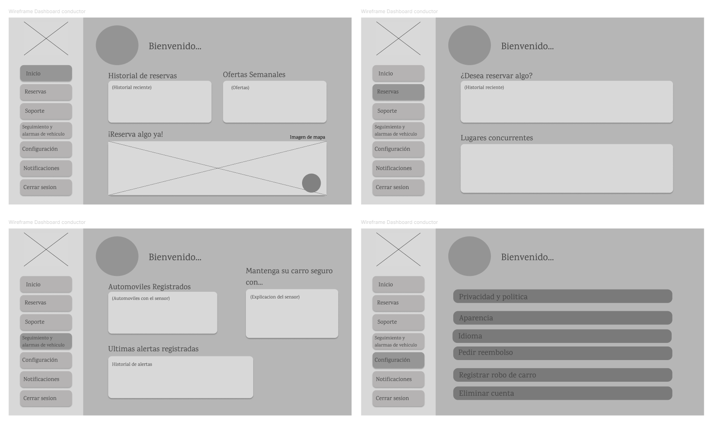

#### 4.4.2. Web Applications Wireflow Diagrams

User goal: Registrarse como conductor o dueno de playa de estacionamiento.
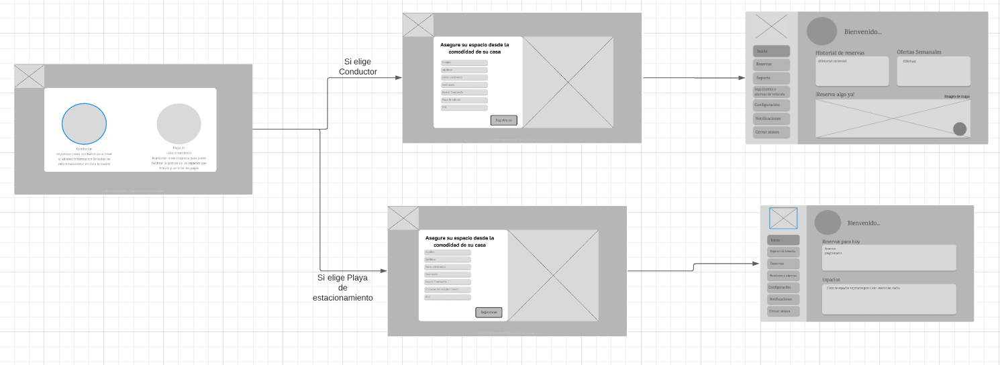

User goal: Iniciar sesion como conductor o dueno de playa de estacionamiento.
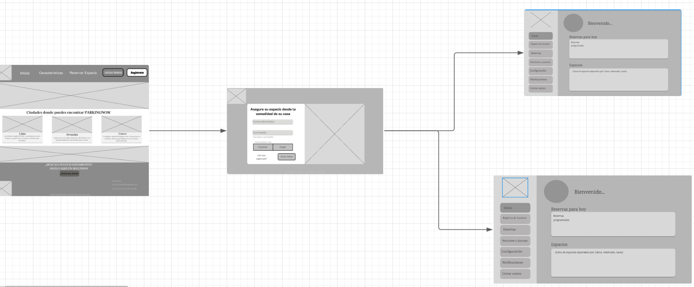

User goal: Hacer una reserva como conductor en la aplicacion.
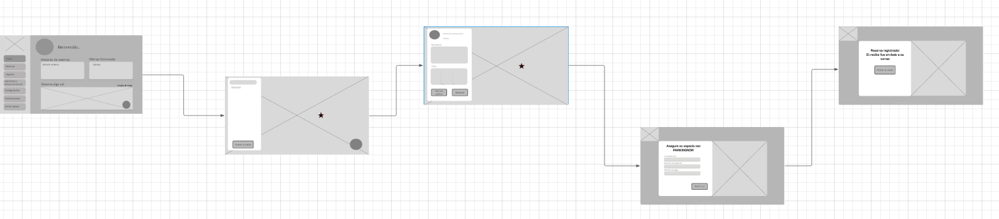

User goal: Dejar una opinion a una playa de estacionamiento.
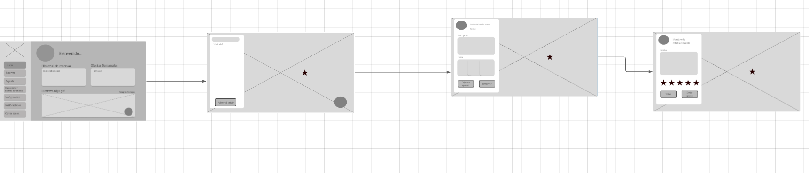

User goal: Recibir soporte en la pestaña de "Soporte" como conductor.
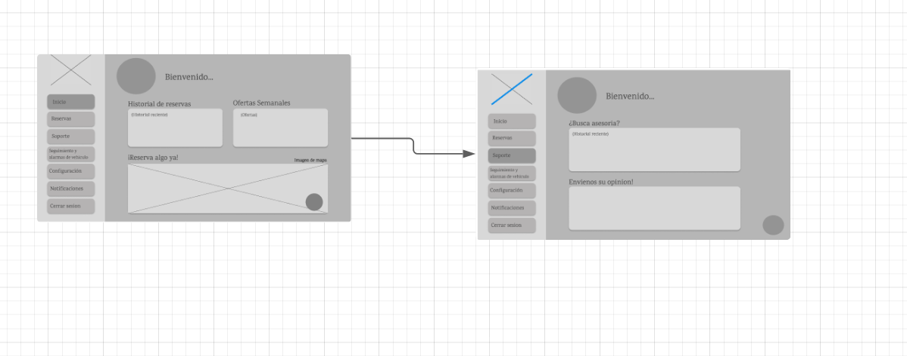

User Goal: Como usuario revisar el estado de mi carro por medio del sensor.
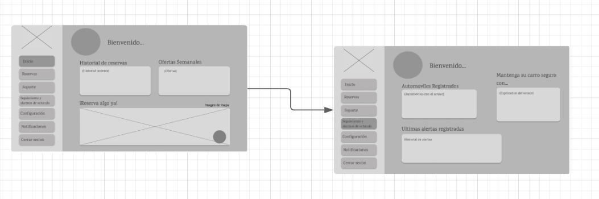

User Goal: Como dueño de la playa de estacionamiento, revisar las reservas programadas para el dia de hoy.
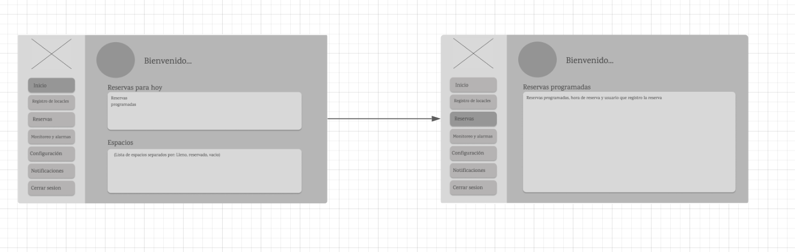

User Goal: Como dueño de la playa de estacionamiento monitorear las alertas y carros que se quedan en el estacionamiento.
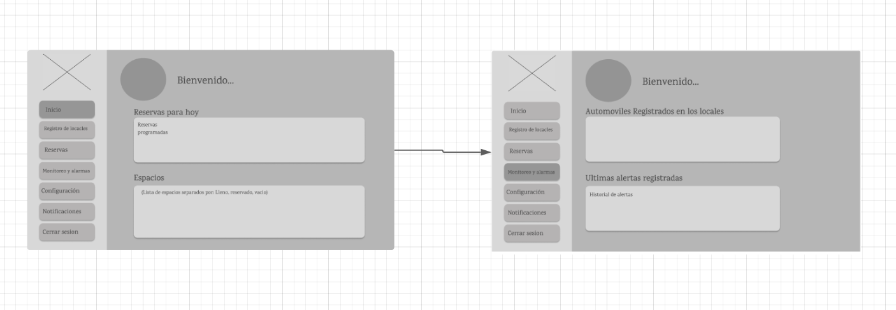

Link: [Figma](https://www.figma.com/design/qb02D1snVoDtoLfT0qdkRV/Parking-now?node-id=0-1&t=dsT3kQGDkndD6UwX-1)

Las dos siguientes imagenes son la homepage y la pagina donde se describen las caracteristicas de nuestro producto.

Aqui se pueden ver las pestañas de inicio de sesion, registro y por ultimo para realizar el pago de una reserva.

Aqui se pueden ver las pestañas de confirmacion de pago de reserva, registro y de envio de opinion.

En las siguientes 4 imagenes se puede ver el mapa de busqueda para las playas de estacionamiento, la forma de reservar un espacio y como dejar una opinion en los establecimientos.

A continuacion se puede ver el Dashboard de los usuarios conductores, donde tendran las opciones que se mencionaron en la seccion del Wireframe.

A continuacion se puede ver el Dashboard de los Dueños de playas de estacionamiento, donde tendran las opciones que se mencionaron en la seccion del Wireframe.

#### 4.4.4. Web Applications User Flow Diagrams

User goal: Registrarse como conductor o dueno de playa de estacionamiento.

User goal: Iniciar sesion como conductor o dueno de playa de estacionamiento.

User goal: Dejar una opinion como conductor en la aplicacion.

User goal: Hacer una reserva como conductor en la aplicacion.

User Goal: Como conductor revisar mis reservas actias, poder reservar y ver los lugares marcados como favoritos
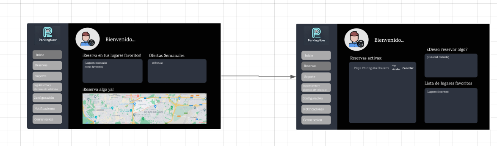

User Goal: Como dueño de una playa de estacionamientos revisar los locales y estadisticas.
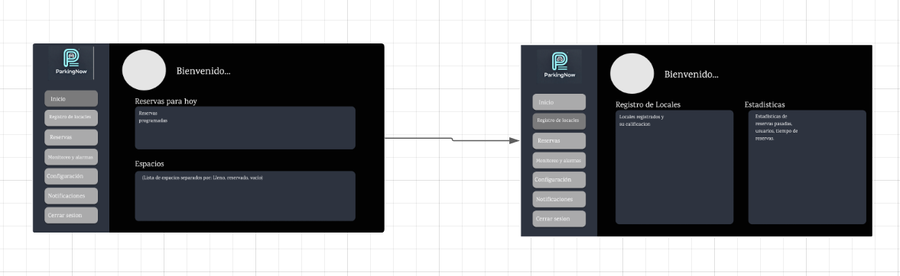

### 4.5. Web Applications Prototyping
Link: [Figma](https://www.figma.com/design/qb02D1snVoDtoLfT0qdkRV/Parking-now?node-id=0-1&t=dsT3kQGDkndD6UwX-1)

### 4.6. Domain-Driven Software Architecture

#### 4.6.1. Software Architecture Context Diagram

#### 4.6.2. Software Architecture Container Diagrams

#### 4.6.3. Software Architecture Components Diagrams

### 4.7. Software Object-Oriented Design

#### 4.7.1. Class Diagrams

#### 4.7.2. Class Dictionary

### 4.8. Database Design

#### 4.8.1. Database Diagram

Link: [Vertabelo](https://my.vertabelo.com/doc/pYDPCowUTtVaVuDmakCr4QlOKjdT1o1o)
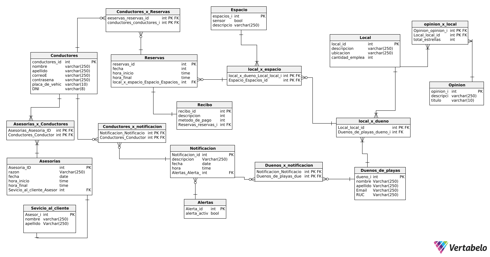

## Capítulo V: Product Implementation, Validation & Deployment

### 5.1. Software Configuration Management

#### 5.1.1. Software Development Environment Configuration

#### 5.1.2. Source Code Management

#### 5.1.3. Source Code Style Guide & Conventions

#### 5.1.4. Software Deployment Configuration

### 5.2. Landing Page, Services & Applications Implementation

#### 5.2.X. Sprint n

##### 5.2.X.1. Sprint Planning n

##### 5.2.X.2. Sprint Backlog n

##### 5.2.X.3. Development Evidence for Sprint Review

##### 5.2.X.4. Testing Suite Evidence for Sprint Review

##### 5.2.X.5. Execution Evidence for Sprint Review

##### 5.2.X.6. Services Documentation Evidence for Sprint Review

##### 5.2.X.7. Software Deployment Evidence for Sprint Review

##### 5.2.X.8. Team Collaboration Insights during Sprint

### 5.3. Validation Interviews

#### 5.3.1. Diseño de Entrevistas

#### 5.3.2. Registro de Entrevistas

#### 5.3.3. Evaluaciones según heurísticas

### 5.4. Video About-the-Product

## Conclusiones 

### Conclusiones y recomendaciones

### Video About-the-Team

## Bibliografía

## Anexos
| Sección         | Enlace                                                                                           |
|-----------------|--------------------------------------------------------------------------------------------------|
| Diseño en Canva | https://www.canva.com/design/DAGOyaW6z7E/ub8lVBXsKH3Em5YVQb223g/edit?utm_content=DAGOyaW6z7E&utm_campaign=designshare&utm_medium=link2&utm_source=sharebutton |
| Miro Board 1    | https://miro.com/app/board/uXjVKmNkzqc=/?share_link_id=307784420338                               |
| Miro Board 2    | https://miro.com/app/board/uXjVKmOWBhk=/?share_link_id=425124811159                               |
