# **COURSE PROJECT**

<p align="center">
  
</p>

<p align="center"><strong>Universidad Peruana de Ciencias Aplicadas</strong></p>

<p align="center"><strong>Ingeniería de Software</strong><br>
Aplicaciones Web - SW52 <br>
Ciclo: 5to <br>
<strong>Profesor:</strong> Juan Carlos Tinoco Licas</p>

<h2 align="center">INFORME</h2>

<h3 align="center">Startup: Code Mondoguito</h3>
<p align="center"><strong>Producto: ParkingNow</strong></p>

<h3 align="center">Team Members:</h3>

<div align="center">

| **Member**                           | **Code**     |
|--------------------------------------|--------------|
| Rodrigo Liberato Saldaña       | U202215623   |
| Samuel Elias Molina Asencios     | U20191A456   |
| Omar Harold Rivera Ticllacuri      | U202214214   |
| Diego Ulises Soto Quispe     | U202214477   |
| Ramos Huamanchumo, Javier Aramis     | U201719648  |
| Loechle Arias Mateo Italo     | U202215004    |

</div>

<p align="center"><strong>Septiembre 2024</strong></p>

# Registro de Versiones del Informe

| Versión | Fecha       | Autor(es)                                                                                                  | Descripción de la modificación                                                                                                                                                       |
|---------|-------------|------------------------------------------------------------------------------------------------------------|---------------------------------------------------------------------------------------------------------------------------------------------------------------------------------------|
| TB1     | 10/09/2024  | Loechle Arias Mateo Italo<br><br>Rodrigo Liberato Saldaña<br><br>Samuel Elias Molina Asencios<br><br>Omar Harold Rivera Ticllacuri<br><br>Diego Ulises Soto Quispe<br><br>Ramos Huamanchumo, Javier Aramis | Se agregó el contenido del capítulo 1 (apartados 1.1, 1.2 y 1.3); el contenido del capítulo 2 (apartados 2.1, 2.2, 2.3, 2.4); el contenido del capítulo 3 (apartados 3.1, 3.2, 3.3 y 3.4); el contenido del capítulo 4 (apartados 4.1, 4.2, 4.3, 4.4, 4.5, 4.6, 4.7 y 4.8); y el contenido del capítulo 5 (apartados 5.1 y 5.2). |
| TP1     |             | Loechle Arias Mateo Italo<br><br>Rodrigo Liberato Saldaña<br><br>Samuel Elias Molina Asencios<br><br>Omar Harold Rivera Ticllacuri<br><br>Diego Ulises Soto Quispe<br><br>Ramos Huamanchumo, Javier Aramis |    Se agregó el contenido del capítulo 5, apartados 5.2.2, 5.2.2.1, 5.2.2.2, 5.2.2.3, 5.2.2.4, 5.2.2.5, 5.2.2.6, 5.2.2.7, 5.2.2.8|                                                                                                                                                                                                                              |
| TB2     |       03/11/2024      | Loechle Arias Mateo Italo<br><br>Rodrigo Liberato Saldaña<br><br>Samuel Elias Molina Asencios<br><br>Omar Harold Rivera Ticllacuri<br><br>Diego Ulises Soto Quispe<br><br>Ramos Huamanchumo, Javier Aramis |               Se agregó el contenido del capítulo 5, apartados 5.2.3, 5.2.3.1, 5.2.3.2, 5.2.3.3, 5.2.3.4, 5.2.3.5, 5.2.3.6, 5.2.3.7, 5.2.3.8, 5.3, 5.3.1, 5.3.2, 5.3.3, 5.4 y las conclusiones.                                                                                                                                                                                             |
| TF1     |             | Loechle Arias Mateo Italo<br><br>Rodrigo Liberato Saldaña<br><br>Samuel Elias Molina Asencios<br><br>Omar Harold Rivera Ticllacuri<br><br>Diego Ulises Soto Quispe<br><br>Ramos Huamanchumo, Javier Aramis |                                                                                                                                                                                       |


# Project Report Collaboration Insights

TB1: Las tareas asignadas para la entrega TB1 se han completado y están documentadas en el siguiente repositorio de GitHub perteneciente a la organización del equipo: [Repositorio GitHub](https://github.com/G3-UPC-SI730-2402-SW52-PARKINGNOW/Report).
Link: https://github.com/G3-UPC-SI730-2402-SW52-PARKINGNOW/Report

Durante la preparación del informe, se llevaron a cabo las siguientes actividades:

- Se escribieron y diagramaron los contenidos asignados a cada miembro en formato Markdown, seguido de commits para asegurar el progreso en el repositorio.
- Se crearon los artefactos necesarios utilizando las herramientas recomendadas y se obtuvieron enlaces de imagen a través de la carpeta `Assets` en la rama `develop` del repositorio del informe.
- Se organizaron reuniones para coordinar el progreso de los elementos del informe y para comunicar los avances del Sprint 1, que se enfoca en la Landing Page.

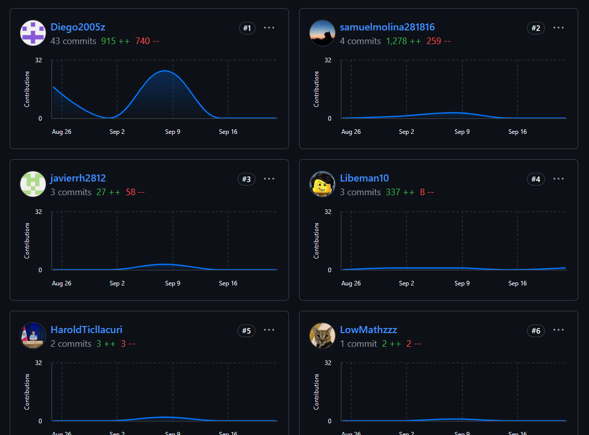

TP1 :Durante la preparación del informe, se realizaron las siguientes tareas.

- Se escribieron y organizaron los contenidos asignados a cada miembro en formato Markdown, haciendo commits para asegurar el progreso en el repositorio.
- Se crearon los documentos necesarios usando las herramientas recomendadas y se obtuvieron enlaces de imágenes desde la carpeta `Assets` en la rama `develop` del repositorio del informe.
- Se organizaron reuniones para coordinar el avance de los elementos del informe y para compartir los progresos del Sprint 2, que se centra en el desarrollo del front-end de la aplicación web.}
  
  

TB2: Avances del Sprint 3 en el Proyecto ParkingNow

Las tareas asignadas para el Sprint 3 han sido finalizadas y están documentadas en el repositorio de GitHub de la organización del equipo: https://github.com/G3-UPC-SI730-2402-SW52-PARKINGNOW

### Actividades Realizadas durante la Preparación del Informe

- **Implementación de Endpoints en Bounded Contexts:** Cada miembro del equipo trabajó en el desarrollo de los endpoints correspondientes a los bounded contexts designados previamente en el backlog de sprint 3. Estos contextos abarcan módulos claves del backend, como la administración de reservas, transacciones, notificaciones, asesorías y la gestión de usuarios y conductores.

- **Creación y Documentación de Artefactos:** Se generaron los artefactos necesarios empleando las herramientas recomendadas, y se obtuvieron enlaces de imagen mediante la carpeta `assets` en la rama `develop` del repositorio del informe. Estos artefactos incluyen diagramas de clases, capturas de la estructura del backend y documentación de los servicios web.

- **Reuniones de Coordinación:** Se llevaron a cabo reuniones periódicas para coordinar el avance de los elementos del informe y comunicar los progresos logrados en el Sprint 3, el cual se enfocó principalmente en el desarrollo del backend de la aplicación web. En estas reuniones, se discutieron temas como la implementación de la arquitectura CLEAN, la integración de CQRS y la separación de servicios dentro del backend.

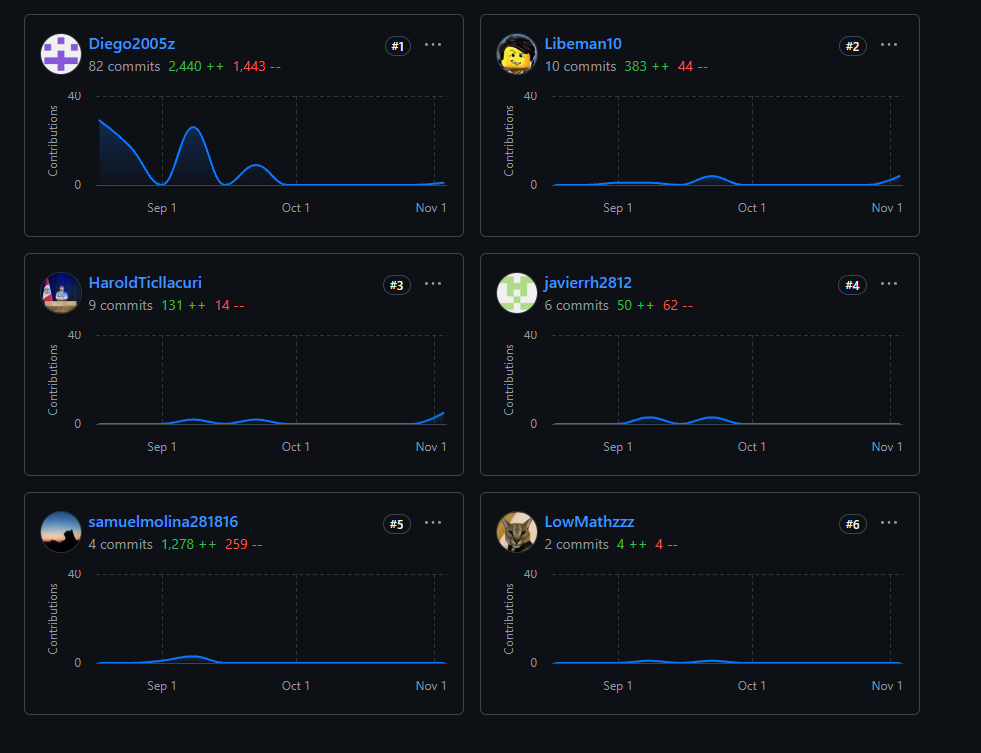

# ABET – EAC - Student Outcome 5

Criterio: La capacidad de funcionar efectivamente en un equipo cuyos miembros
juntos proporcionan liderazgo, crean un entorno de colaboración e inclusivo,
establecen objetivos, planifican tareas y cumplen objetivos.
En el siguiente cuadro se describe las acciones realizadas y enunciados de
conclusiones por parte del grupo, que permiten sustentar el haber alcanzado el logro
del ABET – EAC - Student Outcome 5.
| Criterio específico                                                                                 | Acciones realizadas                                                                                                                                                                                                                                      | Conclusiones                                                                                                                                                                                                                                             |
|------------------------------------------------------------------------------------------------------|----------------------------------------------------------------------------------------------------------------------------------------------------------------------------------------------------------------------------------------------------------|------------------------------------------------------------------------------------------------------------------------------------------------------------------------------------------------------------------------------------------------------------|
| **Trabaja en equipo para proporcionar liderazgo en forma conjunta**                             | **Diego Ulises Soto Quispe *TB1:*** Durante las reuniones del proyecto, participé activamente explicando la introducción del proyecto y la problemática de la startup, utilizando un lenguaje claro para asegurar que todos los miembros del equipo comprendieran las metas y objetivos. Presenté de forma clara los resultados del análisis de requerimientos en el Capítulo 3 y los resultados de las pruebas en el Capítulo 5.<br> **Diego Ulises Soto Quispe *TP1:***: En el TP1, lideré discusiones sobre las metas del proyecto y facilité la comprensión de los objetivos, asegurando que todos los miembros del equipo estuvieran informados y alineados en el proceso. <br> **Diego Ulises Soto Quispe *TB2:*** En el TB2, lideré la creación y organización del Sprint Backlog y planifiqué junto al equipo los objetivos específicos para este entregable. Estuve encargado de definir el Sprint Goal, asegurando que estuviera alineado con las expectativas del proyecto. También revisé y validé los desarrollos propuestos en el Capítulo 5, especialmente en las configuraciones de despliegue, para garantizar que se cumpliera con los criterios de éxito del sprint. Además, apoyé en la revisión y mejora de los artefactos en el informe de proyecto y su documentación, colaborando en la organización de presentaciones para la entrega.  <br> **Omar Harold Rivera Ticllacuri TB1:** Durante el desarrollo del proyecto, participé activamente en el Capítulo 2, creando los user persona y colaborando en el diseño de la Landing Page. También aporté en partes del Capítulo 5, ayudando a definir aspectos clave del proyecto.  <br>   <br> **Omar Harold Rivera Ticllacuri TP1:** Durante el desarrollo de este entregable, mantuve una colaboración cercana y constante con mis compañeros para asegurar un progreso coordinado y evitar obstáculos mientras trabajábamos en conjunto. Participé activamente en la optimización del desarrollo y despliegue del Landing Page, y también contribuí con la revisión y actualización de la documentación del proyecto.**Omar Harold Rivera Ticllacuri TB2:** Durante este entregable, mantuve una colaboración estrecha y constante con mis compañeros para asegurar un avance coordinado y evitar obstáculos en el trabajo en equipo. Participé activamente en la optimización del diseño y despliegue de la Landing Page, y también contribuí con la revisión y actualización de la documentación del proyecto.<br/> **Javier Ramos Huamamchumo** <br> **TB1**: A lo largo del desarrollo del proyecto, desempeñé un papel activo en los capitulos 2 y 5, donde contribuí significativamente en el diseño de la página de aterrizaje y asistiendo en la definición de elementos cruciales para el proyecto. <br> **Rodrigo Liberato Saldaña:** Para este entregable, comuniqué a mis compañeros todos mis avances y cambios que aporté. Apoyé a quienes lo necesitaban, y mis aportes significativos fueron en el Capítulo 2 (análisis de los competidores), Capítulo 4 (Wireframe y Mockup design) y el diseño de la base de datos. También diseñé el PPT para la presentación. **TP** Para este entregable tuvimos una comunicacion constante con mis compañeros, para mantener un orden concreto y no hubieran inconvenientes al avanzar como grupo. Realice algunas de las mejoras en los diagramas de flujo, aporte con cambios y mejoras en la documentacion **TB2 Rodrigo Liberato:** Para este entregable realicé mis aportes en el reporte. Considero que logramos un buen trabajo para este entregable   <br>**Samuel Elias Molina Asencios** <br> **TB1**: Durante el desarrollo del proyecto, fui responsable de la creación del escenario, el desarrollo del lenguaje ubicuo y el diseño del empathy map. A través del escenario, logré visualizar cómo los usuarios interactuarían con el sistema en contextos reales, lo que ayudó a anticipar posibles necesidades y mejoras. El lenguaje ubicuo que propuse permitió que todos los involucrados en el proyecto, desde desarrolladores hasta stakeholders, tuvieran una comprensión compartida y clara de los términos y conceptos clave, evitando malentendidos. <br>**Samuel Elias Molina Asencios** <br> **TP1**: Durante el desarrollo del proyecto, fui parte de la mejora en grupo en nuestros proyectos  mediante la comunicacion asertiva y continua llegue a formar parte de esta entrega, una comprensión compartida y clara de los de los requerimientos nos ayudo a avanzar constantemente evitando malentendidos. <br>**Samuel Elias Molina Asencios** <br> **TB2**: Durante el desarrollo del proyecto, me encargue de la revision del test Evidence parte fundamental de nuestro desarrollo para garantizar el completo funcionamiento de cada una de nuestras opciones dentro de parkingnow solidificando nuestroproyecto cada vez mas    <br>**Mateo Italo Loechle Arias**:Durante la entrega de la tb1 , tuve la responsabilidad de realizar el capitulo 5 , de igual manera aporte en la realizacion del algunos aspectos del punto 4<br> TP: Se realizo el proceso de seleccion para la implementacion de componentes para el front end de la aplicacion.| **TB1:** La participación activa fue fundamental para guiar al equipo en la comprensión de los objetivos y la dirección del proyecto. Su capacidad para comunicar las metas y explicar la problemática de manera clara y efectiva permitió que todos los miembros estuvieran alineados en el desarrollo de las soluciones. La presentación de los resultados del análisis de requerimientos y pruebas facilitó que el equipo técnico tuviera una visión clara de los pasos a seguir. Gracias a su liderazgo y su participación en estas tareas clave, se logró un avance constante en el proyecto, sentando las bases para futuras iteraciones de mejora. Su contribución fue esencial para la cohesión del equipo y el cumplimiento de los plazos establecidos. <br> **TP1:** Liderazgo Compartido: La diversidad de aportes y el liderazgo distribuido en el equipo fueron claves para abordar los desafíos del proyecto. Cada integrante tomó la iniciativa en distintas áreas, lo que enriqueció el desarrollo y la implementación, generando un sentido de pertenencia y responsabilidad compartida. <br> **TB2:** El liderazgo en el TB2 facilitó que el equipo avanzara con un objetivo claro y tareas distribuidas eficientemente. Al coordinar la planificación del sprint y revisar los entregables en cada etapa, se lograron mejoras continuas en la calidad y organización del trabajo. La revisión y documentación minuciosa permitió una implementación efectiva y cumplió con los objetivos del proyecto en esta etapa.|
| **Crea un entorno colaborativo e inclusivo, establece metas, planifica tareas y cumple objetivos.** | **Diego Ulises Soto Quispe *TB1:*** En el Capítulo 1, fui el responsable de documentar el perfil de la startup y el marco teórico del proyecto, utilizando un lenguaje claro y conciso para describir los antecedentes. En el Capítulo 3, redacté los requerimientos específicos del sistema y las historias de usuario. También colaboré en los Capítulos 4 y 5 documentando el diseño del sistema y las configuraciones de implementación. <br> **Diego Ulises Soto Quispe *TP1***: En el TP1, fomenté un entorno colaborativo al documentar el perfil de la startup y los requerimientos del sistema, asegurando que el equipo tuviera claridad sobre las metas y tareas. Además, colaboré en el diseño y la implementación, lo que permitió una planificación efectiva y el cumplimiento de los objetivos del proyecto. <br> **Diego Ulises Soto Quispe *TB2:*** En el TB2, gestioné la comunicación dentro del equipo y ayudé a planificar las tareas para cumplir con las metas del sprint. Redacté el Sprint Goal y establecí prioridades en el Sprint Backlog para asegurar que el equipo trabajara en sincronía. También me aseguré de que la documentación del Capítulo 5 reflejara los cambios realizados durante el sprint y supervisé que cada miembro tuviera claridad en sus responsabilidades, revisando entregables clave para alinear el progreso con las expectativas de TB2.  <br> **Omar Harold Rivera Ticllacuri TB1:** En el Capítulo 2, desarrollé los user persona, la matriz de tareas de usuario, y el user journey mapping. En el Capítulo 4, trabajé en las Style Guidelines y en el diseño UI de la Landing Page, asegurando una experiencia coherente y atractiva. **Omar Harold Rivera Ticllacuri TP1:** En el TP1, contribuí a crear un entorno de colaboración al encargarme de la documentación y el despliegue de la landing page, garantizando que el equipo comprendiera claramente los objetivos y roles. Asimismo, estuve involucrado en el diseño y la implementación, lo que facilitó una planificación eficaz y el cumplimiento de los objetivos del proyecto.  **Omar Harold Rivera Ticllacuri TB2:** Durante el proyecto, promoví un entorno de trabajo colaborativo e inclusivo, alentando a cada miembro del equipo a participar activamente y expresar sus ideas en un ambiente respetuoso. Me dediqué a establecer metas claras y planificando cuidadosamente las tareas para optimizar el flujo de trabajo.   <br> <br> **Javier Ramos Huamanchumo** <br> **TB1**: Revisé todos los capítulos para asegurar cohesión, comenzando por el Capítulo 1, donde establecí el perfil de nuestra startup y el contexto teórico, utilizando un lenguaje claro. En el Capítulo 3, detallé los requerimientos del sistema y las historias de usuario, y luego, supervisé los Capítulos 4 y 5 para garantizar que el diseño del sistema y su implementación estuvieran alineados con nuestros objetivos. <br> **Rodrigo Liberato Saldaña:** Para este entregable, los aportes que realicé por escrito fueron los commits por Git y los análisis de los competidores. **TP** Para este entregable, logramos la comunicacion esperada de todas las formas posibles para tener un avance constante y eficiente.  **TB2 Rodrigo Liberato:** Considero que logramos el objetivo del estudiante comnunicandonos eficientemente entre nosotros para lograr un trabajo efectivo  <br> **Samuel Elias Molina Asencios TB1:** Para este entregable, los aportes que realicé por escrito fueron algunas modificaciones sobre el frontend respecto al testevidence.  <br> **Samuel Elias Molina Asencios TP1:** Para este entregable, los aportes que realicé por escrito fueron algunas modificaciones sobre la landing page asi mismo desarrolle los Ubiquitos. <br>  <br> **Samuel Elias Molina Asencios TB2:** Para este entregable, los aportes que realicé por escrito fueron algunas modificaciones el reporte mejoras continuas y levantamiento de observaciones asignadas a lo largo de nuestro desarrollo. **Mateo Italo Loechle Arias**: En el capitulo 4 realize el Labeling Systems, SEO tags and meta tags , searching systems and nav systems. Tambien aporte en el punto 5 con el sprint backlog y un poco el landing page.<br> TP: Para esta entrega se aporto minimamente a la implementacion de componentes de el front end. | **TB1:** La contribución en la documentación y planificación del proyecto fue determinante para el éxito del equipo. Su habilidad para crear un entorno de trabajo inclusivo, asegurando que todos los miembros estuvieran informados y alineados con los objetivos del proyecto, ayudó a que las tareas se completaran de manera eficiente. La claridad y precisión en la documentación del perfil de la startup y los requerimientos del sistema establecieron una base sólida para el desarrollo. Al colaborar en el diseño del sistema y las configuraciones de implementación, se aseguró de que cada fase del proyecto estuviera bien organizada y alineada con las expectativas. Su capacidad para planificar y cumplir con los objetivos propuestos permitió que el equipo avanzara con seguridad y sin contratiempos, mejorando la calidad de los entregables en cada iteración. <br> **TP1:** Mejora Continua: La revisión constante de los documentos y la colaboración activa en las fases de diseño y desarrollo permitieron identificar y corregir problemas de manera oportuna. Esto no solo mejoró la calidad del trabajo final, sino que también estableció un marco para futuras iteraciones, asegurando que el equipo pudiera adaptarse a cambios y optimizar procesos a lo largo del proyecto. <br> **TB2:** La revisión exhaustiva de los entregables y el apoyo en la planificación de tareas durante el TB2 fomentaron un entorno colaborativo y eficiente. Gracias a su rol en la organización y documentación, el equipo mantuvo un flujo de trabajo constante y ordenado, logrando los objetivos planteados y contribuyendo a una mejora continua del producto. |


# Contenido
- [Registro de Versiones del Informe](#registro-de-versiones-del-informe)
- [Project Report Collaboration Insights](#project-report-collaboration-insights)
- [Student Outcome](#student-outcome)

## Capítulo I: Introducción
- [1.1. Startup Profile](#11-startup-profile)
  - [1.1.1. Descripción de la Startup](#111-descripción-de-la-startup)
  - [1.1.2. Perfiles de integrantes del equipo](#112-perfiles-de-integrantes-del-equipo)
- [1.2. Solution Profile](#12-solution-profile)
  - [1.2.1 Antecedentes y problemática](#121-antecedentes-y-problemática)
  - [1.2.2 Lean UX Process](#122-lean-ux-process)
    - [1.2.2.1. Lean UX Problem Statements](#1221-lean-ux-problem-statements)
    - [1.2.2.2. Lean UX Assumptions](#1222-lean-ux-assumptions)
    - [1.2.2.3. Lean UX Hypothesis Statements](#1223-lean-ux-hypothesis-statements)
    - [1.2.2.4. Lean UX Canvas](#1224-lean-ux-canvas)
- [1.3. Segmentos objetivo](#13-segmentos-objetivo)

## Capítulo II: Requirements Elicitation & Analysis
- [2.1. Competidores](#21-competidores)
  - [2.1.1. Análisis competitivo](#211-análisis-competitivo)
  - [2.1.2. Estrategias y tácticas frente a competidores](#212-estrategias-y-tácticas-frente-a-competidores)
- [2.2. Entrevistas](#22-entrevistas)
  - [2.2.1. Diseño de entrevistas](#221-diseño-de-entrevistas)
  - [2.2.2. Registro de entrevistas](#222-registro-de-entrevistas)
  - [2.2.3. Análisis de entrevistas](#223-análisis-de-entrevistas)
- [2.3. Needfinding](#23-needfinding)
  - [2.3.1. User Personas](#231-user-personas)
  - [2.3.2. User Task Matrix](#232-user-task-matrix)
  - [2.3.3. User Journey Mapping](#233-user-journey-mapping)
  - [2.3.4. Empathy Mapping](#234-empathy-mapping)
  - [2.3.5. As-is Scenario Mapping](#235-as-is-scenario-mapping)
- [2.4. Ubiquitous Language](#24-ubiquitous-language)

## Capítulo III: Requirements Specification
- [3.1. To-Be Scenario Mapping](#31-to-be-scenario-mapping)
- [3.2. User Stories](#32-user-stories)
- [3.3. Impact Mapping](#33-impact-mapping)
- [3.4. Product Backlog](#34-product-backlog)

## Capítulo IV: Product Design
- [4.1. Style Guidelines](#41-style-guidelines)
  - [4.1.1. General Style Guidelines](#411-general-style-guidelines)
  - [4.1.2. Web Style Guidelines](#412-web-style-guidelines)
- [4.2. Information Architecture](#42-information-architecture)
  - [4.2.1. Organization Systems](#421-organization-systems)
  - [4.2.2. Labeling Systems](#422-labeling-systems)
  - [4.2.3. SEO Tags and Meta Tags](#423-seo-tags-and-meta-tags)
  - [4.2.4. Searching Systems](#424-searching-systems)
  - [4.2.5. Navigation Systems](#425-navigation-systems)
- [4.3. Landing Page UI Design](#43-landing-page-ui-design)
  - [4.3.1. Landing Page Wireframe](#431-landing-page-wireframe)
  - [4.3.2. Landing Page Mock-up](#432-landing-page-mock-up)
- [4.4. Web Applications UX/UI Design](#44-web-applications-uxui-design)
  - [4.4.1. Web Applications Wireframes](#441-web-applications-wireframes)
  - [4.4.2. Web Applications Wireflow Diagrams](#442-web-applications-wireflow-diagrams)
  - [4.4.2. Web Applications Mock-ups](#442-web-applications-mock-ups)
  - [4.4.3. Web Applications User Flow Diagrams](#443-web-applications-user-flow-diagrams)
- [4.5. Web Applications Prototyping](#45-web-applications-prototyping)
- [4.6. Domain-Driven Software Architecture](#46-domain-driven-software-architecture)
  - [4.6.1. Software Architecture Context Diagram](#461-software-architecture-context-diagram)
  - [4.6.2. Software Architecture Container Diagrams](#462-software-architecture-container-diagrams)
  - [4.6.3. Software Architecture Components Diagrams](#463-software-architecture-components-diagrams)
- [4.7. Software Object-Oriented Design](#47-software-object-oriented-design)
  - [4.7.1. Class Diagrams](#471-class-diagrams)
  - [4.7.2. Class Dictionary](#472-class-dictionary)
- [4.8. Database Design](#48-database-design)
  - [4.8.1. Database Diagram](#481-database-diagram)

## Capítulo V: Product Implementation, Validation & Deployment
- [5.1. Software Configuration Management](#51-software-configuration-management)
  - [5.1.1. Software Development Environment Configuration](#511-software-development-environment-configuration)
  - [5.1.2. Source Code Management](#512-source-code-management)
  - [5.1.3. Source Code Style Guide & Conventions](#513-source-code-style-guide--conventions)
  - [5.1.4. Software Deployment Configuration](#514-software-deployment-configuration)
- [5.2. Landing Page, Services & Applications Implementation](#52-landing-page-services--applications-implementation)
  - [5.2.1. Sprint 1](#521-sprint-1)
    - [5.2.1.1. Sprint Planning 1](#5211-sprint-planning-1)
    - [5.2.1.2. Sprint Backlog 1](#5212-sprint-backlog-1)
    - [5.2.1.3. Development Evidence for Sprint Review](#5213-development-evidence-for-sprint-review)
    - [5.2.1.4. Testing Suite Evidence for Sprint Review](#5214-testing-suite-evidence-for-sprint-review)
    - [5.2.1.5. Execution Evidence for Sprint Review](#5215-execution-evidence-for-sprint-review)
    - [5.2.1.6. Services Documentation Evidence for Sprint Review](#5216-services-documentation-evidence-for-sprint-review)
    - [5.2.1.7. Software Deployment Evidence for Sprint Review](#5217-software-deployment-evidence-for-sprint-review)
    - [5.2.1.8. Team Collaboration Insights during Sprint](#5218-team-collaboration-insights-during-sprint)
- [5.2.2. Sprint 2](#522-sprint-2)
    - [5.2.2.1. Sprint Planning 2](#5221-sprint-planning-2)
    - [5.2.2.2. Sprint Backlog 2](#5222-sprint-backlog-2)
    - [5.2.2.3. Development Evidence for Sprint Review](#5223-development-evidence-for-sprint-review)
    - [5.2.2.4. Testing Suite Evidence for Sprint Review](#5224-testing-suite-evidence-for-sprint-review)
    - [5.2.2.5. Execution Evidence for Sprint Review](#5225-execution-evidence-for-sprint-review)
    - [5.2.2.6. Services Documentation Evidence for Sprint Review](#5226-services-documentation-evidence-for-sprint-review)
    - [5.2.2.7. Software Deployment Evidence for Sprint Review](#5227-software-deployment-evidence-for-sprint-review)
    - [5.2.2.8. Team Collaboration Insights during Sprint](#5228-team-collaboration-insights-during-sprint)

- [5.2.3. Sprint 3](#sprint-3)
  - [5.2.3.1. Sprint Planning 3](#sprint-planning-3)
  - [5.2.3.2. Sprint Backlog 3](#sprint-backlog-3)
  - [5.2.3.3. Development Evidence for Sprint Review](#development-evidence-for-sprint-review)
  - [5.2.3.4. Testing Suite Evidence for Sprint Review](#testing-suite-evidence-for-sprint-review)
  - [5.2.3.5. Execution Evidence for Sprint Review](#execution-evidence-for-sprint-review)
  - [5.2.3.6. Services Documentation Evidence for Sprint Review](#services-documentation-evidence-for-sprint-review)
  - [5.2.3.7. Software Deployment Evidence for Sprint Review](#software-deployment-evidence-for-sprint-review)
  - [5.2.3.8. Team Collaboration Insights during Sprint](#team-collaboration-insights-during-sprint)

- [5.3. Validation Interviews](#validation-interviews)
  - [5.3.1. Diseño de Entrevistas](#diseño-de-entrevistas)
  - [5.3.2. Registro de Entrevistas](#registro-de-entrevistas)
  - [5.3.3. Evaluaciones según heurísticas](#evaluaciones-según-heurísticas)

- [5.4. Video About-the-Product](#video-about-the-product)


- [Avance de Conclusiones, Bibliografía y Anexos](#avance-de-conclusiones-bibliografía-y-anexos)

## Capítulo I: Introducción

### 1.1. StartUp Profile

En esta sección describiremos la descripción de nuestra Startup.

### 1.1.1. Descripción de la Startup

**PARKINGNOW** es una empresa emergente del ámbito tecnológico que se especializa en ofrecer una solución completa para la gestión de estacionamientos en tiempo real. A través de su plataforma digital, los usuarios pueden reservar y pagar por espacios de estacionamiento mediante el uso de tecnología de geolocalización y sensores infrarrojos, lo que permite una administración más automatizada y eficiente. Con un modelo de negocio independiente y sostenible, **PARKINGNOW** está diseñado tanto para usuarios frecuentes como para aquellos que lo utilizan de forma ocasional, facilitando las transacciones entre ambos. La innovación clave de **PARKINGNOW** radica en el uso de datos en tiempo real, obtenidos a través de sensores infrarrojos, que garantizan la disponibilidad de espacios y optimizan las rutas hacia los estacionamientos más cercanos. Estos sensores detectan la presencia de vehículos interrumpiendo una señal de luz, y al ocupar o desocupar un espacio, el sensor envía una señal a la plataforma que actualiza automáticamente la información disponible, mejorando así la eficiencia y la experiencia del usuario.

**Misión**: Facilitar la conexión entre conductores y propietarios de estacionamientos, optimizando la experiencia de estacionamiento en tiempo real. **PARKINGNOW** utiliza sensores infrarrojos para automatizar la gestión de espacios, incrementando la rentabilidad para los propietarios y satisfaciendo las necesidades de ambos segmentos del mercado.

**Visión**: Convertirse en la principal plataforma de gestión de estacionamientos urbanos en un plazo de cinco años, promoviendo una movilidad urbana más eficiente a través de soluciones tecnológicas innovadoras y sostenibles, como el uso de sensores infrarrojos, que beneficien tanto a los conductores como a los dueños de estacionamientos.

#### 1.1.2. Perfiles de integrantes del equipo

 **Integrantes**                                              | **Descripción**                                                                                                                                                                                                                                                | **Conocimientos**                               |
|--------------------------------------------------------------|----------------------------------------------------------------------------------------------------------------------------------------------------------------------------------------------------------------------------------------------------------------|-------------------------------------------------|
|  <br> Diego Ulises Soto Quispe | Soy estudiante de 5to ciclo en la carrera de Ingeniería de Software. Soy responsable en las labores que se asignan y puntual con los trabajos por entregar, fuera del mundo de programación, me gusta jugar basquet, salir a pasear, jugar videojuegos y manejar en bicicleta. | HTML, Base de datos en SQL Server, C++, Python, NoSQL, JSON |
|  <br> Ramos Huamanchumo, Javier Aramis | Mi nombre es Javier Ramos, actualmente me encuentro en el proceso de traslado hacia la carrera de Ingeniería de Software, ya que deseo formalizar mis conocimientos en el área que me apasiona y a la que me dedico laboralmente. Tengo experiencia en AWS, diversas tecnologías frontend, backend y CMS. | Javascript, AWS, Contentful | 
|  <br> Omar Harold Rivera Ticllacuri | Soy estudiante de Ingeniería de Software, tengo 19 años y actualmente me encuentro en el quinto ciclo de mi carrera. Soy una persona con la cual tengo la disciplina y responsable para desarrollar proyectos de software y software de entretenimiento. Cuento con experiencia sobre el desarrollo de software de entretenimiento. Por ende, apoyaré al grupo en todo lo posible para poder desarrollar adecuadamente el trabajo y la propuesta que se nos asignó. | C++, C#, Python, Unity 2D/3D, Html y Css|
|  <br> Samuel Elias Molina Asencios | Soy estudiante de 7mo ciclo en la carrera de Ingeniería de Software. Actualmente formo parte de un equipo de desarrollo ejecutando el rol de Analista desarrollador de software, me gusta mucho el arte y el deporte, en mis tiempos libres toco Piano o voy a nadar no hay nada mejor que la natación. | SQL, NoSQL, C++, Java, JavaScript, Firebird, Vue, Quasar, Node js, Jreport, PHP, Sniffer, HTML, CSS.|
|  <br> Rodrigo Liberato Saldaña | Soy estudiante de 6to ciclo de la carrera de Ingenieria de software, soy una persona que valora el esfuerzo e intenta apoyar en todo lo posible. La responsabilidad y honestidad son unas de mis cualidades y que seran de ayuda para que el trabajo salga lo mejor posible | C++, SQL, Java, PHP, HTML, CSS.|
|  <br> Loechle Arias Mateo Italo |  Soy estudiante de Ingeniería de Software, tengo 19 años y actualmente me encuentro en el quinto ciclo de mi carrera. Soy una persona con la cual tengo la disciplina y responsable para desarrollar proyectos de software y software de entretenimiento. Cuento con experiencia soy una persona que valora el esfuerzo e intenta apoyar en todo lo posible. La responsabilidad y honestidad son unas de mis cualidades y que seran de ayuda para que el trabajo salga lo mejor posible | C++, SQL, Java, PHP, HTML, CSS.|


### 1.2. Solution Profile


PARKINGNOW es una solución innovadora creada para revolucionar la experiencia de estacionamiento en entornos urbanos. La plataforma digital que ofrecemos permite a los usuarios localizar, reservar y pagar por espacios de estacionamiento en tiempo real, utilizando tecnología de geolocalización y un sensor infrarrojo. Este sensor detecta automáticamente la presencia de vehículos al registrar la interrupción de su señal lumínica. Gracias a esto, la disponibilidad de los espacios se actualiza instantáneamente, facilitando a los conductores la localización de los estacionamientos más cercanos, optimizando sus rutas y disminuyendo el tiempo de búsqueda. Esta funcionalidad mejora considerablemente la experiencia de los usuarios, ya que proporciona datos precisos y en tiempo real sobre los espacios disponibles. En resumen, PARKINGNOW ofrece una solución completa para abordar los retos del estacionamiento urbano, beneficiando tanto a los conductores como a los dueños de los estacionamientos.


### 1.2.1. Antecedentes y problemática

En las ciudades con gran flujo vehicular, es frecuente observar vehículos mal estacionados, ocupando aceras o dificultando el tránsito. Esta situación representa un problema habitual para los conductores que encuentran dificultades para hallar un espacio donde estacionar, algo que se agrava en las zonas urbanas con mayor tráfico. La demanda de estacionamientos es elevada y la información disponible sobre la ocupación de estos espacios suele ser escasa o desactualizada. Asimismo, la falta de herramientas para reservar un lugar con anticipación incrementa la frustración y el tiempo que los conductores deben invertir en buscar dónde aparcar.

Con el fin de comprender mejor las necesidades de nuestros usuarios y alinear nuestra estrategia con los principios de Lean UX, llevamos a cabo un análisis de los antecedentes y problemas utilizando la técnica de "5W's & 2H's", una metodología clave en Lean UX para identificar oportunidades de diseño centradas en el usuario. A continuación, se presenta la información obtenida:

#### What

**¿Cuál es el problema?**  
El principal reto que PARKINGNOW pretende solucionar es la falta de disponibilidad y adecuación de espacios de estacionamiento, lo que obliga a los conductores a aparcar en áreas no permitidas, generando congestión y exponiéndose a sanciones o robos. Además, la falta de tecnologías avanzadas como sensores infrarrojos limita la capacidad de los estacionamientos para gestionar la ocupación en tiempo real.

#### When

**¿Cuándo ocurre el problema?**  
El problema se presenta principalmente en las horas de mayor afluencia, cuando la demanda de espacios de estacionamiento es más alta y los conductores no logran encontrar un lugar que cumpla con sus expectativas.

**¿Cuándo usan los clientes el producto?**  
Los clientes recurren a PARKINGNOW para comprobar la disponibilidad de estacionamientos en tiempo real, hacer reservas, comparar tarifas y asegurarse de que el estacionamiento elegido satisfaga sus necesidades, gracias a la información en tiempo real proporcionada por los sensores infrarrojos.

#### Where

**¿Dónde surge el problema?**  
El problema aparece en zonas urbanas densamente pobladas, donde los estacionamientos son escasos y la información sobre su disponibilidad es limitada o inaccesible. La falta de sistemas automatizados, como los sensores infrarrojos, contribuye a la falta de datos precisos y actualizados.

#### Who

**¿Quiénes están implicados?**  
Los principales afectados son los conductores que necesitan estacionamientos disponibles, seguros y asequibles, y los propietarios de estacionamientos que buscan maximizar la ocupación de sus espacios y atraer más clientes a través de tecnologías avanzadas como los sensores infrarrojos.

**¿A quiénes afecta el problema?**  
Este problema afecta a todos los conductores que buscan estacionamiento, sin importar su edad, género, ubicación o tipo de vehículo.

**¿Quién utilizará el producto?**  
El producto está dirigido a personas que conducen de forma habitual, turistas, estudiantes y cualquier conductor que necesite aparcar su vehículo en un lugar seguro y conveniente que se ajuste a sus preferencias y presupuesto.

#### Why

**¿Por qué ocurre el problema?**  
La falta de sistemas tecnológicos avanzados en los estacionamientos tradicionales, como los sensores infrarrojos, impide la actualización en tiempo real sobre la disponibilidad de espacios, creando una desconexión entre la oferta y la demanda.

**¿Qué llevó a los usuarios a esta situación?**  
La ausencia de información actualizada y la falta de herramientas eficaces para gestionar la ocupación de los espacios, como los sensores infrarrojos, han hecho que los conductores no logren encontrar espacios que se adapten a sus necesidades.

#### How

**¿En qué situaciones usan los clientes nuestro producto?**  
Los clientes pueden utilizar PARKINGNOW en una amplia variedad de situaciones, como al planificar un viaje, buscar estacionamientos que se ajusten a sus necesidades o durante eventos concurridos donde encontrar un lugar puede ser complicado. Los sensores infrarrojos ofrecen información en tiempo real, lo que mejora la experiencia del usuario.

**¿Cómo nos conocerán los usuarios?**  
Nos daremos a conocer a través de campañas publicitarias en redes sociales que resaltarán las ventajas y beneficios de PARKINGNOW, como el uso de tecnología avanzada, incluyendo los sensores infrarrojos para una gestión más eficiente del estacionamiento.

#### How much

**¿Con qué frecuencia ocurre el problema?**  
La falta de seguridad y disponibilidad de estacionamientos es un problema recurrente. Los robos de vehículos y las multas por estacionamientos indebidos son incidentes comunes que afectan a numerosos conductores. La ausencia de tecnologías de detección, como los sensores infrarrojos, exacerba estos problemas.


### 1.2.2. Lean UX Process

En esta sección se llevará a cabo el Lean UX Process, que incluye la visión del modelo de negocio que sustentará nuestro producto de software. Gracias a este enfoque metodológico, podemos centrar nuestra atención en el diseño de la solución y en los problemas identificados mediante design thinking.

#### 1.2.2.1. Lean UX Problem Statements

A continuación, usamos la plantilla de Business Opportunity Statements (Gothelf, 2022) para guiar a nuestro equipo en la creación de un servicio sin barreras que limiten la creatividad o la flexibilidad. Este enfoque nos anima a abordar nuestro trabajo de una manera que responda a las necesidades de los clientes y nos prepare para un exitoso lanzamiento de la idea.

**Plantilla de Business Opportunity Statement:**

El estado actual de [domain] se ha enfocado principalmente en [segments, pain points, etc.]

Lo que los productos/servicios actuales no logran abordar es [this gap].

Nuestro producto/servicio resolverá esta brecha mediante [vision/strategy].

Nuestro enfoque inicial será [this segment].

Sabremos que hemos tenido éxito cuando observemos [these behaviors in our target audience].

**PARKINGNOW Lean UX Problem Statements:**

- Actualmente, los servicios de estacionamiento en áreas urbanas están mayormente enfocados en la oferta limitada de espacios y la falta de opciones para realizar reservas anticipadas, lo que genera frustración en los conductores y conduce al mal uso de los espacios de estacionamiento.

- Lo que los productos/servicios actuales no consiguen resolver es la falta de información en tiempo real sobre la disponibilidad de espacios y la optimización de rutas hacia los estacionamientos más cercanos.

- Nuestro producto/servicio abordará este vacío mediante el desarrollo y la implementación de una plataforma digital que utiliza la localización geográfica y datos en tiempo real proporcionados por un sensor infrarrojo para proporcionar a los conductores información sobre la disponibilidad de espacios y optimizar sus rutas de manera efectiva.

- Nuestro enfoque inicial será captar a los conductores urbanos en ciudades con alta congestión vehicular, donde la demanda de soluciones eficientes de estacionamiento es más elevada.

- Sabremos que hemos logrado el éxito cuando veamos un aumento considerable en las reservas de estacionamiento a través de nuestra plataforma y una reducción en el tiempo promedio que los conductores dedican a encontrar un espacio disponible.

#### 1.2.2.2. Lean UX Assumptions

**Users:**

- Conductores urbanos que buscan espacios de estacionamiento en tiempo real en áreas congestionadas.
- Propietarios de estacionamientos interesados en mejorar la ocupación de sus espacios y optimizar la comunicación con los clientes mediante sensores infrarrojos.
- Empresas y servicios de transporte que necesitan soluciones rápidas y efectivas para estacionar sus flotas.

**User Outcomes:**

**Segmento de Conductores:**

- Acceso a una plataforma en línea que facilite la búsqueda y reserva de espacios disponibles en tiempo real, gracias a la tecnología de sensores infrarrojos.
- Uso de la aplicación para optimizar las rutas hacia los estacionamientos más cercanos, ahorrando tiempo.
- Comprobación de la disponibilidad y las tarifas de los espacios de estacionamiento antes de llegar al destino.

**Segmento de Propietarios de Estacionamientos:**

- Promocionar sus espacios de estacionamiento a un mayor número de conductores.
- Gestionar reservas y comunicaciones con los clientes desde una única plataforma con tecnología de sensores avanzada.
- Aumentar la ocupación de sus espacios mediante herramientas de análisis y optimización provistas por la plataforma.

**Suposiciones de Negocios:**

- Consideramos que existe una demanda creciente por soluciones eficientes que faciliten la búsqueda y reserva de estacionamientos en zonas urbanas con alta congestión.
- A pesar de la competencia en el sector, creemos que podemos diferenciarnos ofreciendo una plataforma en línea que utilice datos en tiempo real mediante sensores infrarrojos, mejorando la experiencia tanto para los conductores como para los propietarios de estacionamientos.
- Pensamos que los usuarios valorarán la conveniencia, transparencia y eficiencia de una plataforma que les permita encontrar y reservar espacios de estacionamiento en tiempo real.

**Suposiciones de Usuarios:**

- **¿Quién usa nuestra plataforma?** Nuestra plataforma es utilizada por conductores urbanos que necesitan estacionar de forma segura y conveniente, y por propietarios de estacionamientos que desean maximizar el uso de sus espacios.
- **¿Cómo se integra nuestro producto en la rutina diaria?** Nuestro producto se adapta a la rutina diaria de los conductores al proporcionar una solución rápida y sencilla para encontrar y reservar espacios, reduciendo el tiempo dedicado a buscar estacionamiento mediante sensores infrarrojos.
- **¿Qué problemas resuelve nuestro producto?** **PARKINGNOW** resuelve la falta de información en tiempo real sobre la disponibilidad de estacionamientos y optimiza las rutas hacia los espacios más cercanos.
- **¿Qué imagen queremos proyectar con nuestro producto?** Queremos que **PARKINGNOW** se perciba como una solución innovadora, confiable y eficiente, destacándonos en la industria del estacionamiento urbano.
- **¿Cuál es el objetivo principal de nuestra aplicación?** El propósito de **PARKINGNOW** es hacer más fácil el proceso de búsqueda, reserva y gestión de espacios de estacionamiento tanto para conductores urbanos como para propietarios de estacionamientos.
- **¿Qué funcionalidades son clave en nuestra aplicación?** Las funciones clave incluyen la búsqueda avanzada basada en la localización y la disponibilidad en tiempo real, la reserva en línea, la optimización de rutas y las herramientas de análisis para los propietarios de estacionamientos.

#### 1.2.2.3. Lean UX Hypothesis Statements

Para formular las Hypothesis Statements, hemos seguido el formato de Lean UX: [We believe that], [This will achieve], y [We will have demonstrated this when].

**Hipótesis 1:**

- Creemos que simplificando el proceso de búsqueda y reserva de estacionamientos a través de nuestra plataforma con el uso de sensores infrarrojos, aumentaremos significativamente el número de usuarios recurrentes, proyectando un incremento del 30% en clientes recurrentes dentro de los primeros seis meses de implementación.

- **Sabremos que hemos tenido éxito cuando observemos** un aumento del 30% en las reservas realizadas por usuarios recurrentes en el mismo periodo.

**Hipótesis 2:**

- Creemos que al implementar un sistema de notificaciones en tiempo real sobre la disponibilidad de espacios de estacionamiento, utilizando sensores infrarrojos, lograremos reducir el tiempo promedio de búsqueda en un 20%.

- **Sabremos que hemos tenido éxito cuando observemos** una reducción del 20% en el tiempo promedio que los usuarios pasan buscando estacionamiento tras la implementación.

**Hipótesis 3:**

- Creemos que al ofrecer descuentos exclusivos a los usuarios frecuentes, lograremos convertir a más usuarios ocasionales en recurrentes, proyectando un aumento del 25% en usuarios frecuentes dentro de los primeros seis meses.

- **Sabremos que hemos tenido éxito cuando observemos** un aumento del 25% en usuarios que utilicen nuestra plataforma más de una vez al mes.

**Hipótesis 4:**

- Creemos que mejorando la optimización de rutas dentro de nuestra plataforma, permitiendo que los usuarios lleguen más rápido a los estacionamientos gracias a la información en tiempo real proporcionada por sensores infrarrojos, aumentaremos la satisfacción del usuario y reduciremos la frustración durante la búsqueda de espacios.

- **Sabremos que hemos tenido éxito cuando observemos** una mejora en las calificaciones de satisfacción del usuario y una disminución en las quejas relacionadas con la búsqueda de estacionamientos.

**Hipótesis 5:**

- Creemos que si implementamos un programa de fidelización que recompense a los usuarios por el uso continuo de nuestra plataforma, lograremos incrementar la retención de clientes y fomentar un crecimiento orgánico en nuestra base de usuarios, proyectando un aumento del 30% en la retención de clientes dentro de los primeros seis meses.

- **Sabremos que hemos tenido éxito cuando observemos** un aumento del 30% en la retención de clientes y un incremento en la cantidad de usuarios que refieren a otros conductores a nuestra plataforma.

##### 1.2.2.4. Lean UX Canvas

El Lean UX Canvas de PARKINGNOW identifica los problemas a los que se enfrentan los conductores al buscar estacionamiento y las dificultades de los propietarios para maximizar la ocupación de sus espacios. Se proponen soluciones como los sensores infrarrojos y los sistemas de reservas anticipadas para mejorar la eficiencia y la satisfacción del usuario, validando su efectividad mediante hipótesis y métricas claras.


<p align="center">
  
</p>

<p align="center">Fuente: Elaboración propia.</p>

### 1.3. Segmentos objetivo

1. Conductores Urbanos Frecuentes:
   - Descripción: Este segmento incluye a personas que necesitan estacionamiento regular en zonas urbanas.
   - Sexo: Masculino y femenino
   - Edades: Adultos jóvenes (18-34 años), adultos de mediana edad (35-54 años) y adultos mayores (55+)
   - Nivel socioeconómico: Clases B, C y D (media-alta, media y baja)
   - Satisfacción de Necesidades: La plataforma permite a estos usuarios ahorrar tiempo y reducir el estrés al ofrecer reservas anticipadas o en tiempo real, optimizando sus desplazamientos diarios. Asimismo, gracias al sensor, el usuario tendra la seguridad del estado de su carro dentro del estacionamiento.

2. Dueños de playas de estacionamientos:
    - Descripcion: El siguiente segmento incluye a las personas dueñas de playas de estacionamintos, o lugares para aparcar carros en zonas urbanas.
    - Sexo: Masculino y Femenino
    - Edades: Adultos jóvenes (18-34 años), Adultos de mediana edad (35 - 54) y adultos mayores (55+)
    - Nivel socioeconómico: Clases B y C (Media-alta y media)
    - Necesidades por satisfacer: Apoyar con el manejo de datos que sucede al momento de que los conductores urbanos frecuentes deseen un lugar para estacionar, ademas de brindar facilidad y seguridad al momento de pagar y ordenar los lugares de estacionamiento. Además, promueve la formalidad y acelera los procesos tediosos que estos negocios suelen tener.
  
## Capítulo II: Requirements Elicitation & Analysis

### 2.1. Competidores

**Parkimeter:**

Parkimeter es una plataforma en línea que ofrece servicios relacionados con el estacionamiento y la gestión de plazas de aparcamiento. La plataforma permite a los usuarios buscar, comparar y reservar plazas de estacionamiento en diferentes ubicaciones. Además de la reserva de plazas de estacionamiento, Parkimeter también proporciona información sobre tarifas de estacionamiento, disponibilidad en tiempo real y otras características útiles para ayudar a los conductores a encontrar y gestionar el estacionamiento de manera más conveniente.

**ElParking**

ElParking permite a los usuarios encontrar, reservar y pagar por estacionamiento a través de su plataforma. La aplicación brinda información en tiempo real acerca de sitios de estacionamiento cercanos quitando un peso de los hombros del consumidor, los conductores. Además, tiene la increíble funcionalidad de seguimiento de multas, pagos en parquímetros, etc.

**Aparcados**

Aparcados permite a los conductores encontrar estacionamientos dependiendo de lo que buscan, optimizando así el proceso de estacionamiento en áreas urbanas La app posee también posee una página web, pero la versión en móviles es la más usada hasta el momento, con una interfaz llamativa para todos los usuarios.


#### 2.1.1. Análisis competitivo

A continuacion, se presentara la tabla de competidores para analizar cada punto especifico de algunos competidores más resaltantes al rededor del mundo. Con esto lograremos adecuarnos a lo que nuestro segmento objetivo quiere.
| **Competitive Analysis Landscape**                              |                                                                                                                              |
|-----------------------------------------------------------------|------------------------------------------------------------------------------------------------------------------------------|
| **¿Por qué llevar a cabo este análisis?**                       | **Escriba en el recuadro la pregunta que busca responder o el objetivo de este análisis.**                                    |
|                                                                 | **Identificar cómo PARKINGNOW se posiciona frente a sus competidores en términos de servicios ofrecidos, ventajas competitivas y estrategias de mercado para mejorar nuestra propuesta de valor y captar más clientes.** |

| ***Competidor***          || ParkingNow| Parkimeter| ElParking| Aparcados|
| ------------------- | ----------------------------------------------------- | ------------------------------------------------------------------------------------------------------------------------------------------------------------------------------------------------------------------------------------------------------------------------------------------------------- |--------------------------------------------------------------------------------------------------------------------------------------------------------------------------------------------------------------------------------|-----------------------------------------------------------------------------------------------------------------------------------------------------------------------------------------------------------------------------------------------------------------------------------------------------------------------------|------------------------------------------------------------------------------------------------------------------------------------------------------------------------------------------------------------------------------------------|
| ***Logo***| | | ||
| ***Perfil***| Overview| Es una aplicacion web que brinda la posibilidad de reservar espacios de estacionamiento en múltiples ciudades ademas que brinda la conexion entre los consumidores y dueños de estacionamientos| Es una aplicacion web y movil que ofrece servicios de reserva de plazas de aparcamiento en  diversas ciudades de Europa y América Latina| Es una aplicacion web y movil que ofrece servicios de reserva de plazas de aparcamiento en  diversas ciudades de Europa y América Latina| Es una aplicacion web y movil que ofrece servicios de reserva de plazas de aparcamiento en diversas ciudades de España principalmente, pero expandiéndose alrededor del mundo|
|| ***Ventaja competitiva ¿Qué valor ofrece a los clientes?*** | Cancelación gratuita hasta con 24 horas de antelación de la reserva, inclusion de un sensor para el automovil y ser el puente entre los consumidores y dueños de playas de estacionamientos en zonas urbanas| Ofrece descuentos de hasta el 70% y no cobra gastos de gestión | Permite más que solo pagar estacionamientos, sino gestionar multas y pagar parquímetros| La app incluye geolocalización y ofrece notificaciones a tiempo real|
| ***Perfil de Marketing*** | ***Mercado objetivo***| Personas que buscaban soluciones de estacionamiento en áreas urbanas congestionadas y personas dueñas de estacionamientos de playas.| Personas que buscaban soluciones de estacionamiento en áreas urbanas congestionadas| Personas que buscaban soluciones de estacionamiento en áreas urbanas congestionadas| Personas que buscaban soluciones de estacionamiento en áreas urbanas congestionadas|
|| ***Estrategias de marketing***| Utiliza publicidad en línea a través de plataformas y redes sociales| Utiliza publicidad en línea a través de plataformas y redes sociales |Utiliza publicidad en línea, redes sociales y reciben promociones de influencers| Utiliza publicidad en línea a través de plataformas y redes sociales  |
| ***Perfil de Producto*** | ***Productos & Servicios***| Ofrece una serie de servicios relacionados con la reserva de plazas de aparcamiento en áreas urbanas y otros destinos. |Realizar servicios de parking en todo el territorio español y otras grandes ciudades del mundo | Ofrece una serie de servicios relacionados con la reserva de plazas de aparcamiento en ciudades concurridas, seguimiento de multas y pagos sencillos. | Ofrece una serie de servicios relacionados con la reserva de plazas de aparcamiento en áreas urbanas y otros destinos |
|| ***Precios & Costos***| La plataforma es gratuita, pero se debe pagar las tarifas de estacionamiento correspondientes |La plataforma es gratuita, pero se debe pagar las tarifas de estacionamiento correspondientes y las suscripciones VIP. | La plataforma es gratuita pero se debe pagar las tarifas de estacionamiento, además de la existencia de tarifas especiales o descuentos | La plataforma es gratuita, pero se debe pagar las tarifas de estacionamiento correspondientes. |
|| ***Canales de distribución (Web y/o Móvil)***| Web| Web/Móvil| Web/Móvil| Web/Movil|
| ***Análisis SWOT***       | ***Fortalezas***| Implementa sensores de estacionamiento en los estacionamientos asociados, un objetivo más amplio que otras aplicaciones y soporte en tiempo real para los consumidores| Parkimeter opera en múltiples ciudades de Europa y América Latina |ElParking implementa seguimiento de multas y pagos a parte de los estacionamientos | Aparcados opera en múltiples ciudades de Europa y Asia|
|| ***Debilidades***| La industria de reserva de estacionamientos en línea es muy competitiva . | Varias empresas que proporcionan servicios similares | La industria de reserva de estacionamientos en línea es muy competitiva. | Varias empresas que proporcionan servicios similares. |
|| ***Oportunidades***| A medida que las ciudades sigan creciendo, la demanda de servicios de reserva podría aumentar |La congestión del tráfico se vuelve más común, eso provocaría una alta demanda en la reserva de estacionamientos | En su país de origen, España, las personas en zonas urbanas van a tener que aprender más acerca de la app para poder vivir en comodidad. | Tiene grandes posibilidades de expandir su mercado aun enfocándose en la reserva de estacionamientos en América Latina |
|| ***Amenazas***| Cambios en las políticas de movilidad urbana.|Nuevas startups compitiendo por la misma base de usuarios.|Nuevas startups compitiendo por la misma base de usuarios. | Nuevas startups compitiendo por la misma base de usuarios. |

#### 2.1.2. Estrategias y tácticas frente a competidores

A continuacion, encontraremos la tabla de Matriz de FODA y C.A.M.E para poder analisar nuestrar estrategias a futuro.

| ***MATRIZ FODA y C.A.M.E*** | **Oportunidades:** La demanda por este tipo de servicio ha tenido un crecimiento considerable a lo largo de los años | **Amenazas:** Cambios en las políticas de movilidad urbana |
|---|---|---|
| **Fortalezas:** Innovación, un público objetivo más extenso y soporte en tiempo real para los usuarios | La estrategia que podemos adoptar en este caso es ofrecer un soporte al cliente de la mejor calidad, para evitar que migren a otras aplicaciones. Además, nuestra propuesta de sensores es una tecnología poco común que atraerá a los usuarios, quienes estarán dispuestos a aprender y utilizarla. | Anticipar los posibles cambios en las políticas urbanas mediante un análisis exhaustivo del entorno relacionado. |
| **Debilidades:** Mercado muy competitivo y relativamente nuevo | Incrementar la promoción de nuestra aplicación y resaltar nuestra propuesta innovadora para que los usuarios nos perciban como la opción más adecuada en el mercado. | Aunque las políticas puedan afectarnos, también afectarán a nuestros competidores. Podemos diseñar campañas de marketing que destaquen que nuestro servicio no requiere cambios en las políticas de movilidad urbana, sino que, por el contrario, mejora la gestión de esta en diversas regiones del país. |


### 2.2. Entrevistas

Esta sección se centra en la recopilación de información mediante entrevistas a representantes de los segmentos objetivo, con el fin de entender sus necesidades y expectativas en relación al servicio.

#### 2.2.1. Diseño de entrevistas

Desarrolla preguntas clave y adicionales dirigidas a cada segmento, teniendo en cuenta factores demográficos, rasgos de personalidad y preferencias tecnológicas, con el objetivo de crear perfiles detallados y precisos de los usuarios.

**Segmento objetivo \#1: Conductores Urbanos Frecuentes**

**Preguntas demográficas:**

-  ¿Cuál es tu nombre?
- ¿Cuál es tu edad?
-  ¿Dónde vives?
-  ¿A qué te dedicas?
-  ¿Cuáles consideras que son tus principales habilidades?


**Preguntas principales:**

* ¿Con qué frecuencia necesitas estacionamiento en la ciudad?  
* ¿Cuánto tiempo dedicas normalmente a buscar estacionamiento?  
* ¿Utilizas actualmente alguna aplicación o servicio para encontrar estacionamiento?  
* ¿Qué tan importante es para ti conocer la disponibilidad de estacionamiento en tiempo real?  
* ¿Estarías dispuesto/a a pagar una tarifa adicional por garantizar un espacio de estacionamiento reservado?  
* ¿Qué consideras más importante al elegir un estacionamiento: costo, proximidad, o seguridad?  
* ¿Te gustaría recibir recomendaciones de rutas hacia el estacionamiento más cercano basado en el tráfico en tiempo real?

**Preguntas complementarias:**

* ¿Has tenido experiencias frustrantes buscando estacionamiento en la ciudad?  
* ¿Qué mejoras te gustaría ver en los servicios de estacionamiento que utilizas actualmente?

**Segmento objetivo \#2: Dueños de playas de estacionamientos**

**Preguntas demográficas:**

-  ¿Cuál es tu nombre?
- ¿Cuál es tu edad?
-  ¿Dónde vives?
-  ¿A qué te dedicas?
-  ¿Cuáles consideras que son tus principales habilidades?

**Preguntas principales:**

* ¿Consideras sencillo el proceso de gestionamiento de espacios en tu estacionamiento?  
* ¿Qué tan importante es para ti contar con información en tiempo real sobre los espacios disponibles?  
* ¿Utilizas algún sistema digital para administrar los pagos y reservas de los espacios de estacionamiento?  
* ¿Qué beneficios ves en la posibilidad de automatizar el proceso de reserva y pago de los espacios de estacionamiento?  
* ¿Qué tan relevante es para ti ofrecer opciones de pago seguras y rápidas a tus clientes?  
* ¿De qué manera crees que la integración de una app que gestione datos y pagos podría mejorar la eficiencia de tu negocio?

**Preguntas complementarias:**

* ¿Cuáles son los principales desafíos que enfrentas al administrar tu estacionamiento?  
* ¿Qué funcionalidades adicionales te gustaría que una app ofreciera para facilitar la gestión de tu negocio?  
* ¿Te gustaría recibir reportes o análisis sobre la ocupación y rotación de vehículos en tu estacionamiento?

#### 2.2.2. Registro de entrevistas
**Segmento objetivo \#1: Conductores Urbanos Frecuentes**

Entrevistado N°1: Bárbara Eliana Seminario León

* Sexo: Femenino  
* Edad: 46  
* Ubicación en la que vive: Surco, Lima, Perú.

Acerca de la entrevista:

* Link: [https://youtu.be/qiEsk6I19uM](https://youtu.be/qiEsk6I19uM)   
* Instante en el que inicia: 0:15  
* Duración: 2:45

Resumen:

Para Bárbara, la necesidad de estacionamiento no es frecuente, pero el tiempo que dedica a buscar un lugar varía según la zona. Actualmente, no utiliza aplicaciones para encontrar estacionamiento, pero valora conocer la disponibilidad antes de llegar y recibir recomendaciones sobre rutas para ahorrar tiempo. Está dispuesta a pagar tarifas adicionales para reservar un espacio, y considera el costo, la proximidad y la seguridad como factores clave al elegir dónde estacionar. En ocasiones, ha tenido que estacionar en lugares inconvenientes debido a la falta de opciones y tiempo limitado. Además, le interesaría que alguien pudiera estacionar su auto por ella.

Captura de pantalla:


Entrevistado N°2: Juan Pablo Guija Solis

* Sexo: Masculino  
* Edad: 19  
* Ubicación en la que vive: San Borja

Acerca de la entrevista: 

* Link: [https://youtu.be/HoAftCu6EPA](https://youtu.be/HoAftCu6EPA)   
* Instante en el que inicia: 0:11  
* Duración: 2:48

Resumen:

Para Juan Pablo, que utiliza su vehículo a diario, encontrar estacionamiento es una necesidad frecuente. El tiempo que dedica a buscar un lugar depende de la zona, y actualmente no usa ninguna app para este propósito. Valora mucho conocer la disponibilidad de estacionamiento antes de llegar, ya que esto le permite ahorrar tiempo. Está dispuesto a pagar tarifas adicionales para reservar un espacio, siempre y cuando estas no sean excesivamente altas. Considera importantes el costo y la proximidad al elegir un lugar para estacionar. Ha tenido experiencias frustrantes, como perder un espacio o encontrarse con estacionamientos demasiado pequeños. Le gustaría recibir avisos en tiempo real cuando se libere un espacio cercano y notificaciones sobre posibles movimientos sospechosos en el área donde estaciona.

Captura de pantalla:
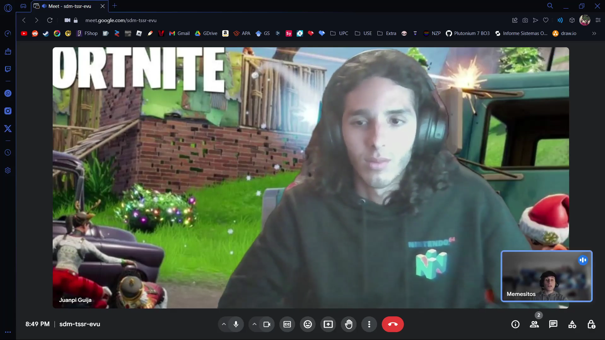

Entrevistado N°3: Mario Andre Cacho Seminario

* Sexo: Masculino  
* Edad: 21  
* Ubicación en la que vive: Surco

Acerca de la entrevista:

* Link: [https://youtu.be/pfjcuJ1VLr0](https://youtu.be/pfjcuJ1VLr0)   
* Instante en el que inicia: 0:10  
* Duración: 2:45

Resumen:

Para Mario, que utiliza su vehículo todos los días para el trabajo o actividades recreativas, encontrar estacionamiento es una necesidad frecuente. El tiempo que dedica a buscar un lugar depende de la hora del día, y actualmente no usa aplicaciones para este propósito. Valora mucho conocer la disponibilidad de estacionamiento antes de llegar y está interesado en recibir recomendaciones de rutas para ahorrar tiempo. Está dispuesto a pagar tarifas adicionales para reservar un espacio, siempre que esto le brinde mayor seguridad y proximidad, aspectos que considera cruciales. Ha experimentado frustraciones al buscar estacionamiento, como llegar tarde al trabajo debido a la falta de espacios o el tráfico. También le gustaría poder verificar la ocupación real de los estacionamientos a través de servicios que ofrecen esta función.

Captura de pantalla:


**Segmento objetivo \#2: Dueños de playas de estacionamientos**

Entrevistado N°1: Karen Aquino 

* Sexo: Femenino
* Edad:  26
* Ubicación en la que vive: La Molina

Acerca de la entrevista: 

* Link:[https://youtu.be/OEVdYvxx6_w](https://youtu.be/OEVdYvxx6_w)
* Instante en el que inicia:  00:24
* Duración: 04:34 minutos

Resumen: La entrevistada fue una mujer que trabaja en una playa de estacionamientos y que se encuentra ligada al sector de servicio al cliente. En la entrevista se hicieron las 6 preguntas principales y una complementaria. Los datos que pudimos obtener fueron que la playa de estacionamientos donde trabaja usan tickets fisicos para mantener realizar los registros, sin embargo estos se suelen perder o no llegan a ser tan especificos. Ademas qu esta abierta a la existencia de una aplicaicon web que pueda facilitar el proceso de reserva, ya que sera mas atractivo para los consumidores y podran tener unas mejores reseñas. Por ultimo, nos dio algunas opciones que nos ayudara a mejorar la idea inicial de aplicacion web, que seria agregar el poder ver la gestion de turnos del personal, registro automatico de entrada y salida de los automoviles y la opcion de tarifas flexibles dependiendo del tiempo que los consumidores se mantengan usando el servicio.

Captura de pantalla:


Entrevistado N°2: Joaquin Horacio Delgado

* Sexo: Masculino  
* Edad: 20  
* Ubicación en la que vive: La Molina

Acerca de la entrevista:

* Link: [https://youtu.be/iP7E3OMT3VQ](https://youtu.be/iP7E3OMT3VQ)   
* Instante en el que inicia: 0:08  
* Duración: 8:26

Resumen:

Para Joaquín, el proceso de gestión de su playa de estacionamiento es sencillo en general, aunque a veces la organización se le complica. Considera importante contar con información en tiempo real sobre la disponibilidad de los espacios, lo que le evitaría tener que revisar físicamente la playa, ahorrando tiempo. Utiliza aplicaciones de pago como Yape o Plin, pero no aplicaciones para la reserva de espacios. Valora mucho la oferta de opciones de pago seguras y rápidas, ya que esto agiliza el proceso de entrada y salida de los clientes. Cree que una aplicación que le ayudará a organizar mejor los datos haría más eficiente el flujo y la gestión de los espacios. Además, le gustaría una funcionalidad donde los clientes pudieran indicar el tiempo que se quedarán en el estacionamiento, permitiendo a la app calcular el costo.

Captura de pantalla:


Entrevistado N°3: Johan Bottger Salazar

* Sexo: Masculino  
* Edad: 21  
* Ubicación en la que vive: San Borja

Acerca de la entrevista:

* Link: [https://youtu.be/IXmJUVjCEaI](https://youtu.be/IXmJUVjCEaI)   
* Instante en el que inicia: 0:08  
* Duración: 4:40

Resumen:

Para Johan, el proceso de gestión de sus dos espacios de estacionamiento es sencillo debido a su baja cantidad, aunque a veces le resulta complicado organizar su tiempo. Considera importante disponer de información en tiempo real sobre la disponibilidad de los espacios para evitar revisar el estacionamiento constantemente. Usa aplicaciones de pago como Yape, pero no utiliza apps para reservas. Piensa que una automatización del proceso le ahorraría tiempo, evitaría llamadas innecesarias y mejoraría la organización de los pagos. La seguridad es un factor crucial, tanto para sus clientes como para él mismo, ya que alquila los espacios dentro del edificio en el que reside. Además, le gustaría contar con una funcionalidad que le permita ver información relevante de sus clientes, como nombre y teléfono, para garantizar una mayor seguridad.

Captura de pantalla:
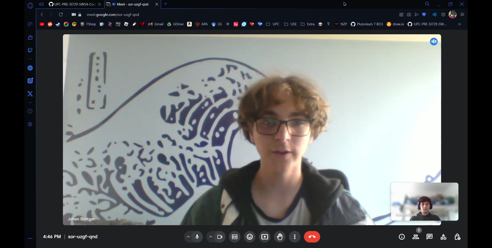

#### 2.2.3. Análisis de entrevistas
De acuerdo con la información recopilada de las entrevistas, realizamos el siguiente análisis de entrevistas:

Segmento objetivo \#1:

**Hallazgos:**

* La necesidad de estacionamiento varía: algunos lo requieren con frecuencia, mientras que otros solo ocasionalmente.  
* El tiempo dedicado a buscar estacionamiento depende de la zona.  
* No se utilizan aplicaciones para encontrar estacionamiento.  
* Es muy importante conocer la disponibilidad de estacionamiento antes de llegar.  
* Se está dispuesto a pagar tarifas adicionales para reservar un espacio, siempre y cuando estas no sean demasiado altas.  
* Factores como el costo, la proximidad y la seguridad son clave al elegir un lugar para estacionar.  
* Existen frustraciones comunes relacionadas con la búsqueda de estacionamiento, como perder un espacio o encontrar lugares inadecuados.  
* Se desea recibir recomendaciones de rutas para ahorrar tiempo y la opción de que alguien estacione el auto por uno.  
* Se valoran los avisos en tiempo real sobre la liberación de espacios cercanos y las notificaciones sobre movimientos sospechosos en el área de estacionamiento.

Segmento objetivo \#2: 

**Hallazgos:**

* La gestión de los estacionamientos es generalmente sencilla debido a la baja cantidad de espacios, pero la organización y el manejo del tiempo pueden ser complicados.  
* Es importante contar con información en tiempo real sobre la disponibilidad de los espacios para evitar revisiones constantes del estacionamiento.  
* Se utilizan aplicaciones de pago como Yape, pero no se emplean aplicaciones para la reserva de espacios.  
* La automatización del proceso se ve como una solución clave para ahorrar tiempo, evitar llamadas innecesarias y mejorar la organización de pagos.  
* La seguridad es crucial tanto para los clientes como para los dueños, especialmente cuando los espacios se encuentran en áreas residenciales.  
* Se valora la posibilidad de acceder a información importante de los clientes (como nombre y teléfono) para garantizar mayor seguridad.

**Conclusiones de ambos segmentos:**

Los resultados del segmento 1 indican que, aunque las necesidades de estacionamiento varían en frecuencia, hay un consenso en la importancia de conocer la disponibilidad de espacios antes de llegar. La disposición a pagar tarifas adicionales es alta, siempre que estas sean razonables. Los factores de costo, proximidad y seguridad son cruciales al elegir un lugar para estacionar. Existen frustraciones comunes con la búsqueda de estacionamiento, y se valora la tecnología para mejorar la experiencia, como recibir avisos en tiempo real y recomendaciones de rutas. La opción de asistencia para estacionar también es deseada. Por otro lado, en el segmento 2, los dueños de playas de estacionamiento encuentran la gestión de pocos espacios generalmente sencilla, aunque la organización y el manejo del tiempo pueden ser desafiantes. Consideran clave contar con información en tiempo real para evitar revisiones constantes y valoran la automatización como una herramienta para ahorrar tiempo y mejorar la eficiencia en pagos. La seguridad, tanto para clientes como para ellos mismos, es esencial, especialmente en áreas residenciales, y ven útil acceder a datos relevantes de los usuarios para aumentar esa seguridad

**Entrevista completa:**

Link de las entrevistas completas: [ParkingNow \- Entrevistas Final.mp4](https://upcedupe-my.sharepoint.com/:v:/g/personal/u202223990_upc_edu_pe/EbIvmu-9HRFItJu_A2zbRx0BPfLCx2uRJnBarh-nlbO95A?nav=eyJyZWZlcnJhbEluZm8iOnsicmVmZXJyYWxBcHAiOiJTdHJlYW1XZWJBcHAiLCJyZWZlcnJhbFZpZXciOiJTaGFyZURpYWxvZy1MaW5rIiwicmVmZXJyYWxBcHBQbGF0Zm9ybSI6IldlYiIsInJlZmVycmFsTW9kZSI6InZpZXcifX0%3D&e=jlmpb3)

**Análisis por medio de herramientas estadísticas:**

Segmento objetivo 1: [https://forms.gle/Lo3Z69GnkyYDcaAYA](https://forms.gle/Lo3Z69GnkyYDcaAYA) 


Segmento objetivo 2: [https://forms.gle/pCNNRar5TBzSPoX38](https://forms.gle/pCNNRar5TBzSPoX38) 


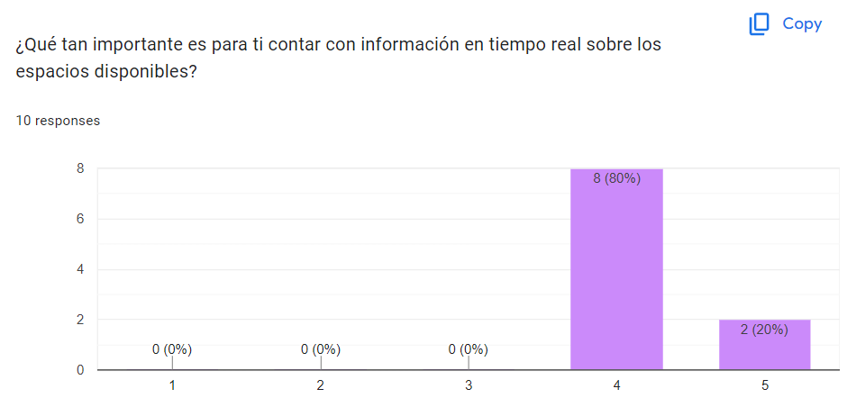


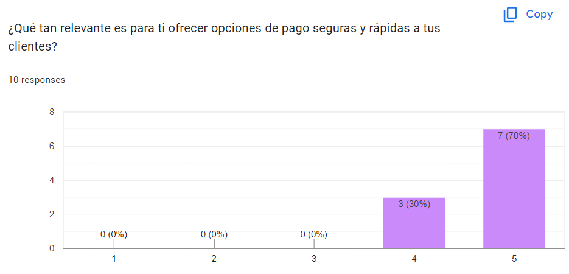


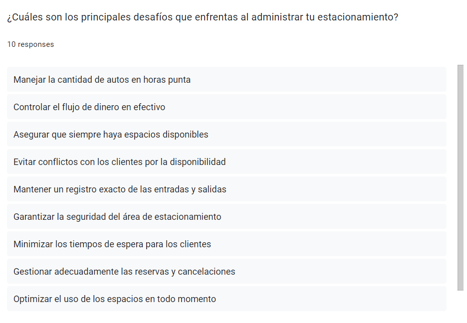


### 2.3. Needfinding
En esta sección se presentarán los artefactos generados a partir del proceso de recopilación llevado a cabo en los segmentos objetivos. Este proceso culmina con la creación de los User Personas, la User Task Matrix, los user Journey Maps, el Empathy Mapping, el As-Is Scenario Mapping y el ubiquitous language.

#### 2.3.1. User Personas

En esta sección del documento se presentan perfiles ficticios que representan a los grupos de interés identificados durante las entrevistas. La información recopilada incluye datos demográficos, características de personalidad, motivaciones, preferencias, metas, desafíos y comportamientos comunes. Estos datos se basan en las entrevistas realizadas anteriormente. Para facilitar la creación de estos perfiles, se han utilizado herramientas de UXPressia.

###### User Persona para Conductores Urbanos

La "User Persona" de Anna Pacheco representa a los conductores urbanos que requieren estacionamientos rápidos y eficientes cerca de sus destinos. Anna es una organizadora de eventos de 29 años, motivada por la comodidad y la eficiencia en sus traslados. Siente frustración por la escasez de espacios de estacionamiento y busca soluciones que sean prácticas y transparentes.


###### User Person para Dueños de playa de estacionamientos

La "User Persona" de Luis Córdova representa a los dueños  de playas de estacionamiento que desean optimizar la gestión y aumentar sus ingresos. Luis, de 26 años, es dueño de una playa de estacionamiento y emplea tecnología para maximizar la ocupación y disminuir los tiempos de espera. Sus objetivos incluyen fidelizar a los clientes y expandir su negocio, aunque se enfrenta a desafíos como problemas tecnológicos y altos costos operativos.


## 2.3.2. User Task Matrix

En el User Task Matrix, hemos identificado las principales actividades realizadas por nuestros dos segmentos y evaluado la relevancia de cada tarea según el segmento correspondiente.

### Indicadores de Importancia:
- ALTA
- MEDIA
- BAJA

### Indicadores de Frecuencia:
- ALTA
- MEDIA
- BAJA

| **Segmento Objetivo**          | **Tarea**                                                | **Frecuencia** | **Importancia** |
|--------------------------------|--------------------------------------------------------|----------------|-----------------|
| Conductores Urbanos Frecuentes | Buscar estacionamientos disponibles                     | Media          | Alta            |
| Conductores Urbanos Frecuentes | Comparar precios de estacionamientos                    | Alta           | Media           |
| Conductores Urbanos Frecuentes | Reservar estacionamientos con anticipación              | Media          | Alta            |
| Conductores Urbanos Frecuentes | Pagar por estacionamiento a través de la aplicación     | Alta           | Alta            |
| Conductores Urbanos Frecuentes | Recibir direcciones al estacionamiento reservado        | Alta           | Alta            |
| Conductores Urbanos Frecuentes | Filtrar estacionamientos por criterios (precio, seguridad, etc.) | Alta | Alta |
| Conductores Urbanos Frecuentes | Recibir notificaciones sobre descuentos y ofertas       | Media          | Baja            |
| Conductores Urbanos Frecuentes | Verificar disponibilidad de estacionamiento en tiempo real | Alta       | Alta            |
| Conductores Urbanos Frecuentes | Consultar historial de estacionamientos utilizados      | Media          | Baja            |
| Dueños de Playa de Estacionamientos | Administrar y actualizar la disponibilidad de espacios | Alta | Alta     |
| Dueños de Playa de Estacionamientos | Ajustar precios de los espacios de estacionamiento   | Media          | Alta            |
| Dueños de Playa de Estacionamientos | Gestionar reservas de estacionamientos              | Alta           | Alta            |
| Dueños de Playa de Estacionamientos | Procesar pagos de estacionamiento a través de la aplicación | Alta | Media |
| Dueños de Playa de Estacionamientos | Revisar y ajustar las características del estacionamiento (precio, seguridad, etc.) | Media | Alta |
| Dueños de Playa de Estacionamientos | Revisar reportes de uso y disponibilidad             | Media          | Media           |
| Dueños de Playa de Estacionamientos | Recibir y gestionar comentarios y valoraciones de los usuarios | Baja | Media |
| Dueños de Playa de Estacionamientos | Promocionar descuentos y ofertas especiales          | Media          | Media           |
| Dueños de Playa de Estacionamientos | Consultar el historial de transacciones y reservas   | Baja           | Media           |

El User Task Matrix nos permite analizar las tareas más frecuentes e importantes para cada segmento y utilizar esta información como referencia para tomar decisiones estratégicas.

#### Conductores Urbanos Frecuentes:
Para los usuarios, las tareas más recurrentes son:
- Realizar el pago del estacionamiento a través de la aplicación.
- Obtener las direcciones hacia el estacionamiento reservado.
- Filtrar estacionamientos según criterios específicos (precio, seguridad, etc.).
- Comprobar la disponibilidad de estacionamientos en tiempo real.

Estas tareas son esenciales para mejorar la experiencia del usuario en el proceso de búsqueda y utilización de estacionamientos.

En cuanto a la importancia, las tareas más relevantes para los usuarios son:
- Pagar el estacionamiento a través de la aplicación.
- Recibir indicaciones para llegar al estacionamiento reservado.
- Filtrar los estacionamientos en base a criterios como precio y seguridad.
- Consultar la disponibilidad en tiempo real.

Estas actividades son clave porque garantizan una experiencia de estacionamiento ágil y satisfactoria, abarcando todo el proceso, desde la búsqueda hasta el pago.

#### Dueños de playas  de Estacionamientos:
Para los dueños de playas de estacionamientos, las actividades que se realizan con mayor frecuencia son:

- Gestionar y actualizar la disponibilidad de espacios.
- Administrar las reservas de estacionamientos.
- Procesar pagos de estacionamiento a través de la aplicación.
- Revisar y ajustar las características del estacionamiento, como el precio y la seguridad.

Estas tareas son fundamentales para asegurar una gestión eficiente de los espacios y garantizar una buena experiencia para los clientes.

En términos de importancia, las tareas más cruciales para los propietarios son:
- Gestionar y actualizar la disponibilidad de espacios.
- Ajustar las tarifas de los espacios de estacionamiento.
- Revisar reportes de uso y disponibilidad.
- Modificar las características del estacionamiento, como el precio y la seguridad.

Estas actividades permiten optimizar la administración de los espacios y responder eficazmente a las necesidades del mercado.

#### Diferencias:
Al comparar ambos segmentos, se observa que los conductores están más enfocados en la conveniencia y eficiencia del proceso de estacionamiento, mientras que los propietarios de estacionamientos se centran en la gestión y maximización de la ocupación de sus espacios. Aunque tienen enfoques diferentes, ambos segmentos requieren un sistema que facilite la disponibilidad y la gestión de los espacios, y que mejore la experiencia general del estacionamiento.

## 2.3.3. User Journey Mapping
En esta sección, hemos desarrollado los mapas de recorrido del usuario para ambos tipos de usuarios: clientes y dueños de playas de estacionamientos. Desde la perspectiva del cliente, el proceso comienza con la búsqueda de un espacio de estacionamiento, seguido por la selección y reserva del espacio, el pago a través de la aplicación, y la obtención de las indicaciones hacia el lugar reservado. Finalmente, el cliente llega al espacio y lo utiliza. Este recorrido revela las metas, desafíos, oportunidades y pasos clave en la experiencia del usuario. Por otro lado, desde el punto de vista del propietario del estacionamiento, el enfoque está en gestionar la disponibilidad de espacios, ajustar precios, procesar las reservas y asegurar que los pagos y el uso del espacio se realicen de forma fluida. El objetivo final es ofrecer una experiencia positiva que incentive a los clientes a recomendar el espacio y que vean al propietario como una opción confiable para futuras reservas.

###### User Journey Mapping para Conductores Urbanos
Este "User Journey Mapping" describe las etapas que un conductor urbano atraviesa al utilizar una aplicación de estacionamiento, desde el descubrimiento de la app hasta la evaluación de su experiencia. Identifica puntos de contacto clave (como aplicaciones y GPS), posibles dificultades (como opciones confusas), y oportunidades para mejorar la usabilidad y la información dentro de la aplicación.


###### User Journey Mapping para Dueños de Playa de Estacionamientos

Este "User Journey Mapping" para dueños de playas de estacionamiento describe las diferentes etapas que atraviesan al utilizar una aplicación de gestión, desde la búsqueda de la herramienta adecuada y su configuración, hasta la instalación y el seguimiento para optimizar el funcionamiento. Se destacan los desafíos en la selección de la aplicación y la comprensión de sus funcionalidades, con oportunidades para mejorar la personalización, la facilidad de uso y el soporte técnico.


#### 2.3.4. Empathy Mapping

A continuación se pueden apreciar los Empathy Mapping de los segmentos objetivos.

### Segmento objetivo: Conductores Urbanos Frecuentes

Este "Empathy Map" refleja a conductores urbanos habituales que tienen dificultades para localizar estacionamientos. Muestra su frustración debido a la escasez de opciones disponibles y su necesidad de contar con herramientas que les ofrezcan información actualizada en tiempo real sobre espacios seguros y accesibles.


### Segmento objetivo: Dueños de playas de estacionamientos

El "Empathy Map" para Dueños de Playas de Estacionamientos señala sus necesidades y preocupaciones al administrar sus espacios de estacionamiento, resaltando oportunidades para optimizar la gestión y mejorar la experiencia de los clientes con PARKINGNOW.


#### 2.3.5. As-is Scenario Mapping

El As-Is ofrece un análisis visual de los escenarios actuales, ayudando a identificar oportunidades de mejora en la experiencia del usuario.

### Segmento Conductores Urbanos Frecuentes

El "As-is Scenario Mapping" para Conductores Urbanos Frecuentes pone en evidencia los desafíos y áreas de mejora en la experiencia de estacionamiento, lo que permite optimizar las soluciones que ofrece PARKINGNOW.


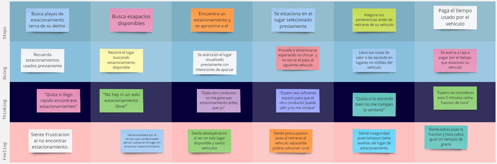 

### Segmento Dueños de Playas de Estacionamientos

El "As-is Scenario Mapping" para Dueños de Playas de Estacionamientos identifica sus desafíos y necesidades, abarcando desde la preparación del espacio hasta la gestión post-servicio. Esto contribuye a mejorar la eficiencia y la satisfacción en la gestión de sus estacionamientos con PARKINGNOW.


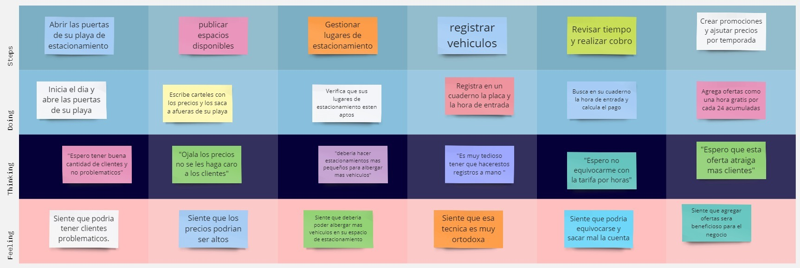
### 2.4. Ubiquitous Language

**Espacio de Estacionamiento:** Un lugar designado dentro de un estacionamiento donde los vehículos pueden ser aparcados.

**Reserva:** El acto de apartar un espacio de estacionamiento por un tiempo específico, garantizando que estará disponible cuando el usuario lo necesite.

**Disponibilidad en Tiempo Real:** Información instantánea y actualizada sobre los espacios de estacionamiento ocupados y libres.

**Geolocalización:** Utilización de tecnologías de ubicación para determinar la posición del usuario y mostrarle las opciones de estacionamiento cercanas.

**Mapa Interactivo:** Mapa digital integrado en la aplicación que visualiza en tiempo real los estacionamientos disponibles cercanos.

**Tarifas por Hora:** El costo calculado por el uso de un espacio de estacionamiento, basado en el tiempo medido en horas.

**Pago en Línea:** Proceso de completar el pago de una reserva utilizando métodos de pago digitales, tales como tarjetas de crédito, débito o billeteras electrónicas.

**Historial de Reservas:** Registro de las reservas anteriores del usuario, incluyendo detalles como fecha, hora, ubicación y monto pagado.

**Notificaciones en Tiempo Real:** Mensajes enviados al usuario para informarle sobre cambios en la disponibilidad de espacios, confirmaciones de reserva o alertas de vencimiento de tiempo de estacionamiento.

**Usuario:** Persona que usa la aplicación para buscar, reservar y pagar por espacios de estacionamiento.

**Propietario de Estacionamiento:** Persona o entidad que posee y gestiona un estacionamiento, y que ofrece espacios disponibles para reservas a través de la aplicación.

**Administrador del Sistema:** Encargado de supervisar y mantener el funcionamiento de la aplicación, gestionando la disponibilidad de los espacios, los usuarios y los datos.

**Check-in:** Proceso de registrar la llegada del usuario al espacio de estacionamiento reservado, iniciando el tiempo de uso.

**Check-out:** Proceso de registrar la salida del espacio de estacionamiento, finalizando el tiempo de uso y actualizando la disponibilidad.

**Zona de Estacionamiento:** Área geográfica que contiene múltiples espacios de estacionamiento, gestionada a través de la aplicación.

**Tiempo de Gracia:** Breve periodo permitido antes o después de la reserva, en el cual el usuario puede llegar sin incurrir en cargos adicionales.

**Multa por Exceso de Tiempo:** Cargo adicional aplicado si el usuario sobrepasa el tiempo reservado para el estacionamiento.

**Sistema de Validación:** Mecanismo para confirmar que un vehículo tiene una reserva válida para un espacio de estacionamiento determinado.

**Interfaz de Usuario (UI):** Elementos visuales de la aplicación con los que los usuarios interactúan para realizar reservas, pagos y recibir notificaciones.

**Backend:** Infraestructura tecnológica que gestiona y almacena los datos de la aplicación, tales como la disponibilidad de espacios y la información de los usuarios.

## Capítulo III: Requirements Specification

### 3.1. To-Be Scenario Mapping
**To Be Scenario Mapping para Conductores Urbanos Frecuentes**


Se enfoca en mejorar la experiencia para los conductores, desde encontrar un lugar de estacionamiento hasta completar el pago y ofrecer comentarios. Cada fase del proceso del usuario está diseñada para optimizar el uso de los espacios y aumentar la comodidad del cliente.

<p align="center">
  
</p>

**To Be Scenario Mapping para Dueños de Playas de Estacionamientos**

Centrado en la administración y uso eficiente de recursos, este mapeo destaca las funciones esenciales para los dueños de playas de estacionamientos, como el control de reservas, el análisis de métricas y la maximización de ingresos, promoviendo una gestión más rentable y eficaz.

<p align="center">
  
</p>

### 3.2. User Stories

## EPICS

Las epics establecidas para el proyecto PARKINGNOW están orientadas a cubrir las principales necesidades tanto de los usuarios como del equipo de desarrollo. Estas epics engloban funcionalidades fundamentales para la plataforma de gestión de estacionamientos en tiempo real, garantizando una interacción fluida para visitantes y desarrolladores. Desde la experiencia del usuario en el landing page hasta la administración técnica del backend, frontend y los servicios web, las epics ofrecen una hoja de ruta clara para el desarrollo de las funcionalidades clave, asegurando una implementación exitosa y alineada con los objetivos del proyecto.

 **Epic / Story ID** | **Título**                                    | **Descripción**                                                                                                                                                             |
|---------------------|-----------------------------------------------|-----------------------------------------------------------------------------------------------------------------------------------------------------------------------------|
| **EP01**            | Navegación en Landing Page                    | **Como** visitante de PARKINGNOW, **deseo** poder navegar de forma intuitiva por la landing page **para** acceder rápidamente a información importante y funciones clave. |
| **EP02**            | Autenticación y Registro de Usuarios          | **Como** visitante, **deseo** registrarme e iniciar sesión utilizando correo electrónico o redes sociales **para** acceder de manera conveniente y segura. |
| **EP03**            | Recuperación de Contraseña                    | **Como** visitante, **deseo** recuperar mi contraseña fácilmente **para** poder acceder a mi cuenta en caso de olvido. |
| **EP04**            | Visualización de Servicios y Beneficios       | **Como** visitante, **deseo** conocer los servicios y beneficios de PARKINGNOW desde la landing page **para** entender cómo la plataforma puede ayudarme. |
| **EP05**            | Soporte y FAQ                                 | **Como** visitante, **deseo** acceder a una sección de soporte y preguntas frecuentes **para** resolver mis dudas de manera rápida y autónoma. |
| **EP06**            | Conexión con Redes Sociales                   | **Como** visitante, **deseo** conectar mi cuenta de PARKINGNOW con mis redes sociales **para** compartir mi experiencia y obtener beneficios adicionales. |
| **EP07**            | Búsqueda de Estacionamientos                  | **Como** visitante, **deseo** buscar estacionamientos y ver la disponibilidad en tiempo real **para** elegir el mejor lugar antes de dirigirme. |
| **EP08**            | Disponibilidad en Tiempo Real                 | **Como** visitante, **deseo** visualizar la disponibilidad de los estacionamientos actualizada automáticamente **para** evitar reservas en espacios ocupados. |
| **EP09**            | Gestión de Reservas                           | **Como** visitante, **deseo** poder realizar, modificar y cancelar mis reservas de estacionamiento **para** ajustar mis planes con flexibilidad. |
| **EP10**            | Gestión de Perfil de Usuario                  | **Como** visitante, **deseo** actualizar y gestionar mi perfil de usuario **para** mantener mi información y preferencias personalizadas. |
| **EP11**            | Notificaciones en Tiempo Real                 | **Como** visitante, **deseo** recibir notificaciones sobre eventos importantes y mis reservas **para** estar informado de manera oportuna. |
| **EP12**            | Integración con Mapas                         | **Como** visitante, **deseo** ver rutas y ubicaciones de estacionamientos mediante integración con mapas **para** optimizar mi tiempo y desplazamiento. |
| **EP13**            | Funcionalidad de Favoritos                    | **Como** visitante, **deseo** marcar estacionamientos como favoritos **para** acceder rápidamente a los lugares que uso frecuentemente. |
| **EP14**            | Opiniones y Calificaciones                    | **Como** visitante, **deseo** dejar y leer opiniones de otros usuarios sobre los estacionamientos **para** tomar decisiones informadas. |
| **EP15**            | Seguridad y Privacidad de Datos               | **Como** visitante, **deseo** que mis datos personales y de pago estén protegidos con altos estándares de seguridad **para** sentirme seguro usando la app. |
| **EP16**            | Optimización de Backend                       | **Como** developer, **deseo** mejorar la eficiencia del backend para consultas y búsquedas **para** reducir los tiempos de espera y mejorar el rendimiento. |
| **EP17**            | Gestión de Promociones y Beneficios           | **Como** visitante, **deseo** acceder a promociones y beneficios personalizados **para** maximizar mis ahorros y recompensas. |
| **EP18**            | Administración de Reservas en Backend         | **Como** developer, **deseo** gestionar las reservas en el backend **para** asegurar que los datos de reserva sean consistentes y actualizados en la plataforma. |
| **EP19**            | Gestión de Pagos y Transacciones              | **Como** visitante, **deseo** realizar pagos seguros y gestionar mis transacciones en la app **para** completar el proceso de reserva de manera confiable. |


---

### User Stories 
Las historias de usuario del proyecto PARKINGNOW están enfocadas en optimizar la experiencia del usuario final y simplificar las tareas del equipo de desarrollo. Estas historias abarcan diversos componentes de la plataforma, como la landing page, la integración y optimización del backend, el diseño de interfaces de usuario eficaces en el frontend, y la implementación de servicios robustos a través de web services. Cada historia está formulada para ser clara y aplicable, con criterios de aceptación bien definidos que guían el proceso de desarrollo y aseguran que las funcionalidades implementadas cumplan con los requisitos del negocio y las expectativas del usuario final.

| **Epic / Story ID** | **Título**                                    | **Descripción**                                                                                                                                                             | **Criterios de Aceptación**                                                                                                                | **Relacionado con (Epic ID)** |
|---------------------|-----------------------------------------------|-----------------------------------------------------------------------------------------------------------------------------------------------------------------------------|--------------------------------------------------------------------------------------------------------------------------------------------------------------------------------|------------------------------|
| **US01**            | Navegación Intuitiva en la Landing Page       | **Como** visitante de PARKINGNOW, **deseo** que la landing page tenga una barra de navegación clara y accesible **para** encontrar fácilmente las secciones importantes. | **Escenario 01**: **Given** que estoy en la landing page, **When** hago clic en el menú de navegación, **Then** debería ver opciones claras como "Inicio", "Características", "Reservar Espacio" y "Contáctenos". <br> **Escenario 02**: **Given** que navego por la página, **When** paso el mouse por los elementos del menú, **Then** deberían resaltarse para indicar que son interactivos. | **EP01**                      |
| **US02**            | Visualización de Ciudades con Servicio        | **Como** visitante, **deseo** ver en la landing page las ciudades donde PARKINGNOW está disponible **para** saber si puedo utilizar el servicio en mi ubicación. | **Escenario 01**: **Given** que estoy en la landing page, **When** desplazo hacia la sección de ciudades, **Then** debería ver información sobre las ciudades como Lima, Arequipa y Cusco. <br> **Escenario 02**: **Given** que selecciono una ciudad, **When** hago clic en la información de la ciudad, **Then** debería ver detalles adicionales de esa ubicación. | **EP04**                      |
| **US03**            | Promociones Destacadas                        | **Como** visitante, **deseo** ver promociones destacadas en la landing page **para** aprovechar descuentos y beneficios en las ciudades disponibles. | **Escenario 01**: **Given** que estoy en la landing page, **When** desplazo hacia la sección de promociones, **Then** debería ver promociones específicas como "Promoción en Lima" y "Promoción en Cusco". <br> **Escenario 02**: **Given** que hago clic en una promoción, **When** selecciono una promoción específica, **Then** debería llevarme a una página de detalles de la promoción. | **EP05**                      |
| **US04**            | Beneficios para Conductores y Dueños de Playas| **Como** visitante, **deseo** ver una sección en la landing page que me explique los beneficios de usar PARKINGNOW **para** entender las ventajas que ofrece. | **Escenario 01**: **Given** que estoy en la landing page, **When** desplazo hacia la sección de beneficios, **Then** debería ver información sobre beneficios para conductores y dueños de playas de estacionamiento. <br> **Escenario 02**: **Given** que quiero más detalles, **When** hago clic en un beneficio específico, **Then** debería expandirse con más información. | **EP04**                      |
| **US05**            | Visualización de Misión de la Empresa         | **Como** visitante, **deseo** ver la misión de PARKINGNOW en la landing page **para** entender los objetivos de la empresa. | **Escenario 01**: **Given** que estoy en la landing page, **When** desplazo hacia la sección de "Misión", **Then** debería ver una breve descripción de la misión de la empresa. <br> **Escenario 02**: **Given** que estoy en la sección de misión, **When** hago clic en "Leer más", **Then** debería abrirse una ventana con información detallada sobre la misión. | **EP06**                      |
| **US06**            | Visualización de Visión de la Empresa         | **Como** visitante, **deseo** ver la visión de PARKINGNOW en la landing page **para** conocer sus metas futuras y crecimiento. | **Escenario 01**: **Given** que estoy en la landing page, **When** desplazo hacia la sección de "Visión", **Then** debería ver una breve descripción de la visión de la empresa. <br> **Escenario 02**: **Given** que quiero conocer más detalles, **When** hago clic en "Leer más" en la sección de visión, **Then** debería ver una descripción completa de los objetivos futuros. | **EP06**                      |
| **US07**            | Visualización del Equipo                      | **Como** visitante, **deseo** ver una sección que muestre a los miembros del equipo de PARKINGNOW **para** conocer quiénes están detrás del proyecto. | **Escenario 01**: **Given** que estoy en la landing page, **When** desplazo hacia la sección "Our Team", **Then** debería ver fotos y descripciones de cada miembro del equipo. <br> **Escenario 02**: **Given** que estoy en la sección del equipo, **When** hago clic en la imagen de un miembro, **Then** debería ver información detallada sobre sus roles y experiencia. | **EP04**                      |
| **US08**            | Información de Contacto                       | **Como** visitante, **deseo** ver una sección de contacto en la landing page **para** saber cómo comunicarme con PARKINGNOW si tengo preguntas o comentarios. | **Escenario 01**: **Given** que estoy en la landing page, **When** desplazo hacia la sección "Contact Us", **Then** debería ver un formulario para ingresar nombre, correo electrónico y mensaje. <br> **Escenario 02**: **Given** que estoy en la sección de contacto, **When** hago clic en "Enviar Mensaje" sin llenar todos los campos, **Then** debería ver un mensaje de error indicando que todos los campos son obligatorios. | **EP07**                      |
| **US09**            | Envío de Mensaje de Contacto                  | **Como** visitante, **deseo** poder enviar un mensaje a PARKINGNOW desde la landing page **para** hacer preguntas o dar feedback. | **Escenario 01**: **Given** que estoy en la sección de contacto, **When** ingreso mi nombre, correo y mensaje y hago clic en "Enviar Mensaje", **Then** debería ver una confirmación de que el mensaje fue enviado exitosamente. <br> **Escenario 02**: **Given** que he enviado un mensaje, **When** el envío es exitoso, **Then** debería recibir un correo de confirmación indicando que PARKINGNOW ha recibido mi mensaje. | **EP07**                      |
| **US10**            | Visualización de Información de Características | **Como** visitante, **deseo** ver las características de PARKINGNOW en la landing page **para** entender qué ofrece el servicio. | **Escenario 01**: **Given** que estoy en la landing page, **When** desplazo hacia la sección de características, **Then** debería ver una descripción de las características principales de PARKINGNOW. <br> **Escenario 02**: **Given** que quiero conocer más detalles, **When** hago clic en una característica específica, **Then** debería abrirse una ventana emergente con información adicional. | **EP04**                      |
| **US11**            | Botón de Registro e Inicio de Sesión          | **Como** visitante, **deseo** ver botones destacados de "Registrarse" e "Iniciar Sesión" en la landing page **para** acceder a la plataforma o crear una cuenta fácilmente. | **Escenario 01**: **Given** que estoy en la landing page, **When** veo la sección superior de la página, **Then** deberían estar visibles los botones de "Iniciar Sesión" y "Registrarse". <br> **Escenario 02**: **Given** que hago clic en "Iniciar Sesión", **When** no tengo una cuenta creada, **Then** debería ver una opción para registrarme rápidamente. | **EP02**                      |
| **US12**            | Enlace a Redes Sociales                       | **Como** visitante, **deseo** ver enlaces a las redes sociales de PARKINGNOW en la landing page **para** seguir sus novedades y actualizaciones. | **Escenario 01**: **Given** que estoy en la landing page, **When** desplazo hacia el pie de página, **Then** debería ver íconos de redes sociales que me lleven a las cuentas oficiales de PARKINGNOW. <br> **Escenario 02**: **Given** que hago clic en un ícono de redes sociales, **When** selecciono Facebook, **Then** debería redirigirme a la página oficial de PARKINGNOW en Facebook. | **EP06**                      |
| **US13**            | Visualización de Slogan                       | **Como** visitante, **deseo** ver un slogan atractivo en la landing page de PARKINGNOW **para** entender de inmediato la propuesta del servicio. | **Escenario 01**: **Given** que estoy en la landing page, **When** veo la sección principal, **Then** debería encontrar un slogan o mensaje atractivo que me introduzca al servicio. <br> **Escenario 02**: **Given** que el slogan aparece en la sección principal, **When** paso a otra sección y vuelvo a la principal, **Then** el slogan debería mantenerse visible. | **EP04**                      |
| **US14**            | Acceso a Información Legal                    | **Como** visitante, **deseo** ver enlaces a la información legal y políticas de privacidad en la landing page **para** revisar los términos de uso y la protección de mis datos. | **Escenario 01**: **Given** que estoy en la landing page, **When** desplazo hacia el pie de página, **Then** debería ver enlaces a las políticas de privacidad y términos de servicio. <br> **Escenario 02**: **Given** que hago clic en el enlace de política de privacidad, **When** se abre el documento, **Then** debería ver la información completa de privacidad en una nueva página o ventana. | **EP13**                      |
| **US15**            | Inicio de Sesión para Conductores             | **Como** developer de Web Application de PARKINGNOW, **necesito** implementar la funcionalidad de inicio de sesión para conductores **para** que puedan acceder a sus cuentas de manera segura. | **Escenario 01**: **Given** que el conductor ingresa su correo y contraseña, **When** hace clic en "Iniciar sesión", **Then** debe acceder a su dashboard de conductor si las credenciales son correctas. <br> **Escenario 02**: **Given** que el conductor ingresa credenciales incorrectas, **When** intenta iniciar sesión, **Then** debe mostrarse un mensaje de error indicando que las credenciales son inválidas. | **EP11**                      |
| **US16**            | Registro de Conductores                       | **Como** developer de Web Application de PARKINGNOW, **necesito** implementar el registro de conductores **para** que puedan crear una cuenta en la plataforma. | **Escenario 01**: **Given** que un nuevo usuario quiere registrarse, **When** ingresa los datos necesarios y hace clic en "Registrarse", **Then** debe recibir un mensaje de confirmación de cuenta creada. <br> **Escenario 02**: **Given** que el usuario intenta registrarse sin llenar los campos requeridos, **When** intenta completar el registro, **Then** debe mostrarse un mensaje de error solicitando los datos faltantes. | **EP02**                      |
| **US17**            | Registro de Dueños de Playa                   | **Como** developer de Web Application de PARKINGNOW, **necesito** implementar el registro de dueños de playa **para** que puedan crear una cuenta y gestionar su estacionamiento. | **Escenario 01**: **Given** que un dueño de playa quiere registrarse, **When** llena el formulario de registro y hace clic en "Registrarse", **Then** debe recibir un mensaje de confirmación de cuenta creada. <br> **Escenario 02**: **Given** que el formulario no está completo, **When** intenta registrarse, **Then** debe mostrarse un mensaje de error indicando los campos faltantes. | **EP02**                      |
| **US18**            | Búsqueda de Reservas para Conductores         | **Como** developer de Web Application de PARKINGNOW, **necesito** implementar la búsqueda de reservas **para** que los conductores puedan ver sus reservas activas y pasadas. | **Escenario 01**: **Given** que el conductor quiere ver sus reservas, **When** ingresa al menú de reservas, **Then** debe ver una lista de todas sus reservas activas y completadas. <br> **Escenario 02**: **Given** que el conductor busca una reserva específica, **When** ingresa un criterio de búsqueda, **Then** debe mostrarse la reserva correspondiente si existe. | **EP04**                      |
| **US19**            | Pago de Reservas por Transacción              | **Como** developer de Web Application de PARKINGNOW, **necesito** implementar el pago por transacción **para** que los conductores puedan completar sus reservas. | **Escenario 01**: **Given** que el conductor realiza una reserva, **When** selecciona "Pagar", **Then** debe ser dirigido a la pasarela de pago para completar la transacción. <br> **Escenario 02**: **Given** que el pago es exitoso, **When** se procesa el pago, **Then** debe recibir una confirmación de reserva y recibo de pago. | **EP12**                      |
| **US20**            | Confirmación de Reserva Registrada            | **Como** developer de Web Application de PARKINGNOW, **necesito** que se muestre una pantalla de confirmación **para** asegurar que el usuario sepa que su reserva fue registrada correctamente. | **Escenario 01**: **Given** que el usuario completa una reserva, **When** el sistema confirma la transacción, **Then** debe ver una pantalla indicando que su reserva fue registrada con éxito. <br> **Escenario 02**: **Given** que el sistema no puede confirmar la reserva, **When** se produce un error en el pago, **Then** debe mostrarse un mensaje solicitando un nuevo intento de pago. | **EP12**                      |
| **US21**            | Registro de Opiniones                         | **Como** developer de Web Application de PARKINGNOW, **necesito** implementar una funcionalidad para registrar opiniones **para** que los usuarios puedan dar retroalimentación sobre sus experiencias. | **Escenario 01**: **Given** que el usuario quiere dejar una opinión, **When** completa el formulario de opinión y hace clic en "Enviar", **Then** debe ver un mensaje de confirmación de que su opinión fue enviada. <br> **Escenario 02**: **Given** que el usuario intenta enviar una opinión sin completar los campos requeridos, **When** hace clic en "Enviar", **Then** debe recibir un mensaje indicando que los campos son obligatorios. | **EP11**                      |
| **US22**            | Notificaciones en el Dashboard del Conductor  | **Como** developer de Web Application de PARKINGNOW, **necesito** implementar notificaciones en el dashboard del conductor **para** que reciban alertas relevantes como ofertas o recordatorios de reservas. | **Escenario 01**: **Given** que el conductor ingresa a su dashboard, **When** hay notificaciones pendientes, **Then** debe ver un ícono indicando nuevas notificaciones. <br> **Escenario 02**: **Given** que el conductor visualiza una notificación, **When** hace clic en ella, **Then** debe acceder a detalles adicionales o redirigirse a la página correspondiente. | **EP09**                      |
| **US23**            | Configuración de Preferencias de Usuario      | **Como** developer de Web Application de PARKINGNOW, **necesito** implementar la configuración de preferencias **para** que los usuarios puedan personalizar su experiencia en la plataforma. | **Escenario 01**: **Given** que el usuario quiere modificar sus preferencias, **When** accede a "Configuración" y guarda los cambios, **Then** su perfil debe actualizarse con las nuevas preferencias. <br> **Escenario 02**: **Given** que el usuario cambia sus preferencias de notificación, **When** guarda la configuración, **Then** debe recibir notificaciones de acuerdo con sus preferencias. | **EP08**                      |
| **US24**            | Historial de Reservas en el Dashboard del Conductor | **Como** developer de Web Application de PARKINGNOW, **necesito** implementar el historial de reservas **para** que los conductores puedan consultar sus reservas pasadas. | **Escenario 01**: **Given** que el conductor quiere revisar su historial, **When** accede a la sección de historial de reservas, **Then** debe ver una lista de todas sus reservas previas. <br> **Escenario 02**: **Given** que el conductor busca una reserva específica en el historial, **When** ingresa una fecha o nombre de estacionamiento, **Then** debería encontrar la reserva correspondiente. | **EP04**                      |
| **US25**            | Alerta de Espacio Disponible                  | **Como** developer de Web Application de PARKINGNOW, **necesito** implementar alertas de disponibilidad de espacios **para** notificar a los conductores cuando un espacio de interés esté disponible. | **Escenario 01**: **Given** que el conductor marca un estacionamiento como favorito, **When** un espacio en ese estacionamiento se desocupa, **Then** debería recibir una notificación en su dashboard. <br> **Escenario 02**: **Given** que el conductor recibe una alerta de disponibilidad, **When** hace clic en la notificación, **Then** debería ser redirigido a la página de reserva para ese espacio. | **EP09**                      |
| **US26**            | Soporte en Tiempo Real en el Dashboard del Conductor | **Como** developer de Web Application de PARKINGNOW, **necesito** implementar un sistema de soporte en tiempo real **para** que los conductores puedan resolver dudas o problemas rápidamente. | **Escenario 01**: **Given** que el conductor necesita ayuda, **When** accede a la sección de soporte en el dashboard, **Then** debería ver opciones de contacto o un chat en tiempo real. <br> **Escenario 02**: **Given** que el conductor inicia una consulta de soporte, **When** envía su mensaje, **Then** debería recibir una respuesta o ver un mensaje de confirmación de recibido. | **EP07**                      |
| **US27**            | Favoritos para Conductores                    | **Como** developer de Web Application de PARKINGNOW, **necesito** permitir que los conductores marquen estacionamientos como favoritos **para** facilitar futuras reservas. | **Escenario 01**: **Given** que el conductor quiere agregar un estacionamiento a sus favoritos, **When** hace clic en el botón "Favorito" en el detalle del estacionamiento, **Then** debería ver el estacionamiento en su lista de favoritos. <br> **Escenario 02**: **Given** que el conductor quiere reservar un estacionamiento favorito, **When** accede a su lista de favoritos, **Then** debería ver una opción para hacer la reserva directamente. | **EP04**                      |
| **US28**            | Verificación de Reserva en el Dashboard del Conductor | **Como** developer de Web Application de PARKINGNOW, **necesito** implementar una opción para verificar el estado de la reserva **para** que los conductores puedan confirmar si su espacio está listo. | **Escenario 01**: **Given** que el conductor quiere verificar el estado de su reserva, **When** accede a la sección de reservas activas, **Then** debe ver un estado que indique si la reserva está confirmada o en proceso. <br> **Escenario 02**: **Given** que el estado de la reserva cambia, **When** el conductor accede a la reserva, **Then** debe ver la información actualizada de inmediato. | **EP05**                      |
| **US29**            | Cancelación de Reserva en el Dashboard        | **Como** developer de Web Application de PARKINGNOW, **necesito** implementar la opción de cancelación de reserva **para** que los conductores puedan cancelar en caso de cambios de planes. | **Escenario 01**: **Given** que el conductor tiene una reserva activa, **When** selecciona la opción de cancelación, **Then** debería ver una confirmación de cancelación y una notificación de reembolso si aplica. <br> **Escenario 02**: **Given** que el conductor cancela una reserva, **When** intenta reservar el mismo espacio de nuevo, **Then** el sistema debe permitir la nueva reserva si el espacio sigue disponible. | **EP05**                      |
| **US30**            | Gestión de Alertas para Conductores           | **Como** developer de Web Application de PARKINGNOW, **necesito** implementar la gestión de alertas **para** que los conductores puedan ver y gestionar alertas de seguridad o disponibilidad en el dashboard. | **Escenario 01**: **Given** que el conductor tiene alertas pendientes, **When** accede a la sección de alertas en su dashboard, **Then** debe ver una lista de alertas recientes. <br> **Escenario 02**: **Given** que el conductor revisa una alerta específica, **When** hace clic en ella, **Then** debería ver detalles adicionales o sugerencias de acción. | **EP09**                      |
| **US31**            | Personalización de Notificaciones para Conductores | **Como** developer de Web Application de PARKINGNOW, **necesito** permitir que los conductores configuren sus preferencias de notificación **para** recibir solo las alertas que les interesan. | **Escenario 01**: **Given** que el conductor quiere personalizar sus notificaciones, **When** ajusta sus preferencias en la configuración, **Then** solo debería recibir las notificaciones seleccionadas. <br> **Escenario 02**: **Given** que el conductor cambia sus preferencias, **When** guarda la configuración, **Then** las futuras notificaciones deberían respetar estas preferencias. | **EP08**                      |
| **US32**            | Visualización de Mapa en el Dashboard del Conductor | **Como** developer de Web Application de PARKINGNOW, **necesito** integrar un mapa interactivo en el dashboard **para** que los conductores vean ubicaciones de estacionamientos cercanos en tiempo real. | **Escenario 01**: **Given** que el conductor accede a su dashboard, **When** abre la sección de mapa, **Then** debería ver ubicaciones de estacionamientos cercanos con disponibilidad en tiempo real. <br> **Escenario 02**: **Given** que el conductor selecciona una ubicación en el mapa, **When** hace clic en ella, **Then** debería ver opciones para realizar una reserva en esa ubicación. | **EP10**                      |
| **US33**            | Seguimiento de Reserva en Tiempo Real         | **Como** developer de Web Application de PARKINGNOW, **necesito** implementar una funcionalidad de seguimiento en tiempo real **para** que los conductores puedan ver el estado de su reserva activa en todo momento. | **Escenario 01**: **Given** que el conductor tiene una reserva activa, **When** accede a la sección de seguimiento, **Then** debería ver el estado en tiempo real de su reserva. <br> **Escenario 02**: **Given** que el estado de la reserva cambia, **When** el conductor revisa la reserva, **Then** debería ver el cambio reflejado de inmediato. | **EP05**                      |
| **US34**            | Gestión de Clientes en Servicio al Cliente     | **Como** developer de web services, **necesito** crear un endpoint para gestionar consultas y solicitudes de servicio al cliente **para** permitir soporte eficaz a los usuarios. | **Escenario 01**: **Given** que se recibe una consulta de un cliente, **When** el administrador accede al endpoint `/api/client-service`, **Then** debería ver todas las solicitudes pendientes con detalles. <br> **Escenario 02**: **Given** que un cliente envía una nueva solicitud, **When** se crea una nueva consulta en el endpoint, **Then** debería notificarse al equipo de servicio al cliente. | **EP07**                      |
| **US35**            | Notificación de Cambios en la Disponibilidad de Espacios | **Como** developer de web services, **necesito** implementar un endpoint que envíe notificaciones automáticas cuando un espacio cambie de estado **para** mantener a los usuarios informados en tiempo real. | **Escenario 01**: **Given** que un espacio de estacionamiento se desocupa, **When** el sistema detecta el cambio en el endpoint `/api/space-notifications`, **Then** debería enviar una notificación a los usuarios interesados. <br> **Escenario 02**: **Given** que un usuario tiene una reserva, **When** su espacio cambia de estado, **Then** debería recibir una notificación push y por correo electrónico. | **EP09**                      |
| **US36**            | Historial de Transacciones para Usuarios       | **Como** developer de web services, **necesito** desarrollar un endpoint para consultar el historial de transacciones de cada usuario **para** permitir la revisión de pagos y reservas anteriores. | **Escenario 01**: **Given** que un usuario desea ver su historial de transacciones, **When** accede al endpoint `/api/user-transactions`, **Then** debería ver una lista de todas sus transacciones ordenadas por fecha. <br> **Escenario 02**: **Given** que el administrador necesita revisar las transacciones de un usuario específico, **When** ingresa el ID del usuario en el endpoint, **Then** debería obtener el historial detallado del usuario. | **EP13**                      |
| **US37**            | Gestión de Ocupación de Espacios en Tiempo Real | **Como** developer de web services, **necesito** implementar un endpoint para actualizar automáticamente la disponibilidad de espacios **para** reflejar cambios en tiempo real según los sensores. | **Escenario 01**: **Given** que un espacio cambia de estado, **When** el sensor envía la actualización al endpoint `/api/space-occupancy`, **Then** el sistema debería reflejar el estado actualizado en tiempo real. <br> **Escenario 02**: **Given** que se ocupa un espacio sin reserva, **When** el sensor detecta la ocupación, **Then** el sistema debería generar una alerta automática al administrador. | **EP09**                      |
| **US38**            | Configuración de Alertas de Seguridad          | **Como** developer de web services, **necesito** implementar un endpoint para que los administradores configuren alertas de seguridad **para** responder rápidamente a eventos sospechosos en los espacios de estacionamiento. | **Escenario 01**: **Given** que un administrador configura alertas, **When** ingresa criterios de alerta en el endpoint `/api/security-alerts`, **Then** debería poder definir parámetros específicos como hora, ubicación y tipo de alerta. <br> **Escenario 02**: **Given** que se detecta un evento de seguridad, **When** se activa una alerta, **Then** el sistema debe enviar notificaciones automáticas a los responsables. | **EP13**                      |
| **US39**            | Administración de Tarifas por Ubicación        | **Como** developer de web services, **necesito** implementar un endpoint para configurar tarifas de estacionamiento basadas en la ubicación **para** que los administradores ajusten precios según la demanda. | **Escenario 01**: **Given** que un administrador necesita ajustar tarifas, **When** accede al endpoint `/api/parking-rates`, **Then** debería poder configurar tarifas por ciudad o zona. <br> **Escenario 02**: **Given** que una tarifa es modificada, **When** se actualiza en el sistema, **Then** todos los precios de los espacios correspondientes deberían reflejar el cambio automáticamente. | **EP12**                      |
| **US40**            | Registro de Alertas de Seguridad               | **Como** developer de web services, **necesito** un endpoint para registrar todas las alertas de seguridad detectadas en los estacionamientos **para** que los administradores revisen incidentes pasados. | **Escenario 01**: **Given** que ocurre un incidente de seguridad, **When** el sistema lo registra en el endpoint `/api/security-log`, **Then** debería almacenar la fecha, hora, ubicación y tipo de incidente. <br> **Escenario 02**: **Given** que un administrador revisa el historial de alertas, **When** solicita los registros, **Then** debería ver una lista cronológica de los eventos de seguridad. | **EP13**                      |
| **US41**            | Gestión de Datos de Vehículos                  | **Como** developer de web services, **necesito** un endpoint para almacenar y gestionar información de los vehículos registrados **para** poder hacer seguimiento y gestionar accesos. | **Escenario 01**: **Given** que un usuario registra un vehículo, **When** ingresa los detalles en el endpoint `/api/vehicle-management`, **Then** debería guardarse en la base de datos. <br> **Escenario 02**: **Given** que un administrador necesita actualizar datos de un vehículo, **When** accede a este endpoint, **Then** debería poder editar o eliminar la información del vehículo. | **EP10**                      |
| **US42**            | Reportes de Promociones Utilizadas             | **Como** developer de web services, **necesito** un endpoint para generar reportes de promociones utilizadas **para** analizar la efectividad de las promociones y optimizar futuras campañas. | **Escenario 01**: **Given** que un administrador solicita un reporte de promociones, **When** accede al endpoint `/api/promotion-reports`, **Then** debería ver un resumen con el uso de cada promoción. <br> **Escenario 02**: **Given** que se requiere un reporte detallado, **When** el administrador filtra por fecha y ubicación, **Then** debería obtener un desglose por cada categoría seleccionada. | **EP05**                      |
| **US43**            | Auditoría de Acciones en la Plataforma         | **Como** developer de web services, **necesito** un endpoint para registrar y auditar todas las acciones críticas de los usuarios y administradores **para** garantizar la seguridad y trazabilidad de las operaciones. | **Escenario 01**: **Given** que un usuario realiza una acción crítica, **When** el sistema registra la acción en el endpoint `/api/audit-log`, **Then** debería almacenarse con detalles de la fecha, hora, usuario y tipo de acción. <br> **Escenario 02**: **Given** que un auditor revisa el historial, **When** filtra por tipo de acción o usuario, **Then** debería obtener un listado preciso de todas las acciones que cumplen con los filtros. | **EP13**                      |
| **US44**            | Historial de Opiniones de Usuarios             | **Como** developer de web services, **necesito** implementar un endpoint para registrar y consultar el historial de opiniones de los usuarios **para** mejorar la experiencia de usuario a través del feedback. | **Escenario 01**: **Given** que un usuario deja una opinión, **When** el sistema la guarda en el endpoint `/api/user-reviews`, **Then** debería incluir detalles del usuario, calificación y comentario. <br> **Escenario 02**: **Given** que un administrador consulta el historial de opiniones, **When** accede al endpoint, **Then** debería ver una lista cronológica de todas las opiniones con detalles. | **EP11**                      |
| **US45**            | Integración con el Sistema de Pago             | **Como** developer de web services, **necesito** un endpoint para procesar pagos y verificar transacciones **para** asegurar que todos los pagos de reservas se realicen de forma segura. | **Escenario 01**: **Given** que un usuario realiza un pago, **When** procesa la transacción en el endpoint `/api/payment-processing`, **Then** debería generar una respuesta de éxito o error según el resultado. <br> **Escenario 02**: **Given** que ocurre un error en el pago, **When** el sistema detecta la falla, **Then** debería enviar un mensaje de error detallado y sugerencias de resolución. | **EP13**                      |
| **US46**            | Generación de Reportes de Ocupación            | **Como** developer de web services, **necesito** un endpoint para generar reportes de ocupación de los estacionamientos **para** analizar el uso y optimizar la disponibilidad de espacios. | **Escenario 01**: **Given** que un administrador solicita un reporte, **When** accede al endpoint `/api/occupancy-reports`, **Then** debería ver el porcentaje de ocupación por ubicación y fecha. <br> **Escenario 02**: **Given** que se necesita un análisis de tendencias, **When** el administrador filtra por período, **Then** debería obtener una representación gráfica de la ocupación. | **EP06**                      |
| **US47**            | Configuración de Opciones de Notificaciones    | **Como** developer de web services, **necesito** implementar un endpoint para que los usuarios configuren sus preferencias de notificaciones **para** personalizar los avisos que desean recibir. | **Escenario 01**: **Given** que un usuario ajusta sus preferencias de notificaciones, **When** accede al endpoint `/api/notification-preferences`, **Then** debería poder activar o desactivar tipos de notificación específicos. <br> **Escenario 02**: **Given** que el sistema envía notificaciones, **When** las preferencias están activadas, **Then** el usuario debería recibir solo las notificaciones configuradas en su perfil. | **EP09**                      |
| **US48**            | API de Feedback Automático                    | **Como** developer de web services, **necesito** implementar un endpoint para recopilar feedback de los usuarios al finalizar su reserva **para** obtener insights sobre su experiencia de usuario. | **Escenario 01**: **Given** que un usuario completa una reserva, **When** el sistema solicita feedback en el endpoint `/api/automatic-feedback`, **Then** debería almacenar los comentarios para análisis posterior. <br> **Escenario 02**: **Given** que el administrador consulta el feedback, **When** revisa los comentarios en el endpoint, **Then** debería ver un resumen con estadísticas de satisfacción. | **EP11**                      |
| **US49**            | Gestión de Reembolsos                         | **Como** developer de web services, **necesito** implementar un endpoint para gestionar solicitudes de reembolso **para** asegurar que los usuarios puedan solicitar reembolsos fácilmente en caso de problemas. | **Escenario 01**: **Given** que un usuario solicita un reembolso, **When** el sistema procesa la solicitud en el endpoint `/api/refunds`, **Then** debería generar una respuesta de éxito o error según el caso. <br> **Escenario 02**: **Given** que se requiere seguimiento de reembolsos, **When** el administrador consulta el historial de reembolsos, **Then** debería ver un listado con detalles de cada solicitud. | **EP13**                      |
| **US50**            | Auditoría de Cambios de Tarifas               | **Como** developer de web services, **necesito** un endpoint para auditar todas las modificaciones de tarifas en la plataforma **para** asegurar un control y seguimiento sobre los cambios de precios. | **Escenario 01**: **Given** que un administrador modifica una tarifa, **When** se registra el cambio en el endpoint `/api/rate-audit`, **Then** debería almacenar la fecha, hora y detalles de la tarifa modificada. <br> **Escenario 02**: **Given** que un auditor revisa el historial de cambios de tarifas, **When** solicita un reporte, **Then** debería obtener un listado con todas las modificaciones realizadas. | **EP12**                      |

## 3.3. Impact Mapping

**Descripción del Impact Map: Conductor Urbano Frecuente para PARKINGNOW**

Este mapa de impacto de PARKINGNOW busca aumentar la lealtad de los conductores frecuentes en la ciudad, mejorando la seguridad y accesibilidad en los estacionamientos urbanos. El objetivo es incrementar el uso del servicio en un 30% con soluciones como sistemas de navegación más precisos, sensores para monitorear espacios en tiempo real y alertas sobre disponibilidad. Las historias de usuario están enfocadas en hacer las rutas más fáciles, asegurar la seguridad y enviar notificaciones, brindando una mejor experiencia a los conductores.


<p align="center">
  
</p>


**Descripción del Impact Map: Dueño de Playa de Estacionamiento para PARKINGNOW**

Este mapa de impacto está dirigido a los dueños de estacionamientos y se enfoca en mejorar la administración y uso de sus espacios. El objetivo es aumentar la eficiencia y la satisfacción de los clientes en un 30% durante los próximos seis meses. Para lograrlo, se proponen soluciones como un sistema para gestionar reservas en tiempo real, la visualización de espacios disponibles mediante sensores y herramientas para recibir opiniones de los clientes. Estas funciones ayudan a los propietarios a aprovechar mejor los espacios, reducir los tiempos de espera y mejorar el servicio gracias al feedback directo de los usuarios.


<p align="center">
  
</p>


### 3.4. Product Backlog

Utilizamos la escala de Fibonacci para la estimación de los Story Points.
| **# Orden** | **User Story ID** | **Título**                                                       | **Descripción**                                                                                                                                                     | **Story Points (1/2/3/5/8)** |
|-------------|-------------------|------------------------------------------------------------------|---------------------------------------------------------------------------------------------------------------------------------------------------------------------|------------------------------|
| 1           | US01              | Navegación Intuitiva en la Landing Page                          | Como visitante de PARKINGNOW, deseo que la landing page tenga una barra de navegación clara y accesible para encontrar fácilmente las secciones importantes.       | 5                            |
| 2           | US02              | Visualización de Ciudades con Servicio                           | Como visitante, deseo ver en la landing page las ciudades donde PARKINGNOW está disponible para saber si puedo utilizar el servicio en mi ubicación.               | 3                            |
| 3           | US03              | Promociones Destacadas                                           | Como visitante, deseo ver promociones destacadas en la landing page para aprovechar descuentos y beneficios en las ciudades disponibles.                           | 5                            |
| 4           | US04              | Beneficios para Conductores y Dueños de Playas                   | Como visitante, deseo ver una sección en la landing page que me explique los beneficios de usar PARKINGNOW para entender las ventajas que ofrece.                  | 3                            |
| 5           | US05              | Visualización de Misión de la Empresa                            | Como visitante, deseo ver la misión de PARKINGNOW en la landing page para entender los objetivos de la empresa.                                                   | 2                            |
| 6           | US06              | Visualización de Visión de la Empresa                            | Como visitante, deseo ver la visión de PARKINGNOW en la landing page para conocer sus metas futuras y crecimiento.                                                | 2                            |
| 7           | US07              | Visualización del Equipo                                         | Como visitante, deseo ver una sección que muestre a los miembros del equipo de PARKINGNOW para conocer quiénes están detrás del proyecto.                        | 3                            |
| 8           | US08              | Información de Contacto                                          | Como visitante, deseo ver una sección de contacto en la landing page para saber cómo comunicarme con PARKINGNOW si tengo preguntas o comentarios.                 | 3                            |
| 9           | US09              | Envío de Mensaje de Contacto                                     | Como visitante, deseo poder enviar un mensaje a PARKINGNOW desde la landing page para hacer preguntas o dar feedback.                                             | 5                            |
| 10          | US10              | Visualización de Información de Características                  | Como visitante, deseo ver las características de PARKINGNOW en la landing page para entender qué ofrece el servicio.                                              | 3                            |
| 11          | US11              | Botón de Registro e Inicio de Sesión                             | Como visitante, deseo ver botones destacados de "Registrarse" e "Iniciar Sesión" en la landing page para acceder a la plataforma o crear una cuenta fácilmente.   | 5                            |
| 12          | US12              | Enlace a Redes Sociales                                          | Como visitante, deseo ver enlaces a las redes sociales de PARKINGNOW en la landing page para seguir sus novedades y actualizaciones.                              | 2                            |
| 13          | US13              | Visualización de Slogan                                          | Como visitante, deseo ver un slogan atractivo en la landing page de PARKINGNOW para entender de inmediato la propuesta del servicio.                              | 2                            |
| 14          | US14              | Acceso a Información Legal                                       | Como visitante, deseo ver enlaces a la información legal y políticas de privacidad en la landing page para revisar los términos de uso y la protección de mis datos. | 3                           |
| 15          | US15              | Inicio de Sesión para Conductores                                | Como developer de Web Application de PARKINGNOW, necesito implementar la funcionalidad de inicio de sesión para conductores para que puedan acceder a sus cuentas de manera segura. | 5                            |
| 16          | US16              | Registro de Conductores                                          | Como developer de Web Application de PARKINGNOW, necesito implementar el registro de conductores para que puedan crear una cuenta en la plataforma.              | 5                            |
| 17          | US17              | Registro de Dueños de Playa                                      | Como developer de Web Application de PARKINGNOW, necesito implementar el registro de dueños de playa para que puedan crear una cuenta y gestionar su estacionamiento. | 5                          |
| 18          | US18              | Búsqueda de Reservas para Conductores                            | Como developer de Web Application de PARKINGNOW, necesito implementar la búsqueda de reservas para que los conductores puedan ver sus reservas activas y pasadas. | 3                            |
| 19          | US19              | Pago de Reservas por Transacción                                 | Como developer de Web Application de PARKINGNOW, necesito implementar el pago por transacción para que los conductores puedan completar sus reservas.           | 5                            |
| 20          | US20              | Confirmación de Reserva Registrada                               | Como developer de Web Application de PARKINGNOW, necesito que se muestre una pantalla de confirmación para asegurar que el usuario sepa que su reserva fue registrada correctamente. | 3                          |
| 21          | US21              | Registro de Opiniones                                            | Como developer de Web Application de PARKINGNOW, necesito implementar una funcionalidad para registrar opiniones para que los usuarios puedan dar retroalimentación sobre sus experiencias. | 3                          |
| 22          | US22              | Notificaciones en el Dashboard del Conductor                     | Como developer de Web Application de PARKINGNOW, necesito implementar notificaciones en el dashboard del conductor para que reciban alertas relevantes como ofertas o recordatorios de reservas. | 5                          |
| 23          | US23              | Configuración de Preferencias de Usuario                         | Como developer de Web Application de PARKINGNOW, necesito implementar la configuración de preferencias para que los usuarios puedan personalizar su experiencia en la plataforma. | 3                            |
| 24          | US24              | Historial de Reservas en el Dashboard del Conductor              | Como developer de Web Application de PARKINGNOW, necesito implementar el historial de reservas para que los conductores puedan consultar sus reservas pasadas.  | 3                            |
| 25          | US25              | Alerta de Espacio Disponible                                     | Como developer de Web Application de PARKINGNOW, necesito implementar alertas de disponibilidad de espacios para notificar a los conductores cuando un espacio de interés esté disponible. | 5                            |
| 26          | US26              | Soporte en Tiempo Real en el Dashboard del Conductor             | Como developer de Web Application de PARKINGNOW, necesito implementar un sistema de soporte en tiempo real para que los conductores puedan resolver dudas o problemas rápidamente. | 5                            |
| 27          | US27              | Favoritos para Conductores                                       | Como developer de Web Application de PARKINGNOW, necesito permitir que los conductores marquen estacionamientos como favoritos para facilitar futuras reservas.  | 3                            |
| 28          | US28              | Verificación de Reserva en el Dashboard del Conductor            | Como developer de Web Application de PARKINGNOW, necesito implementar una opción para verificar el estado de la reserva para que los conductores puedan confirmar si su espacio está listo. | 3                            |
| 29          | US29              | Cancelación de Reserva en el Dashboard                           | Como developer de Web Application de PARKINGNOW, necesito implementar la opción de cancelación de reserva para que los conductores puedan cancelar en caso de cambios de planes. | 5                          |
| 30          | US30              | Gestión de Alertas para Conductores                              | Como developer de Web Application de PARKINGNOW, necesito implementar la gestión de alertas para que los conductores puedan ver y gestionar alertas de seguridad o disponibilidad en el dashboard. | 5                          |
| 31          | US31              | Personalización de Notificaciones para Conductores               | Como developer de Web Application de PARKINGNOW, necesito permitir que los conductores configuren sus preferencias de notificación para recibir solo las alertas que les interesan. | 3                          |
| 32          | US32              | Visualización de Mapa en el Dashboard del Conductor              | Como developer de Web Application de PARKINGNOW, necesito integrar un mapa interactivo en el dashboard para que los conductores vean ubicaciones de estacionamientos cercanos en tiempo real. | 5                          |
| 33          | US33              | Seguimiento de Reserva en Tiempo Real                            | Como developer de Web Application de PARKINGNOW, necesito implementar una funcionalidad de seguimiento en tiempo real para que los conductores puedan ver el estado de su reserva activa en todo momento. | 5                          |
| 34          | US34              | Gestión de Clientes en Servicio al Cliente                       | Como developer de web services, necesito crear un endpoint para gestionar consultas y solicitudes de servicio al cliente para permitir soporte eficaz a los usuarios. | 3                            |
| 35          | US35              | Notificación de Cambios en la Disponibilidad de Espacios         | Como developer de web services, necesito implementar un endpoint que envíe notificaciones automáticas cuando un espacio cambie de estado para mantener a los usuarios informados en tiempo real. | 5                          |
| 36          | US36              | Historial de Transacciones para Usuarios                         | Como developer de web services, necesito desarrollar un endpoint para consultar el historial de transacciones de cada usuario para permitir la revisión de pagos y reservas anteriores. | 3                          |
| 37          | US37              | Gestión de Ocupación de Espacios en Tiempo Real                  | Como developer de web services, necesito implementar un endpoint para actualizar automáticamente la disponibilidad de espacios para reflejar cambios en tiempo real según los sensores. | 5                          |
| 38          | US38              | Configuración de Alertas de Seguridad                            | Como developer de web services, necesito implementar un endpoint para que los administradores configuren alertas de seguridad para responder rápidamente a eventos sospechosos en los espacios de estacionamiento. | 5                          |
| 39          | US39              | Administración de Tarifas por Ubicación                          | Como developer de web services, necesito implementar un endpoint para configurar tarifas de estacionamiento basadas en la ubicación para que los administradores ajusten precios según la demanda. | 5                          |
| 40          | US40              | Registro de Alertas de Seguridad                                 | Como developer de web services, necesito un endpoint para registrar todas las alertas de seguridad detectadas en los estacionamientos para que los administradores revisen incidentes pasados. | 3                          |
| 41          | US41              | Gestión de Datos de Vehículos                                    | Como developer de web services, necesito un endpoint para almacenar y gestionar información de los vehículos registrados para poder hacer seguimiento y gestionar accesos. | 3                          |
| 42          | US42              | Reportes de Promociones Utilizadas                               | Como developer de web services, necesito un endpoint para generar reportes de promociones utilizadas para analizar la efectividad de las promociones y optimizar futuras campañas. | 3                          |
| 43          | US43              | Auditoría de Acciones en la Plataforma                           | Como developer de web services, necesito un endpoint para registrar y auditar todas las acciones críticas de los usuarios y administradores para garantizar la seguridad y trazabilidad de las operaciones. | 5                          |
| 44          | US44              | Historial de Opiniones de Usuarios                               | Como developer de web services, necesito implementar un endpoint para registrar y consultar el historial de opiniones de los usuarios para mejorar la experiencia de usuario a través del feedback. | 3                          |
| 45          | US45              | Integración con el Sistema de Pago                               | Como developer de web services, necesito un endpoint para procesar pagos y verificar transacciones para asegurar que todos los pagos de reservas se realicen de forma segura. | 5                          |
| 46          | US46              | Generación de Reportes de Ocupación                              | Como developer de web services, necesito un endpoint para generar reportes de ocupación de los estacionamientos para analizar el uso y optimizar la disponibilidad de espacios. | 3                          |
| 47          | US47              | Configuración de Opciones de Notificaciones                      | Como developer de web services, necesito implementar un endpoint para que los usuarios configuren sus preferencias de notificaciones para personalizar los avisos que desean recibir. | 3                          |
| 48          | US48              | API de Feedback Automático                                       | Como developer de web services, necesito implementar un endpoint para recopilar feedback de los usuarios al finalizar su reserva para obtener insights sobre su experiencia de usuario. | 3                          |
| 49          | US49              | Gestión de Reembolsos                                            | Como developer de web services, necesito implementar un endpoint para gestionar solicitudes de reembolso para asegurar que los usuarios puedan solicitar reembolsos fácilmente en caso de problemas. | 3                          |
| 50          | US50              | Auditoría de Cambios de Tarifas                                  | Como developer de web services, necesito un endpoint para auditar todas las modificaciones de tarifas en la plataforma para asegurar un control y seguimiento sobre los cambios de precios. | 8                          |


## Capítulo IV: Product Design

### 4.1. Style Guidelines

En este apartado, se mostrará de manera organizada los estilos y herramientas que se usarán para diseñar nuestra solución.

#### 4.1.1. General Style Guidelines


Brand Overview

En muchas ciudades, conseguir un espacio de estacionamiento adecuado resulta complicado, especialmente debido a la falta de información en tiempo real y la carencia de herramientas para reservar espacios con anticipación. Esto provoca estacionamientos ilegales, tráfico congestionado y una experiencia frustrante para los conductores. PARKINGNOW fue creado para solucionar estos inconvenientes, proporcionando una plataforma que conecta a los conductores con espacios de estacionamiento disponibles en tiempo real. Mediante el uso de tecnología avanzada, como geolocalización y sensores infrarrojos, nuestra plataforma no solo facilita la búsqueda y reserva de espacios, sino que también contribuye a mejorar la fluidez del tráfico urbano, beneficiando tanto a los conductores como a los propietarios de estacionamientos.

**Brand name**

El nombre de nuestra solución, PARKINGNOW, refleja claramente su objetivo principal: ofrecer una herramienta rápida y eficiente para encontrar y gestionar espacios de estacionamiento. La palabra "Parking" (estacionamiento) se combina con "Now" (ahora) para resaltar la inmediatez y simplicidad que brinda nuestra plataforma. Optamos por un nombre en inglés debido a su carácter universal y su capacidad para resonar en un mercado global.

A continuación, se presenta el **Logo**:


**Typography**

La tipografía en PARKINGNOW desempeña un papel fundamental en la claridad y la facilidad de navegación de nuestra interfaz. Hemos elegido una fuente moderna y fácilmente legible que asegura que la información clave sea accesible para los usuarios de manera rápida. La tipografía se estructura en cuatro niveles: headings (títulos), body (texto principal), buttons (botones) y links (enlaces), lo que garantiza una jerarquía visual definida y una experiencia de usuario consistente.

Para este proyecto, hemos utilizado dos fuentes tipográficas: la primera es Kalam y la segunda es Tinos.

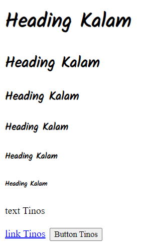


**Colors**

La elección de colores es una parte fundamental del diseño. Una buena selección de colores comunica al usuario lo que realmente ofrecemos. Por eso, nuestro color primario es el azul y el color secundario es el verde azulado. También hemos seleccionado colores de estado que usaremos para informar al usuario mientras interactúa con nuestra aplicación. Los colores elegidos para PARKINGNOW no solo definen la estética de la marca, sino que también comunican su propósito y valores.

- **Color Primario (Azul Noche):** El azul noche simboliza tecnología y seguridad, dos aspectos clave de la experiencia de estacionamiento que ofrecemos. Este color transmite tranquilidad y confianza, elementos esenciales para los usuarios de nuestra plataforma.


- **Color Secundario (Amarillo):** Este color vibrante aporta energía y resalta la eficiencia y visibilidad de nuestro servicio. El amarillo es ideal para captar la atención del usuario y destacar elementos importantes en la plataforma, como botones o ítems resaltantes.


- **Color Secundario (Gris):** El gris simboliza neutralidad y profesionalismo, proporcionando un equilibrio visual en la interfaz. Se utiliza en áreas menos destacadas, ofreciendo un contraste elegante y sutil.


- **Color Secundario (Blanco):** El blanco representa simplicidad y pureza, proporcionando un fondo limpio que mejora la legibilidad y la experiencia del usuario en nuestra plataforma. Es esencial para destacar el contenido principal y ofrecer una apariencia ordenada.

- **Color Secundario (Negro):** El negro evoca sofisticación y seriedad, usado en detalles y tipografía para ofrecer un fuerte contraste con los otros colores. Refuerza la solidez y confiabilidad del servicio que brindamos.

#### 4.1.2. Web Style Guidelines

Desarrollaremos un sitio web que sea completamente adaptable a dispositivos móviles, lo que significa que se ajustará a cualquier tamaño de pantalla sin afectar la experiencia del usuario. De esta forma, nuestra aplicación web siempre será intuitiva y visualmente atractiva, sin importar el dispositivo que se utilice. En base a esto, nuestra plataforma debe ajustarse a las diferentes resoluciones utilizadas por los dispositivos actuales.

Utilizaremos el patrón Z en el diseño, asegurando que los usuarios comiencen su navegación desde la página de inicio visualizando el logo. Luego, se desplazarán naturalmente hacia la derecha para encontrar las opciones disponibles. Posteriormente, bajarán verticalmente para explorar el contenido general y finalizarán moviéndose horizontalmente hacia la derecha para acceder a información sobre nuestra startup y los medios de contacto.

El diseño también integrará colores llamativos que capten la atención del usuario, transmitiendo sensaciones de tranquilidad, confianza y motivándolos a usar nuestra aplicación. Además, los espacios y efectos implementados ayudarán a los usuarios a comprender fácilmente el propósito de nuestra página de inicio y aplicación web.


### 4.2. Information Architecture

En esta sección, el equipo detalla las decisiones que guían la organización del contenido en las experiencias web y móvil de PARKINGNOW, abarcando tanto la Landing Page como la Aplicación Web. Estas propuestas están diseñadas para que los usuarios puedan adaptarse fácilmente a las funciones de cada producto y encontrar lo que necesitan sin complicaciones. Las decisiones incluyen los sistemas de organización, etiquetado, navegación y búsqueda.

#### 4.2.1. Organization Systems

Para estructurar la arquitectura de la información de PARKINGNOW, hemos adoptado un sistema de organización jerárquico tanto en la Landing Page como en la Aplicación Web. Este sistema asegura una navegación intuitiva y permite a los usuarios encontrar rápidamente la información que buscan.

#### **Landing Page**

La Landing Page de PARKINGNOW está organizada jerárquicamente para que los usuarios accedan fácilmente a la información más relevante y realicen las acciones necesarias:

1. **Barra de Navegación Principal**: Situada en la parte superior, ofrece accesos directos a las secciones principales:
   - **Inicio (Home)**: Proporciona una visión general de los servicios de PARKINGNOW e incluye un banner destacado con botones de llamado a la acción para registro e inicio de sesión.
   - **Servicios (Services)**: Describe los servicios ofrecidos tanto a conductores como a propietarios de estacionamientos. La sección está organizada para que cada usuario identifique rápidamente los beneficios que PARKINGNOW les ofrece.
   - **Transacción (Plans):** Explica las diferentes opciones de transacción disponibles, con detalles sobre las características y beneficios de cada una.
   - **Contáctanos (Contact Us)**: Facilita el contacto con el equipo de soporte a través de un formulario y enlaces a redes sociales.
   - **Nosotros (About Us)**: Presenta la misión, visión y el equipo detrás de PARKINGNOW, promoviendo confianza y transparencia.

2. **Estructura de Contenido Jerárquica**:
   - **Encabezados y Subencabezados**: Organizan el contenido de cada sección para que los usuarios exploren según sus intereses.
   - **Botones de Llamada a la Acción (CTAs)**: Colocados estratégicamente para guiar a los usuarios a acciones como registrarse o iniciar sesión.

3. **Footer**:
   - Incluye enlaces a políticas de privacidad, términos de servicio, contacto y redes sociales, ofreciendo una navegación adicional.

#### **Aplicación Web**

La Aplicación Web de PARKINGNOW está diseñada para proporcionar una experiencia personalizada a dos segmentos principales: Conductores Urbanos Frecuentes y Dueños de Estacionamientos. El contenido está estructurado de forma que cada usuario pueda navegar eficientemente.

1. **Para Conductores Urbanos Frecuentes**:
   - **Inicio (Home)**: Muestra una vista general de las reservas actuales y accesos directos a funciones clave como búsqueda de estacionamientos y favoritos.
   - **Búsqueda de Estacionamiento (Search Parking)**: Permite a los usuarios buscar y ver la disponibilidad de estacionamientos en tiempo real con filtros avanzados.
   - **Favoritos (Favorites)**: Lista de estacionamientos marcados como favoritos para un acceso rápido.
   - **Historial (History)**: Un registro de todas las reservas pasadas para ayudar a los usuarios a rastrear su actividad de estacionamiento.

2. **Para Dueños de Estacionamientos**:
   - **Inicio (Home)**: Muestra un resumen de la ocupación y notificaciones relevantes.
   - **Monitoreo (Monitoring)**: Herramientas para supervisar la ocupación en tiempo real y gestionar reservas.
   - **Reservas (Reservations)**: Permite gestionar reservas, aprobando o rechazando solicitudes.
   - **Estadísticas (Statistics)**: Proporciona análisis detallados del uso de estacionamientos e ingresos, ayudando a optimizar operaciones.

#### 4.2.2. Labeling Systems

Los sistemas de etiquetado en la Landing Page y la Aplicación Web de PARKINGNOW están diseñados para facilitar la navegación y mejorar la experiencia del usuario, asegurando que las secciones y funciones sean fácilmente reconocibles y accesibles.

#### **Etiquetas de Encabezados (Headings)**

- **Inicio/Home**: Encabezado en la página principal que da la bienvenida a los usuarios con un banner.
  
- **Servicios/Services**: Describe las funciones principales de la plataforma.

- **Planes y Precios/Transaction Pricing:** Detalla las opciones de precios y planes disponibles.

- **Contáctanos/Contact Us**: Facilita el contacto con un formulario y medios de soporte.

- **Sobre Nosotros/About Us**: Proporciona información sobre la empresa, misión y visión.

#### **Etiquetas Textuales (Text Labels)**

- **Buscar Estacionamiento/Find Parking**: Utilizada en la barra de búsqueda para ingresar ubicación y buscar estacionamientos.

- **Reservar/Reserve**: Botón que permite confirmar una reserva.

- **Historial/History**: Muestra el historial de reservas.

- **Favoritos/Favorites**: Lista de estacionamientos marcados como favoritos.

- **Configuraciones/Settings**: Acceso a preferencias y ajustes de cuenta.

#### **Etiquetas Icónicas (Iconic Labels)**

- **Icono de Búsqueda (Lupa)**: Representa la búsqueda de estacionamientos.

- **Icono de Calendario**: Indica la fecha y hora de las reservas.

- **Icono de Estrella**: Marca los estacionamientos favoritos.

- **Icono de Coche**: Representa el seguimiento del vehículo en el estacionamiento.

- **Icono de Notificación**: Alerta a los usuarios sobre actualizaciones importantes.

#### 4.2.3. SEO Tags and Meta Tags

Los SEO Tags y Meta Tags optimizarán la visibilidad de la página y aplicación web de PARKINGNOW en motores de búsqueda.

**Title**
``<title>PARKINGNOW</title>``

**Description**
``<meta name="description" content="ParkingNow es una aplicacion que ayuda a los usuarios a reservar lugares de estacionamiento"/>``

**Keywords**
``<meta name="viewport" content="width=device-width, initial-scale=1.0">``

**Author**
``<meta name="copyright" content="© 2024 PARKINGNOW. Todos los derechos reservados."/>``

#### 4.2.4. Searching Systems

Los sistemas de búsqueda permitirán a los usuarios navegar fácilmente y encontrar lo que necesitan en la aplicación web.

- **Búsqueda por caracteres:** Los usuarios pueden buscar establecimientos por nombre o propietario.

- **Búsqueda por ubicación:** Utiliza la ubicación exacta para encontrar el estacionamiento.

- **Búsqueda por mapa:** Los usuarios pueden usar el mapa para buscar locales cercanos o lejanos.

#### 4.2.5. Navigation Systems

La navegación será intuitiva, guiando a los usuarios para realizar acciones como iniciar sesión, registrarse o realizar una reserva sin complicaciones.

### 4.3. Landing Page UI Design

Presentamos los primeros diseños de la Landing Page y la aplicación web.

#### 4.3.1. Landing Page Wireframe


#### 4.3.2. Landing Page Mock-up


### 4.4. Web Applications UX/UI Design

Presentamos los resultados del diseño de la Aplicación Web en Figma.

#### 4.4.1. Web Applications Wireframes

Link: [Figma](https://www.figma.com/design/qb02D1snVoDtoLfT0qdkRV/Parking-now?node-id=0-1&t=dsT3kQGDkndD6UwX-1) https://www.figma.com/design/qb02D1snVoDtoLfT0qdkRV/Parking-now?node-id=0-1&t=dsT3kQGDkndD6UwX-1


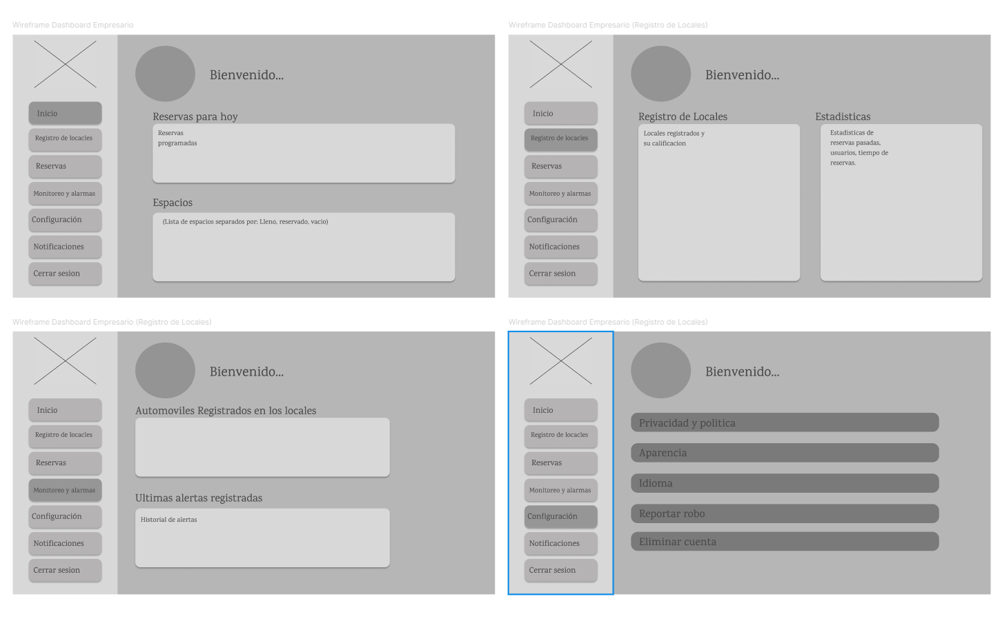


#### 4.4.2. Web Applications Wireflow Diagrams

User goal: Registrarse como conductor o dueno de playa de estacionamiento.


User goal: Iniciar sesion como conductor o dueno de playa de estacionamiento.
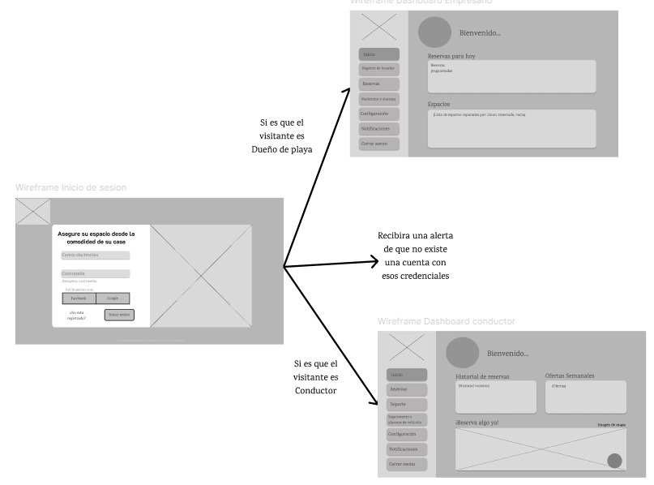

User goal: Hacer una reserva como conductor en la aplicacion.


User goal: Dejar una opinion a una playa de estacionamiento.


#### 4.4.3. Web Applications Mock-ups

Link: [Figma](https://www.figma.com/design/qb02D1snVoDtoLfT0qdkRV/Parking-now?node-id=0-1&t=dsT3kQGDkndD6UwX-1)


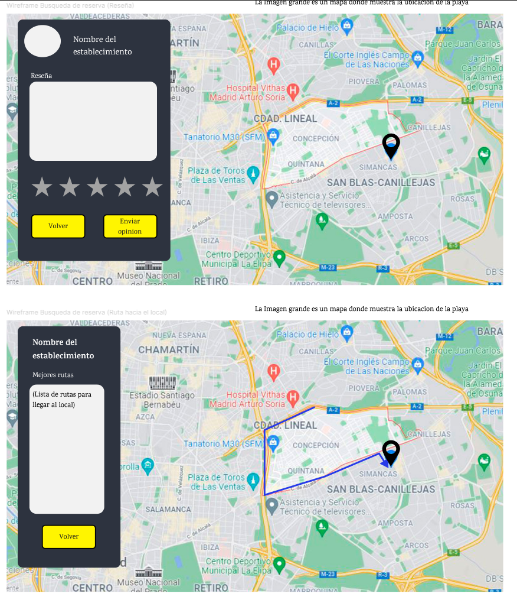


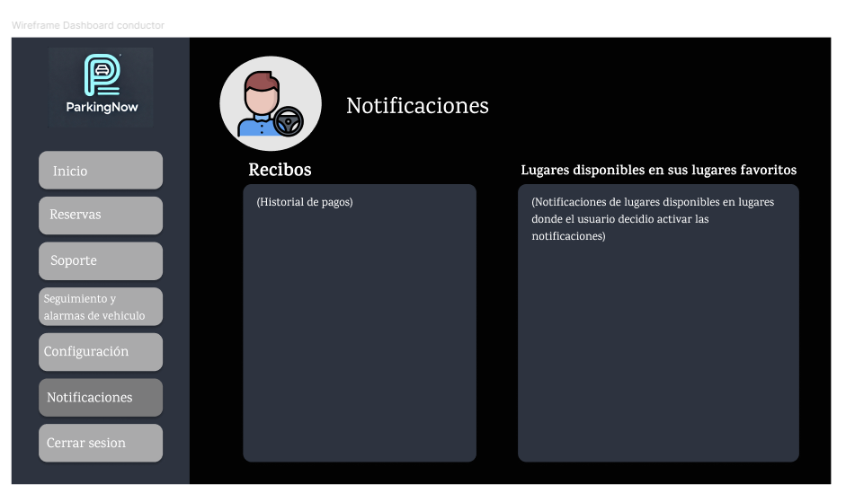

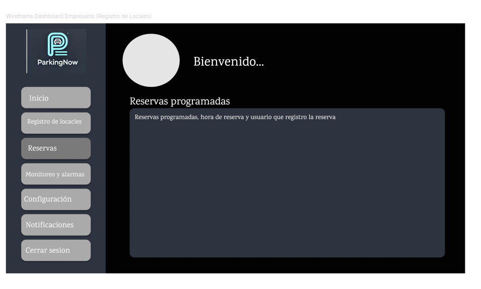


#### 4.4.4. Web Applications User Flow Diagrams

User goal: Registrarse como conductor o dueno de playa de estacionamiento.


User goal: Iniciar sesion como conductor o dueno de playa de estacionamiento.


User goal: Dejar una opinion como conductor en la aplicacion.


User goal: Hacer una reserva como conductor en la aplicacion.


### 4.5. Web Applications Prototyping

Link: [Figma](https://www.figma.com/design/qb02D1snVoDtoLfT0qdkRV/Parking-now?node-id=0-1&t=dsT3kQGDkndD6UwX-1) https://www.figma.com/design/qb02D1snVoDtoLfT0qdkRV/Parking-now?node-id=0-1&t=dsT3kQGDkndD6UwX-1


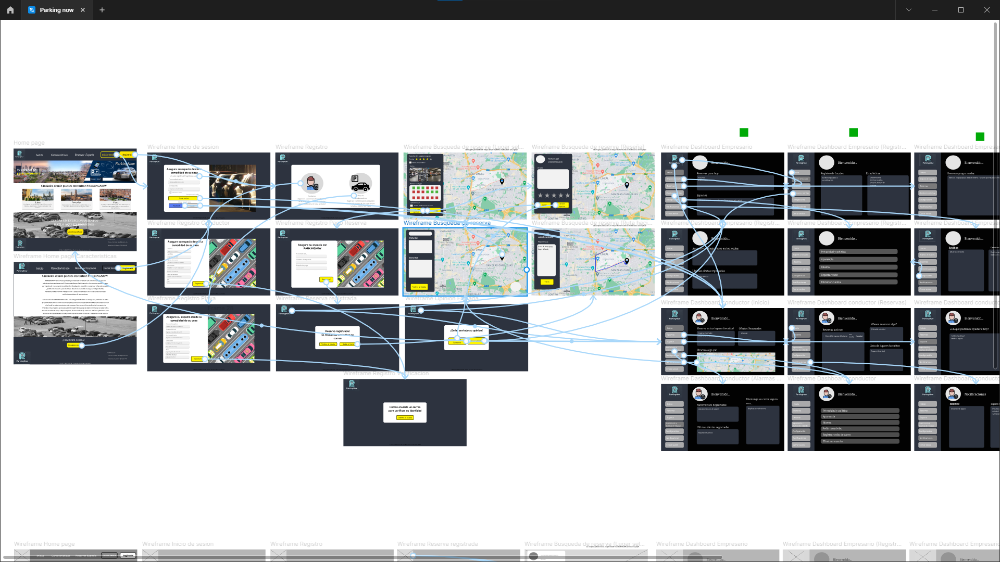

Evidencia: 

Explicación:
https://upcedupe-my.sharepoint.com/:v:/g/personal/u202214477_upc_edu_pe/EbbItuqjG5lKkbMH-BwTW1MBImmRTC15DyIPclYNgeb9MA?e=RwBYeG&nav=eyJyZWZlcnJhbEluZm8iOnsicmVmZXJyYWxBcHAiOiJTdHJlYW1XZWJBcHAiLCJyZWZlcnJhbFZpZXciOiJTaGFyZURpYWxvZy1MaW5rIiwicmVmZXJyYWxBcHBQbGF0Zm9ybSI6IldlYiIsInJlZmVycmFsTW9kZSI6InZpZXcifX0%3D

### 4.6. Domain-Driven Software Architecture

Los diagramas de arquitectura de software nos permiten diseñar nuestro sistema utilizando el enfoque de Domain Driven Design.

#### 4.6.1. Software Architecture Context Diagram

Este diagrama muestra la interacción entre los usuarios de PARKINGNOW y sistemas externos como geolocalización y procesamiento de pagos.


#### 4.6.2. Software Architecture Container Diagrams

Este diagrama de contenedores ilustra los componentes principales de la PARKINGNOW, como la Aplicación Web, la API Backend, la Base de Datos, y los servicios externos.


#### 4.6.3. Software Architecture Components Diagrams

***Parking Component diagram***  
Diagrama que cubre todo lo relacionado con los estacionamientos.


***Reservation Component diagram***  
Diagrama que cubre todo lo relacionado con las reservas.
.png>)

***Location Component diagram***  
Diagrama que cubre todo lo relacionado con la gestión de ubicación en tiempo real.
.png>)

### 4.7. Software Object-Oriented Design

#### 4.7.1. Class Diagrams


#### 4.7.2. Class Dictionary

| N | Entidad | Nombre de Atributos | Definición | Tipo de Datos |
| :---: | ----- | ----- | ----- | ----- |
| 1 | Usuario | usuario\_id | Código de Usuario (Número de Usuarios) | int |
|  |  | nombre\_usuario | Nombre del usuario | varchar |
|  |  | contrasena | Contraseña de la cuenta del usuario | varchar |
|  |  | rol | Rol del usuario | varchat |
| 2 | Alertas | Alerta\_id | Código de la Alerta | int |
|  |  | alerta\_activa | Estado de la Alerta | bool |
| 3 | Transacción | transaccion\_id | Código de la transacción | int |
|  |  | fecha | Fecha de la transacción | date |
|  |  | monto | Monto de la transacción | decimal |
|  |  | metodo\_pago | Método de pago de la transacción | varchar |
|  |  | estado | Estado de la transacción | varchar |
| 4 | Seguridad | seguridad | Tipo de seguridad | int |
|  |  | descripción | Descripción del tipo de seguridad | varchar |
|  |  | nivel\_seguridad | Nivel de seguridad | varchar |
| 5 | Dashboard | tiempo\_carga | Tiempo de carga | int |
|  |  | numero\_usuarios | Número de usuarios en el local | int |
|  |  | numero\_reservas | Número de reservas en el local | int |
|  |  | numero\_opiniones | Número de opiniones en el local | int |
|  |  | ingresos\_totales | Cantidad de ingresos en el local | decimal |
|  |  | promedio\_calificacion | Promedio de calificación en el local | float |
|  |  | tiempo\_uso\_promedio | Tiempo de uso promedio en el local | TimeSpan |
|  |  | numero\_espacios\_disponibles | Número de espacios disponibles en el local | int |
|  |  | numero\_notificaciones | Número de notificaciones | int |
| 6 | Promociones | promocion\_id | Código de promoción | int |
|  |  | descripcion | Descripción de la promoción | varchar |
|  |  | descuento | Cantidad del descuento | decimal |
|  |  | fecha\_inicio | Fecha de inicio de la promoción | date |
|  |  | fecha\_fin | Fecha de fin de la promoción | date |
| 7 | Tarifa | tarifa\_id | Código de la tarifa | int |
|  |  | descripcion | Descripció de la tarifa | varchar |
|  |  | precio\_hora | Cantidad monetaria por hora en el estacionamiento | decimal |
|  |  | dia\_semana | Día de la semana de la tarifa | varchar |
|  |  | Horario | Horario por el tiempo de estacionamiento usado | varchar |
| 8 | ServicioAlCliente | Asesorid | Código del Asesor | int |
|  |  | Nombre | Nombre del Asesor | string |
|  |  | Apellido | Apellido del Asesor | string |
| 9 | Servicio\_al\_cliente | Asesor\_id | Código del Asesor | int |
|  |  | nombre | Nombre del Asesor | varchar |
|  |  | apellido | Apellido del Asesor | varchar |
| 10 | Vehículo | vehiculo\_id | Código del vehículo | int |
|  |  | marca | Marca del vehículo | varchar |
|  |  | modelo | Modelo del vehículo | varchar |
|  |  | color | Color del vehículo | varchar |
|  |  | placa | Placa del vehículo | varchar |
| 11 | Asesorias | Asesoria\_ID | Código de la Asesoría | int |
|  |  | Razon | Razón de la Asesoría | varchar |
|  |  | fecha | Fecha de la Asesoría | date |
|  |  | hora\_inicio | Hora de inicio de la Asesoría | time |
|  |  | hora\_final | Hora de fin de la Asesoría | time |
|  |  | Servicio\_al\_cliente\_Asesor\_id | Código del Asesor | int |
| 12 | Persona | ID | Código de la Persona | int |
|  |  | nombre | Nombre de la persona | string |
|  |  | apellido | Apellido de la persona | string |
|  |  | email | Email de la persona | string |
| 13 | Conductores | placa\_de\_vehiculo | Placa del vehículo del conductor | varchar |
|  |  | DNI | DNI del conductor | varchar |
| 14 | Notificacion | Notificacion\_id | Código de la notificación | int |
|  |  | descripcion | Descripción de la notificación | varchar |
|  |  | fecha | Fecha de la notificación | date |
|  |  | hora | Hora exacta de la notificación | time |
|  |  | Alertas\_Alerta\_id | Código de la Alerta | int |
|  |  | prioridad | Prioridad de la notificación | varchar |
|  |  | fecha\_envio | Fecha de envío de la notificación | date |
| 15 | Duenos\_de\_playas | DuenoId | ID del dueño del estacionamiento | int |
|  |  | Nombre | Nombre del dueño del estacionamiento | string |
|  |  | Apellido | Apellido del dueño del estacionamiento | string |
|  |  | Correo | Correo del dueño del estacionamiento | string |
|  |  | RUC | RUC del dueño del estacionamiento | string |
|  |  | telefono | Teléfono del dueño del estacionamiento | varchar |
|  |  | direccion | Dirección del dueño del estacionamiento | varchar |
| 16 | Reservas | reservas\_id | Código de la reserva | int |
|  |  | Fecha | Fecha de la reserva | int |
|  |  | hora\_inicio | Hora de inicio de la reserva | time |
|  |  | hora\_final | Hora de fin de la reserva | time |
|  |  | estado\_reserva | Estado de la reserva | varchar |
|  |  | numero\_vehiculo | Número del vehículo en reserva | varchar |
|  |  | local\_x\_espacio\_Espacio\_Espacios\_id | ID del espacio usado en el estacionamiento | int |
| 17 | Recibo | recibo\_id | Código del recibo | int |
|  |  | descripcion | Descripción del recibo | int |
|  |  | metodo\_de\_pago | Método de pago del recibo | int |
|  |  | Reservas\_reservas\_id | Código de la reserva | int |
| 18 | Opinion | opinion\_id | Código de la opinión | int |
|  |  | usuario\_id | Código del usuario | int |
|  |  | fecha\_opinion | Fecha de la opinión | date |
|  |  | descripcion | Descripción de la opinión | varchar |
|  |  | titulo | Título de la opinión | varchar |
| 19 | Local | local\_id | Código del local | int |
|  |  | descripcion | Descripción del local | varchar |
|  |  | ubicacion | Ubicación del local | varchar |
|  |  | cantidad\_empleados | Cantidad de empleados del local | int |
| 20 | Espacio | Espacios\_id | Código de los espacios | int |
|  |  | Sensor | Sensor de los espacios | int |
|  |  | descripcion | Descripción de los espacios | varchar |
|  |  | ubicacion | Ubicación de los espacios | varchar |

### 4.8. Database Design

En este apartado se mostrará el diseño de base de datos utilizado en nuestro proyecto, siguiendo los contextos definidos anteriormente.

| Clase         | Descripción |
| ------------- | ----------- |
| **Alarma**    | Representa una alarma que puede ser activada cuando ocurre un evento específico. Incluye atributos como `id`, `estado` y `activado`, y permite manipular las alarmas a través de métodos como `activar()` y `desactivar()`. |
| **Transaccion** | Gestiona las transacciones del sistema, relacionadas con el uso de servicios o pagos. Atributos como `estandarizar`, `fecha_pago`, y `monto_total` permiten definir detalles financieros. Contiene métodos como `getInfoEstado()`. |
| **Usuario**   | Contiene la información básica del usuario, como su `id`, `nombre`, `apellido`, y su nivel de acceso dentro del sistema. Ofrece métodos como `getInfo()` y `getAcceso()`. |
| **Vinculo**   | Define la relación entre usuarios y el sistema, asociando vehículos o estacionamientos al perfil del usuario. Contiene el método `getVinculo()`. |
| **Servicio_al_cliente** | Permite la gestión de servicios relacionados con el usuario, con atributos como `id`, `nombre_servicio`, y `estado`. Incluye métodos para obtener información y gestionar el servicio. |
| **Conductores** | Representa a los conductores dentro del sistema, asociados a los vehículos que usan el sistema de estacionamiento. Contiene métodos para obtener información de vehículos y el historial. |
| **Promociones** | Gestiona las promociones aplicables al sistema, permitiendo la creación y activación de promociones específicas. Contiene atributos como `id`, `descuento`, y `disponibilidad`. |
| **Notificacion** | Gestiona el envío de notificaciones a los usuarios del sistema. Tiene atributos como `id`, `descripcion`, y `estado`, y métodos para enviar o cancelar notificaciones. |
| **Dueno_de_local** | Representa a los dueños de los estacionamientos. Contiene atributos como `nombre`, `direccion`, y métodos para gestionar los locales y obtener información de los mismos. |
| **Espacio**   | Representa los espacios dentro de los locales de estacionamiento, cada uno con atributos como `id`, `disponibilidad`, y `capacidad`. Incluye métodos como `verificarDisponibilidad()`. |
| **Local**     | Define los locales que contienen múltiples espacios de estacionamiento. Contiene atributos como `direccion`, `capacidad_total`, y `horario`, y está relacionado con la clase `Espacio`. |
| **Tarifa**    | Define las tarifas aplicables a los espacios de estacionamiento. Incluye atributos como `detalle`, `precio`, y `fecha`, y tiene métodos como `getInfo()`. |
| **Recibo**    | Gestiona los recibos de las transacciones, con atributos como `id_recibo`, `monto`, `fecha_emision`, y métodos para procesar y emitir recibos. |
| **ProcesoPago** | Gestiona el procesamiento de pagos dentro del sistema. Se asocia con `Recibo` para registrar la información financiera de cada transacción. |

#### 4.8.1. Database Diagram

Link: [Vertabelo](https://my.vertabelo.com/doc/pYDPCowUTtVaVuDmakCr4QlOKjdT1o1o) https://my.vertabelo.com/doc/pYDPCowUTtVaVuDmakCr4QlOKjdT1o1o


## Capítulo V: Product Implementation, Validation & Deployment

### 5.1. Gestión de la Configuración del Software

Se establecen directrices para garantizar la coherencia en el desarrollo del software, unificando al equipo en el uso de herramientas, normas de codificación y métodos de implementación.

#### 5.1.1. Configuración del Entorno de Desarrollo de Software

A continuación se detallan las diversas herramientas de software que el equipo ha utilizado para llevar a cabo las tareas del proyecto PARKINGNOW.

##### Diseño UX/UI

1. **UXPressia**: [https://uxpressia.com/](https://uxpressia.com/)  
   Herramienta empleada para desarrollar User Personas, Empathy Maps, Journey Maps e Impact Maps, brindando un enfoque centrado en el usuario.

2. **Figma**: [https://www.figma.com/](https://www.figma.com/)  
   Plataforma colaborativa de diseño usada para la creación de wireframes, maquetas y prototipos para aplicaciones móviles y de escritorio.

3. **Miro**: [https://miro.com/](https://miro.com/)  
   Utilizada para desarrollar los As-Is y To-Be Scenario Maps, facilitando la visualización y planificación de diversos escenarios de uso de la plataforma.

##### Desarrollo de Software

4. **Visual Studio Code**: [https://code.visualstudio.com/](https://code.visualstudio.com/)  
   Editor de código ligero utilizado para crear la landing page y aplicaciones web, haciendo uso de HTML5, CSS3, JavaScript y TypeScript.

5. **WebStorm**:  
   Entorno de desarrollo utilizado para trabajar con HTML, CSS, JavaScript y frameworks como Vue y Angular.

6. **Rider**:  
   IDE utilizado para desarrollar con el lenguaje C# y la plataforma .NET, implementando servicios web basados en ASP.NET.

7. **Spring Boot Framework**:  
   Framework utilizado para crear servicios web RESTful en Java, brindando una base sólida y escalable.

8. **GitHub**: [https://github.com/](https://github.com/)  
   Plataforma usada para el control de versiones, aplicando GitFlow para una gestión estructurada del código.

9. **Git**: [https://git-scm.com/](https://git-scm.com/)  
   Sistema de control de versiones utilizado para manejar los cambios en el código a través de commits, permitiendo la colaboración eficiente entre los desarrolladores.

##### Gestión de Proyectos y Colaboración

10. **WhatsApp**: [https://web.whatsapp.com/](https://web.whatsapp.com/)  
    Aplicación de mensajería utilizada para coordinar y discutir temas del proyecto en tiempo real.

11. **Google Docs**: [https://docs.google.com/](https://docs.google.com/)  
    Utilizado para la creación y edición colaborativa de documentos, permitiendo que varios miembros del equipo trabajen al mismo tiempo.

##### Documentación de Software

12. **Vertabelo**: [https://vertabelo.com/](https://vertabelo.com/)  
    Herramienta en línea utilizada para diseñar y gestionar de forma colaborativa las bases de datos del proyecto.

13. **LucidChart**: [https://lucid.app/](https://lucid.app/)  
    Plataforma usada para crear diagramas UML, wireflows y user flows, facilitando la planificación y visualización del sistema.

14. **Structurizr**: [https://www.structurizr.com/](https://www.structurizr.com/)  
    Herramienta empleada para modelar la arquitectura del software utilizando diagramas C4, proporcionando una representación clara de la estructura del proyecto.

##### Pruebas de Software

15. **Swagger / OpenAPI Specification**: [https://swagger.io/specification/](https://swagger.io/specification/)  
    Utilizado para documentar y probar las APIs RESTful creadas con Spring Boot, permitiendo la generación de documentación interactiva.

16. **Markdown**  
    Lenguaje de marcado ligero usado para la documentación del proyecto y en los archivos README del repositorio de la organización.

#### 5.1.2. Gestión del Código Fuente

En PARKINGNOW, se utilizan Git y GitHub para gestionar las versiones del código, siguiendo el flujo de trabajo de GitFlow, que organiza el trabajo en ramas para desarrollo, nuevas funcionalidades, lanzamientos y correcciones. Se fomenta el uso de Conventional Commits para asegurar que los mensajes de commit sean claros y comprensibles.

##### Enlaces a los Repositorios:
- **Organización:** https://github.com/G3-UPC-SI730-2402-SW52-PARKINGNOW

- **Reporte:** https://github.com/G3-UPC-SI730-2402-SW52-PARKINGNOW/Report

- **Landing Page:** https://github.com/G3-UPC-SI730-2402-SW52-PARKINGNOW/Landing-Page-g3

- **Frontend:** https://github.com/G3-UPC-SI730-2402-SW52-PARKINGNOW/Frontend-

- **Backend:** https://github.com/G3-UPC-SI730-2402-SW52-PARKINGNOW/Backend

### GitFlow

En PARKINGNOW, el modelo de GitFlow se emplea para gestionar el código de manera estructurada, organizando el trabajo en diferentes ramas para facilitar la integración y el desarrollo continuo. Las ramas principales son:

1. **Master Branch:** Aquí se almacenan las versiones estables del proyecto.
2. **Develop Branch:** Esta rama se utiliza para integrar características en desarrollo.
3. **Feature Branches:** Se crean desde `develop` para desarrollar nuevas funcionalidades, y una vez completadas, se fusionan de nuevo en `develop`.
4. **Release Branches:** Se crean desde `develop` para preparar las versiones estables, realizando los ajustes finales antes de fusionarlas en `master`.
5. **Hotfix Branches:** Estas ramas se crean para solucionar errores críticos que requieren ser arreglados rápidamente en la rama `master` y luego se fusionan tanto en `master` como en `develop`.

La estructura de GitFlow en PARKINGNOW se organiza con `master` como la rama que contiene la versión estable del proyecto, `develop` para la integración de nuevas funcionalidades, y ramas temporales como `feature/*`, `release/*` y `hotfix/*` para gestionar nuevas características, versiones de producción y correcciones urgentes, respectivamente.

### Convenciones de Commits

Para los mensajes de commit en el proyecto PARKINGNOW, se sigue la convención de Conventional Commits. Estos mensajes tienen un formato estándar que ayuda a comprender fácilmente el historial del proyecto:

```plaintext
<type>[optional scope]: <description>

[optional body]

[optional footer(s)]
```

- **Type:** 
   - `feat`: Se usa cuando se añade una nueva característica.
   - `fix`: Para la corrección de errores.
   - `docs`: Modificaciones en la documentación.
   - `style`: Cambios que no afectan la lógica del código, como formato o estilo.
   - `refactor`: Modificaciones que no añaden características ni corrigen errores.
   - `test`: Adición o modificación de pruebas.
   
- **Scope:** Proporciona información adicional sobre el área del código afectada. Ejemplo: `feat(auth): add login functionality`.

### Ejemplos de commits:

- `feat(login): add user authentication module`
- `fix(payment): resolve payment gateway issue`
- `docs(README): update setup instructions`

Con esta estructura, **PARKINGNOW** puede gestionar eficientemente el flujo de trabajo del desarrollo, asegurando una integración continua y una organización clara del código fuente.

#### 5.1.3. Source Code Style Guide & Conventions

En el proyecto PARKINGNOW, hemos implementado una serie de guías de estilo y convenciones para asegurar que todo el equipo de desarrollo siga una estructura consistente y clara en todo el ciclo de vida del proyecto. Esto facilita la legibilidad del código, mejora la colaboración entre los desarrolladores y asegura que el código sea mantenible a largo plazo.

#### Nomenclatura General

Para asegurar la coherencia en todo el código, se seguirán las siguientes directrices:

- Los nombres de variables, funciones y métodos deben utilizar **camelCase**.
- Los nombres de clases y componentes seguirán la convención **PascalCase**.
- Para los archivos y carpetas, se empleará la convención **kebab-case**.

El uso de **inglés** para todos los nombres es obligatorio, con el fin de asegurar la comprensión entre los miembros del equipo y facilitar la colaboración internacional.

**Ejemplos**:

- Variables: `parkingSpace`, `userLocation`
- Clases: `ParkingManager`, `User`
- Archivos: `parking-manager.service.ts`, `user.controller.js`

#### Espacios y Sangría

La sangría de código en PARKINGNOW seguirá las siguientes reglas para asegurar la claridad y el orden del código:

- Se utilizarán 2 espacios para la sangría en archivos HTML, CSS, JavaScript, y TypeScript.
- En archivos Java, se utilizarán 4 espacios para la sangría.

Esta convención ayuda a mantener la consistencia en todos los lenguajes empleados en el proyecto y facilita la colaboración entre diferentes desarrolladores.

**Ejemplo de HTML con sangría**:

```html
<!DOCTYPE html>
<html>
  <head>
    <title>ParkingNOW</title>
  </head>
  <body>
    <h1>Parking Disponibles</h1>
    <p>Encuentra y reserva tu espacio fácilmente</p>
  </body>
</html>
```

#### Convenciones por Lenguaje

### 1. Framework:
Se hará uso de **Vue Framework** para el desarrollo de las aplicaciones web del frontend.

### 2. Tecnologías:
- **HTML5** y **CSS3** se usarán para los aspectos estáticos y de presentación de las páginas y aplicaciones web.
- **JavaScript** será el lenguaje de programación principal para añadir interactividad y lógica a las aplicaciones.

### 3. Diseño:
- El diseño de las **Landing Pages** y **Aplicaciones Web** estará basado en **Material Design**, para asegurar una experiencia de usuario coherente, moderna y optimizada para dispositivos móviles.

### 4. Biblioteca de componentes de UI:
- Se utilizará **PrimeVue** como la biblioteca principal para componentes de la interfaz de usuario (UI), lo que facilita la construcción de interfaces interactivas y atractivas.
- PrimeVue proporciona una amplia gama de componentes ya preparados que siguen los principios de **Material Design**, como botones, tablas, formularios, y más.

### 5. Estilo y Estructura:
- **HTML/CSS**: Se seguirá la [Guía de Estilo de HTML y CSS de Google](https://google.github.io/styleguide/htmlcssguide.html) para mantener la consistencia y legibilidad en los archivos de estructura y estilo.
- **JavaScript**: Para el código JavaScript, se aplicará la [Guía de Estilo de JavaScript de Airbnb](https://github.com/airbnb/javascript), que es un estándar ampliamente adoptado en la industria y asegura un código limpio, bien organizado y mantenible.

### 6. Arquitectura del proyecto:
- El proyecto seguirá la arquitectura de componentes de **Vue**, donde cada funcionalidad o sección de la página se encapsula en un componente independiente que gestiona su propio estado y comportamiento.

### Ejemplo de Convención para un Componente en Vue:

```vue
<template>
  <div>
    <Button label="Reservar" @click="reservarEspacio" />
  </div>
</template>

<script>
export default {
  name: 'GestorDeEstacionamiento',
  data() {
    return {
      espaciosDisponibles: 10
    };
  },
  methods: {
    reservarEspacio() {
      if (this.espaciosDisponibles > 0) {
        this.espaciosDisponibles--;
      }
    }
  }
};
</script>

<style scoped>
/* Aplicando Material Design a través de PrimeVue */
button {
  background-color: #6200ea;
  color: white;
}
</style>
```

4. **Gherkin**:
   - Para escribir los tests automatizados, seguimos la convención de [Gherkin Syntax](https://cucumber.io/docs/gherkin/). Esto permite una descripción clara y precisa de los escenarios de prueba en los archivos `.feature`.
   - Utilizamos Given-When-Then para describir el comportamiento esperado en cada escenario.

**Ejemplo de Gherkin**:

```gherkin
Feature: Reserva de espacio de estacionamiento

  Scenario: Reserva exitosa
    Given el usuario ha iniciado sesión
    When selecciona un espacio disponible
    Then el sistema debe confirmar la reserva
```

#### Espaciado y Comillas

- **Espacios**: Siempre se debe colocar un espacio alrededor de los operadores y entre los parámetros en las funciones.

  **Ejemplo**:
  ```vue
  <script>
  export default {
    data() {
      return {
        totalSpaces: 50,
        bookedSpaces: 10,
        availableSpaces: 0
      };
    },
    mounted() {
      this.availableSpaces = this.totalSpaces - this.bookedSpaces;
    }
  };
  </script>


- Comillas: En JavaScript dentro de Vue, se utilizan comillas simples (') para las cadenas, mientras que en las plantillas HTML de Vue se prefieren las comillas dobles (").

#### Límite de Longitud de Línea

El código no debe exceder las 80 columnas por línea. En caso de necesitar más espacio, se recomienda dividir la línea de código para mejorar la legibilidad.

#### 5.1.4. Software Deployment Configuration

En esta sección se detalla la configuración necesaria para el despliegue de la solución PARKINGNOW, incluyendo los pasos clave para lograr la publicación satisfactoria de la Landing Page, Servicios Web y Aplicaciones Web Frontend utilizando GitHub Pages para visualizar cada commit del Landing Page.

**Landing Page**: 

Se utiliza la documentación oficial de github para realizar el despliegue del landing page: https://docs.github.com/es/pages/quickstart, el cual se resumen de la siguiente manera: 

1. **Actualización de Ramas:**
   Asegúrate de que todas las ramas del repositorio estén actualizadas. Luego, ingresa a GitHub y dirígete al repositorio del proyecto PARKINGNOW.
2. **Acceso a las Configuraciones:**
   Una vez dentro del repositorio, haz clic en la pestaña Setting en la parte superior del repositorio.

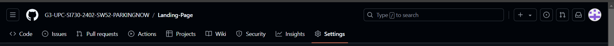

3. **Selección de GitHub Pages:**
   Dentro de la sección Settings, en el menú lateral, busca la opción llamada Pages. Esta opción permite configurar el despliegue de la página desde una rama específica del repositorio.
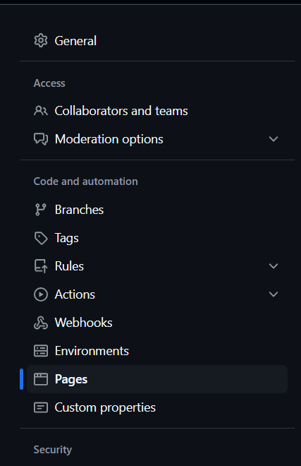

4. **Configuración de la Rama Principal:**
   En la opción Pages, selecciona la rama principal (generalmente llamada main o master). Luego, haz clic en el botón Save para iniciar el proceso de deploy de la página.

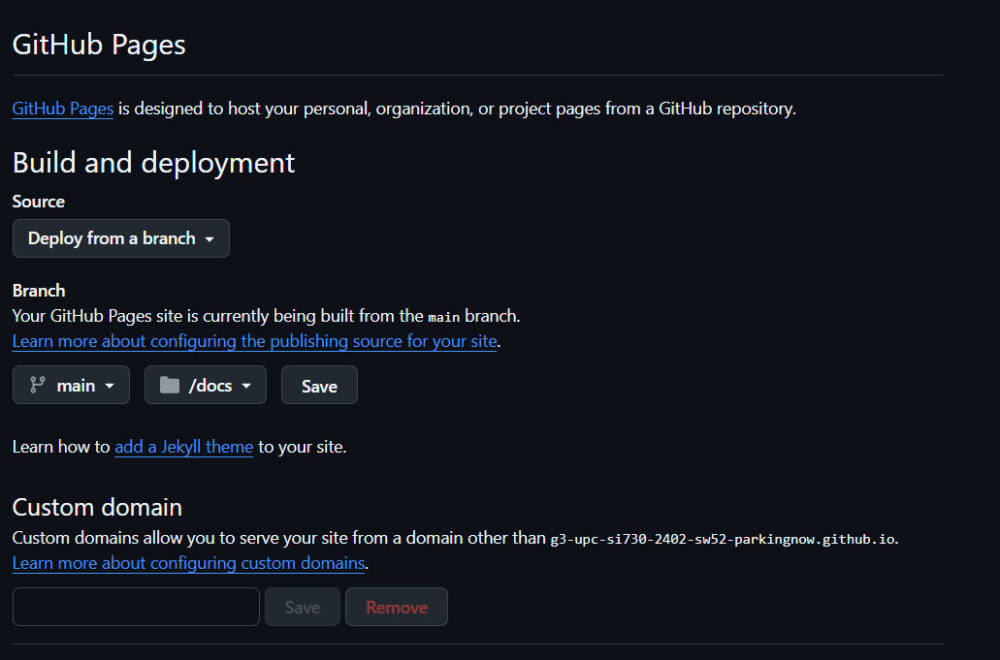

5. **Confirmación del Deploy:**
   Una vez que GitHub complete el proceso de deploy, en la parte superior de la sección Pages se mostrará un mensaje de confirmación junto con el enlace generado para acceder a la Landing Page del proyecto.

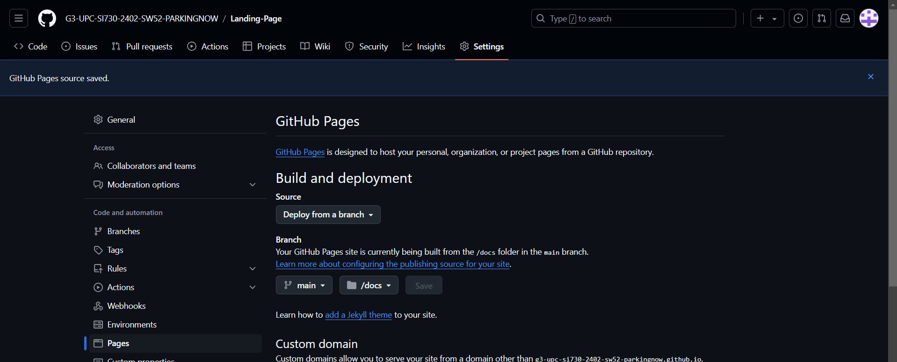


6. **Acceso a la Página:**
   Finalmente, podrás acceder a la Landing Page desde el enlace que se generó al finalizar el deploy.

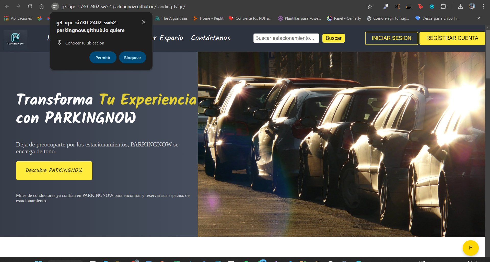

### 5.2. Implementación de Landing Page, Servicios y Aplicaciones

#### 5.2.1. Sprint 1

A continuación veremos sobre la planificacion del sprint 1

##### 5.2.1.1. Planificación del Sprint 1

| Sprint \# | Sprint 1 |
| :---: | :---: |
| **Sprint Planning Background** |  |
| Date | 03/09/24 |
| Time | 22:10 horas |
| Location | Virtual meeting \- Zoom |
| Prepared By | Diego Ulises Soto Quispe |
| Attendees | \- Diego Ulises Soto Quispe <br> \- Loechle Arias Mateo Italo <br> \- Rodrigo Liberato Saldaña <br> \- Omar Harold Rivera Ticllacuri <br> \- Samuel Elias Molina Asencios <br> \- Ramos Huamanchumo, Javier Aramis|
| Sprint 1 Review Summary | La opinión del product owner y las partes interesadas con respecto al avance realizado sobre el desarrollo de la landing page de PARKINGNOW fue positiva, cumpliendo con los objetivos esperados. |
| Sprint 1 Retrospective Summary | Se completó la implementación de la primera versión de la landing page, aunque se identificaron algunas deficiencias en cuanto al diseño visual y la usabilidad de la plataforma. Se mejorará en futuros sprints. |
| **Sprint Goal & User Stories** |  |
| Sprint 1 Goal | Desarrollar la Landing Page de PARKINGNOW. |
| Sprint 1 Velocity | Velocidad de 30 \- Primer Sprint |
| Sum of Story Points | Sprint 1 \- 45 Story Points |

##### 5.2.1.2. Backlog del Sprint 1

Trello: 
Link: https://trello.com/invite/b/66e8592fa7463897e6009305/ATTI40cdd58c92843377c1bb36efe058ba4f83EFDA35/sprint-1-parkingnow

| Sprint # | Sprint 1 |   |   |   |   |   |   |
| :---: | :---: | :---: | :---: | :---: | :---: | :---: | :---: |
| Historia de Usuario |   | Ítem de Trabajo / Tarea |   |   |   |   |   |
| ID | Título | ID | Título | Descripción | Estimación (Horas) | Asignado a | Estado |
| US01 | Navegación Intuitiva en la Landing Page | WT01 | Implementación de Navegación Intuitiva | Como visitante de la plataforma PARKINGNOW, deseo que la landing page tenga una barra de navegación clara para encontrar fácilmente las funciones clave. | 5 | Samuel Elias | Done |
| US02 | Visualización de Ciudades con Servicio | WT02 | Implementación de Visualización de Ciudades con Servicio | Como usuario de PARKINGNOW, deseo ver las ciudades en las que el servicio está disponible para saber dónde puedo utilizarlo. | 3 | Javier Aramis Ramos Huamanchumo | Done |
| US03 | Promociones Destacadas | WT03 | Implementación de Promociones Destacadas | Como visitante de PARKINGNOW, deseo ver promociones destacadas en la landing page para aprovechar descuentos en el servicio. | 2 | Diego Ulises Soto Quispe | Done |
| US04 | Beneficios para Conductores y Dueños de Playas | WT04 | Implementación de Beneficios | Como visitante de PARKINGNOW, quiero conocer los beneficios del servicio tanto para conductores como para dueños de estacionamientos. | 5 | Rodrigo Liberato | Done |
| US05 | Visualización de la Misión de la Empresa | WT05 | Implementación de Misión de la Empresa | Como visitante de PARKINGNOW, quiero visualizar la misión de la empresa para entender su propósito y valores. | 3 | Diego Ulises Soto Quispe | Done |
| US06 | Visualización de Visión de la Empresa | WT06 | Implementación de Visión de la Empresa | Como visitante de PARKINGNOW, deseo conocer la visión de la empresa para ver sus objetivos a largo plazo. | 3 | Javier Aramis Ramos Huamanchumo | Done |
| US07 | Visualización del Equipo | WT07 | Implementación de Visualización del Equipo | Como visitante de PARKINGNOW, quiero ver quiénes forman parte del equipo detrás de la plataforma para conocer a los responsables del servicio. | 2 | Mateo Italo Loechle Arias | Done |
| US08 | Información de Contacto | WT08 | Implementación de Información de Contacto | Como visitante de PARKINGNOW, deseo tener acceso a la información de contacto para comunicarme en caso de dudas o problemas. | 2 | Rodrigo Liberato | Done |
| US09 | Envío de Mensaje de Contacto | WT09 | Implementación de Envío de Mensaje de Contacto | Como visitante de PARKINGNOW, quiero poder enviar mensajes de contacto directamente desde la plataforma para resolver inquietudes rápidamente. | 5 | Omar Harold | Done |
| US10 | Visualización de Información de Características | WT10 | Implementación de Características del Servicio | Como visitante de PARKINGNOW, deseo ver las características principales del servicio en la landing page para entender qué ofrece. | 3 | Samuel Elias | Done |
| US11 | Botón de Registro e Inicio de Sesión | WT11 | Implementación de Botón de Registro e Inicio de Sesión | Como visitante de PARKINGNOW, quiero tener un botón de registro e inicio de sesión en la landing page para acceder fácilmente a mi cuenta. | 5 | Javier Aramis Ramos Huamanchumo | Done |
| US12 | Enlaces a Redes Sociales | WT12 | Implementación de Enlaces a Redes Sociales | Como visitante de PARKINGNOW, deseo ver enlaces a las redes sociales de la empresa para seguir sus actualizaciones. | 2 | Rodrigo Liberato | Done |
| US13 | Visualización de Slogan | WT13 | Implementación de Visualización de Slogan | Como visitante de PARKINGNOW, quiero ver el slogan de la empresa en la landing page para captar su mensaje principal. | 3 | Omar Harold | Done |
| US14 | Acceso a Información Legal | WT14 | Implementación de Información Legal | Como visitante de PARKINGNOW, deseo tener acceso a la información legal para conocer los términos y condiciones del servicio. | 2 | Mateo Italo Loechle Arias | Done |


##### 5.2.1.3. Evidencia del Desarrollo para la Revisión del Sprint

| Repositorio | Rama | ID del Commit | Mensaje del Commit | Cuerpo del Mensaje del Commit | Fecha del Commit |
| :---: | :---: | :---: | :---: | :---: | :---: |
| https://github.com/G3-UPC-SI730-2402-SW52-PARKINGNOW/Landing-Page-g3  | Feature/main | d033f50 | Initial commit | \- | 3 semanas atrás |
|  | Feature/main | fcff3d9 | Update README.md | \- | 26/09/24 |
|  | Feature/main | 236b776 | Update README.md | \- | 26/09/24 |
|  | Feature/main | ab49487 | Update README.md | \- | 27/09/24 |
|  | Feature/main | 2f0a9d7 | Update README.md | \- | 27/09/24 |

##### 5.2.1.4. Evidencia de la Suite de Pruebas para la Revisión del Sprint

En esta entrega correspondiente al Sprint 1, no se incluye esta sección, ya que el enfoque principal fue el desarrollo de la Landing Page como base. Esta fue completada satisfactoriamente de acuerdo con las necesidades de los usuarios, siguiendo las especificaciones del Sprint Backlog.


##### 5.2.1.5. Execution Evidence for Sprint Review.
Tras finalizar el Sprint 1, pudimos implementar todas las secciones de nuestra Landing Page, asegurando que se vea perfectamente. También le dimos un formato llamativo que atrae la atención del usuario hacia sus distintos elementos. Además, incorporamos métodos de navegación en la página, como botones al principio y al final, que permiten desplazarse fácilmente entre las secciones. A continuación, te compartimos imágenes que muestran los avances logrados.

Es importante destacar que el objetivo principal del Landing Page es convertir a los visitantes en futuros clientes o usuarios habituales de nuestro servicio. Para lograrlo, utilizamos llamados a la acción (Call To Action) que los guían hacia la aplicación web.

A continuación, te presentamos capturas de pantalla del desarrollo del Landing Page:

En la parte superior, el encabezado (Header) presenta botones para Inicio (Home), Características (Characteristics), Reserva de Espacio (Reserve-Space), y Contáctenos (Contact-Us), así como información sobre nosotros. Estos elementos permiten a los visitantes navegar fácilmente a la sección que desean ver.


**Imagen 1:** Encabezado y botones de desplazamiento.

Se muestra la sección "Transforma", que ofrece una breve descripción y una frase representativa de ParkingNow. Esta sección facilita el inicio del uso del servicio web y presenta una imagen vinculada al mismo.


**Imagen 2:** Sección Transforma.


Se presenta la sección de beneficios del servicio, destacando las ventajas específicas para cada segmento objetivo definido por el equipo.


**Imagen 3:** Sección Beneficios del servicio

La sección de tipos de clientes en la landing page muestra a los posibles usuarios los distintos perfiles de clientes disponibles.


**Imagen 4:** Sección tipo de cliente.

Seguidamente se presenta la sección de contacto, aquí nuestros posibles usuarios pueden realizarnos preguntas personalizadas acerca de la aplicación que se está presentando.


**Imagen 5:** Sección Contáctenos

A continuación, se muestra la sección "Sobre nosotros" (about-us), donde se ofrece un resumen con información sobre los integrantes que están desarrollando la solución de software.


**Imagen 6:** Sección footer.
Finalmente, se muestra la sección del pie de página, donde están disponibles nuestros enlaces para que el usuario pueda volver a las secciones que prefiera.

##### 5.2.1.6. Services Documentation Evidence for Sprint Review.

En el primer sprint, hemos desarrollado y lanzado la página de inicio de la aplicación web "PARKINGNOW". Esta página incluye diferentes secciones, las cuales fueron creadas por el equipo Code Mondonguito, con cada miembro del grupo responsable de una sección específica.

<table> 
  <tr>
    <td> <strong>End Point </strong></td>
    <td align="center"> <strong>Funciones</strong> </td>
  </tr>

  <tr>
    <td> https://github.com/G3-UPC-SI730-2402-SW52-PARKINGNOW/Landing-Page-g3 </td>
    <td> Desplegar Landing Page de PARKINGNOW</td>
  </tr>
</table>

##### 5.2.1.7. Software Deployment Evidence for Sprint Review.

Para implementar nuestra página, decidimos usar GitHub Pages. Durante este proceso, creamos un repositorio en GitHub para gestionar el control de versiones. En la sección de Configuración, publicamos el proyecto desde la rama "main", que anteriormente estaba en la rama "developer".

**Link de la Landing Page desplegada:** [PARKINGNOW] https://g3-upc-si730-2402-sw52-parkingnow.github.io/Landing-Page-g3/

##### 5.2.1.8. Team Collaboration Insights during Sprint.
En esta entrega, nuestro objetivo principal fue la creación de la Landing Page. Para lograrlo, utilizamos varias herramientas, incluyendo GitHub, Visual Studio Code, WebStorm, HTML, CSS y JavaScript. A continuación, presentamos los diagramas de flujo que muestran los commits realizados por cada miembro del equipo PARKINGNOW:

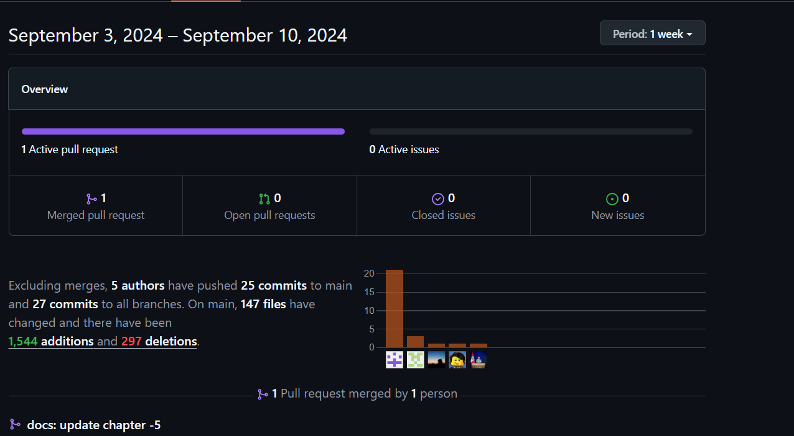

Esta imagen proporciona una representación visual de las fechas en que se realizaron modificaciones en el repositorio de nuestra Landing Page, así como el número de cambios efectuados en cada commit. Este gráfico es útil para entender cómo ha evolucionado el proyecto a lo largo del tiempo y la intensidad del desarrollo.

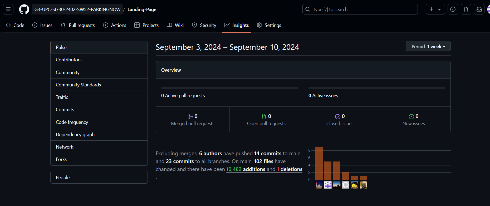

Estos gráficos muestran de manera visual las clonaciones realizadas en nuestro repositorio y las fechas en que ocurrieron. También proporcionan información sobre el número de visitantes que ha tenido el repositorio a lo largo del tiempo.

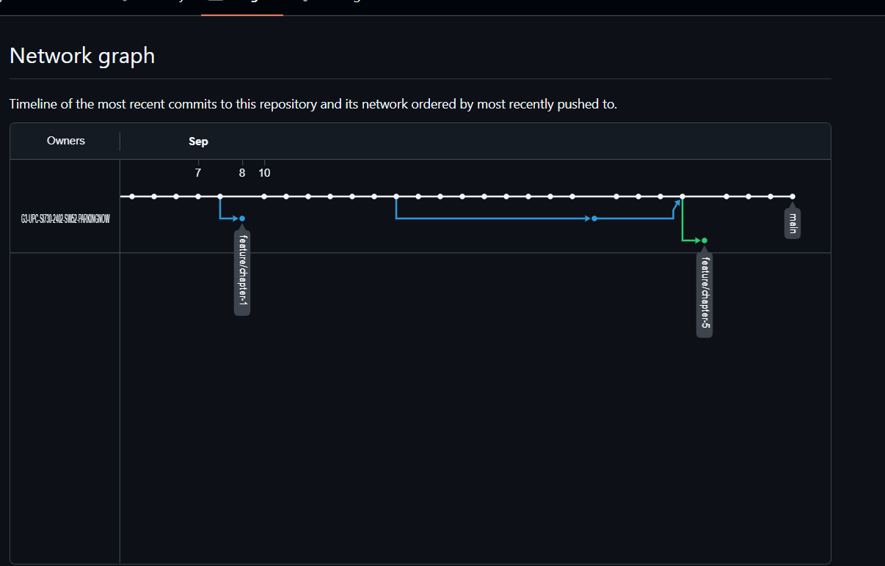

 5.2.1. Sprint 2

Los detalles de Sprint Planning se realizo al inicio de este sprint para poder definir las tareas respectivas para cada uno de los integrantes y mostrar nuestros avances semanales.

##### 5.2.2.2. Sprint Planning 2

| Sprint # | Sprint 2 |
| :---: | :---: |
| **Antecedentes de la Planificación del Sprint** |  |
| Fecha | 21/09/24 |
| Hora | 11:00 AM |
| Ubicación | Reunión virtual - Zoom |
| Preparado Por | Diego Ulises Soto Quispe - Líder del equipo|
| Asistentes | - Diego Ulises Soto Quispe <br> - Javier Aramis Ramos Huamanchumo <br> - Mateo Italo Loechle Arias <br> - Rodrigo Liberato Saldaña <br> - Omar Harold Rivera Ticllacuri <br> - Samuel Elias Molina Asencios |
| Resumen de la Revisión del Sprint 2 | El propósito de este Sprint fue mejorar la experiencia del usuario mediante la optimización de las funcionalidades en la interfaz de la página PARKINGNOW. Se completaron múltiples tareas enfocadas en la interfaz de usuario. |
| Resumen de la Retrospectiva del Sprint 2 | La ejecución de este Sprint fue satisfactoria, logrando cumplir con todas las tareas planificadas para el frontend. Se identificaron oportunidades de mejora en el diseño de la interfaz, las cuales se abordarán en el próximo Sprint. |
| **Objetivo del Sprint y Historias de Usuario** | US15, US16, US18, US19, US20, US21, US22, US23, US24, US25, US26, US27, US28, US29, US30, US31, US32 |
| Objetivo del Sprint 2 | Implementar la gestión de usuarios y desarrollar nuevas funcionalidades de frontend para la plataforma PARKINGNOW. |
| Velocidad del Sprint 2 | Velocidad de 30 - Segundo Sprint |
| Total de Puntos de Historia | Sprint 2 - 74 Puntos de Historia |


##### Sprint Backlog 2


Link del Trello: https://trello.com/invite/b/66e9b5b8f40799cfcf6b00d3/ATTIa96971e39f8a6c5827fd4d56f290181a384AD640/sprint-backlog-2
| Sprint # | Sprint 2 |   |   |   |   |   |   |
| :---: | :---: | :---: | :---: | :---: | :---: | :---: | :---: |
| User Story |   | Work-Item / Task |   |   |   |   |   |
| ID | Title | ID | Title | Description | Estimation (Hours) | Assigned To | Status |
| US15 | Inicio de Sesión para Conductores | WT01 | Implementación de Inicio de Sesión | Desarrollar la funcionalidad de inicio de sesión para conductores en la aplicación. | 4 | Omar Harold Rivera Ticllacuri | To-do |
| US16 | Registro de Conductores | WT02 | Implementación de Registro | Crear la funcionalidad de registro de conductores en la plataforma. | 4 | Samuel Elias Molina Asencios | To-do |
| US17 | Registro de Dueños de Playa | WT03 | Implementación de Registro de Dueños | Desarrollar el registro para dueños de playa en la aplicación. | 4 | Rodrigo Liberato Saldaña | To-do |
| US18 | Búsqueda de Reservas para Conductores | WT04 | Implementación de Búsqueda de Reservas | Implementar la búsqueda de reservas activas y pasadas para conductores. | 3 | Diego Ulises Soto Quispe | In-Process |
| US19 | Pago de Reservas por Transacción | WT05 | Implementación de Pago | Desarrollar la funcionalidad de pago por transacción para reservas de estacionamiento. | 5 | Diego Ulises Soto Quispe | Done |
| US20 | Confirmación de Reserva Registrada | WT06 | Implementación de Confirmación | Crear pantalla de confirmación de reserva registrada. | 3 | Omar Harold Rivera Ticllacuri | Done |
| US21 | Registro de Opiniones | WT07 | Implementación de Opiniones | Implementar la funcionalidad para registrar opiniones de usuarios. | 3 | Samuel Elias Molina Asencios | Done |
| US22 | Notificaciones en el Dashboard del Conductor | WT08 | Implementación de Notificaciones | Desarrollar el sistema de notificaciones para el dashboard del conductor. | 4 | Rodrigo Liberato Saldaña | Done |
| US23 | Configuración de Preferencias de Usuario | WT09 | Implementación de Preferencias | Permitir a los usuarios configurar sus preferencias en la aplicación. | 3 | Ramos Huamanchumo, Javier Aramis | Done |
| US24 | Historial de Reservas en el Dashboard del Conductor | WT10 | Implementación de Historial | Desarrollar el historial de reservas en el dashboard del conductor. | 4 | Diego Ulises Soto Quispe | Done |
| US25 | Alerta de Espacio Disponible | WT11 | Implementación de Alertas | Crear alertas para disponibilidad de espacios de estacionamiento. | 4 | Omar Harold Rivera Ticllacuri | To-do |
| US26 | Soporte en Tiempo Real en el Dashboard del Conductor | WT12 | Implementación de Soporte | Desarrollar un sistema de soporte en tiempo real para conductores. | 5 | Samuel Elias Molina Asencios | To-do |
| US27 | Favoritos para Conductores | WT13 | Implementación de Favoritos | Permitir a los conductores marcar estacionamientos como favoritos. | 3 | Rodrigo Liberato Saldaña | To-do |
| US28 | Verificación de Reserva en el Dashboard del Conductor | WT14 | Implementación de Verificación | Crear funcionalidad para verificar el estado de la reserva en el dashboard. | 3 | Ramos Huamanchumo, Javier Aramis | To-do |
| US29 | Cancelación de Reserva en el Dashboard | WT15 | Implementación de Cancelación | Desarrollar la opción de cancelación de reservas desde el dashboard. | 4 | Diego Ulises Soto Quispe | To-do |
| US30 | Gestión de Alertas para Conductores | WT16 | Implementación de Gestión de Alertas | Implementar la gestión de alertas de seguridad y disponibilidad. | 4 | Omar Harold Rivera Ticllacuri | To-do |
| US31 | Personalización de Notificaciones para Conductores | WT17 | Implementación de Personalización | Permitir la personalización de notificaciones en la aplicación. | 3 | Samuel Elias Molina Asencios | To-do |
| US32 | Visualización de Mapa en el Dashboard del Conductor | WT18 | Implementación de Mapa | Integrar un mapa interactivo en el dashboard. | 5 | Rodrigo Liberato Saldaña | To-do |


##### 5.2.2.3. Development Evidence for Sprint Review

Aca tenemos nuestro Frontend ya desplegado.

| Repository | Branch | Commit ID | Commit Message | Commit Message Body | Committed on (Date) |
| :---: | :---: | :---: | :---: | :---: | :---: |
| [https://github.com/G3-UPC-SI730-2402-SW52-PARKINGNOW/Frontend-](https://github.com/G3-UPC-SI730-2402-SW52-PARKINGNOW/Frontend-)  | feature/chapter-5 | f93fb7c | Add Sprint 2 table to README | \- | 17/09/24 |
|  | feature/chapter-5 | b3ba393 | Added 5.2.2.6 section on README.md | \- | 24/09/24 |
|  | feature/chapter-5 | a5224f0 | Update README.md | \- | 23/09/24 |
|  | feature/chapter-5 | 0581697 | Updated README.md and added Trello board screenshot | \- | 17/09/24 |
|  | feature/chapter-5 | 74b2f9c | Update README.md | \- | 24/09/24 |

##### 5.2.2.4. Testing Suite Evidence for Sprint Review
Debido al desarrollo del Landing Page y del Front End Application dentro del Sprint 2, se omite esta sección para el presente avance del proyecto. En futuro desarrollo se brindará información con mayor detalle.

##### 5.2.2.5.Execution Evidence for Sprint Review.

Para el Frontend

Link del despliegue: https://aplicaciones-web-42482.web.app

1.- Login


2.- Registro para ambos usuarios


3.- Registro para el conductor


4.- Registro para el dueño de playa de estacionamiento


5.- Pantalla del dueño de playa de estacionamiento


6.- Pantalla del conductor


7.- Pantalla de Reservas

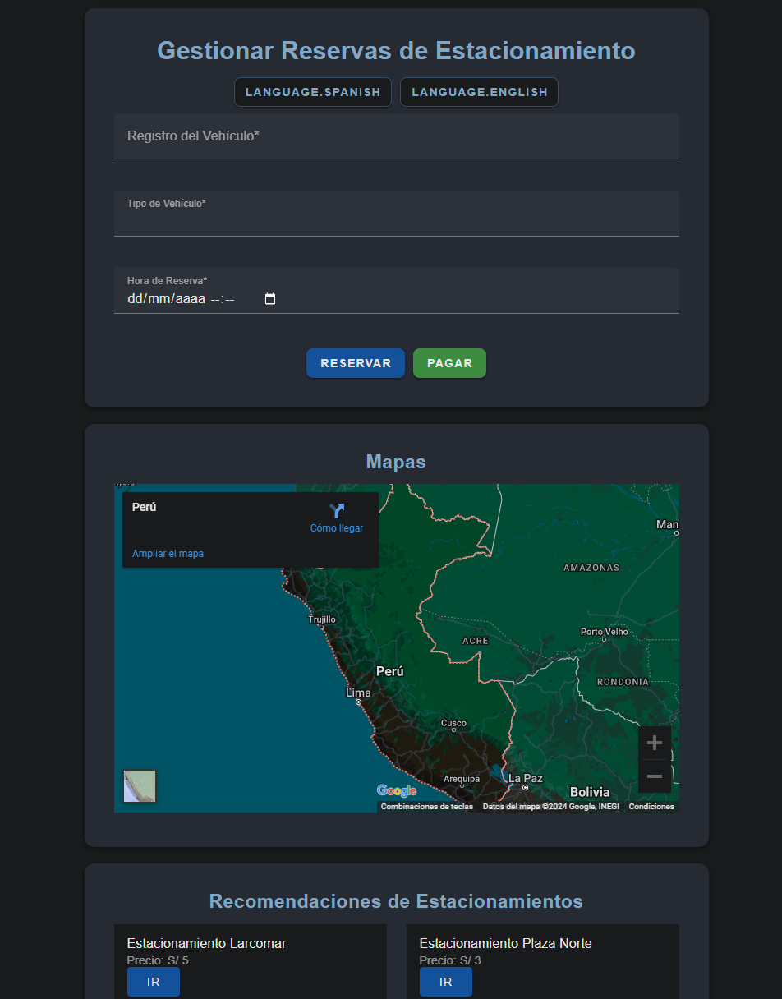

##### 5.2.2.6.Services Documentation Evidence for Sprint Review.

| Nombre de Endpoint | Acciones Implementadas | Sintaxis de llamada | Especificacion de parametros | Ejemplo de llamada| Explicacion del Response|
|- |- |- |- |-| - |
| reservations-api.service.json | GET | ``fetch('src/app/reservations/services/reservations-api.service.json')`` | Siempre se necesitara la ID para hallar los datos| ``fetch('src/app/reservations/services/reservations-api.service.json') .then(response => response.json()) .then(data => {this.reservations = data;});`` | En esta seccion, se retornan los IDs de las reservas que se hicieorn en la aplicacion | 
| reviews-api.service.json | GET | ``fetch('src/app/reviews/services/reviews-api.service.json')`` | Siempre se necesitara la ID para hallar los datos requeridos | ``fetch('src/app/reviews/services/reviews-api.service.json') .then(response => response.json()) .then(data => {this.reviews = data;});`` | En esta seccion, se retornan los IDs de las reviews que se hicieorn en la aplicacion  | 
| parking-aviability-api.service.json | GET | ``fetch('src/app/parking/services/parkingAV-api.service.json')`` | Siempre se necesitara la ID para hallar los datos requeridos | ``fetch('src/app/parking/services/parkingAV-api.service.json') .then(response => response.json()) .then(data => {this.parkingAV = data;});`` | En esta seccion, se retornan los IDs de los sitios libres en los estacionamientos que se hicieorn en la aplicacion |
| users-api.service.json | GET | (Not used) | Siempre se necesitara la ID para hallar los datos requeridos | Language spanish to english index.html | En esta seccion, se retornan los IDs de los usuarios que se hicieorn en la aplicacion |
| promotions-api.service.json | GET | ``fetch('src/app/promotions/services/promotions-api.service.json')`` | Siempre se necesitara la ID para hallar los datos requeridos | ``fetch('src/app/promotions/services/promotions-api.service.json') .then(response => response.json()) .then(data => {this.promotions = data;});`` | En esta seccion, se retornan los IDs de las promociones que se hicieorn en la aplicacion |
| security-api.service.json | GET | ``fetch('src/app/security/services/security-api.service.json')`` | Siempre se necesitara la ID para hallar los datos requeridos | ``fetch('src/app/security/services/security-api.service.json') .then(response => response.json()) .then(data => {this.security = data;});`` | En esta seccion, se retornan los IDs de los servicios de seguridad que se hicieorn en la aplicacion |

##### 5.2.2.7.Software Deployment Evidence for Sprint Review.

Para esta entrega, nuestra solucion de ha sido desplegado en el siguiente repositorio


Asimismo como el frontend en el siguiente repositorio


Por ultimo, utilizamos esta API: [Parking API](https://parkalot.io/open-api/) (https://parkalot.io/open-api/)

##### 5.2.2.8.Team Collaboration Insights during Sprint.

En esta entrega, el objetivo fue avanzar en el desarrollo de la primera versión de la Aplicación Web Frontend y desplegar una versión actualizada de la página de aterrizaje. Para lograr esto, se utilizaron herramientas como GitHub para el control de versiones y los editores de código Visual Studio Code y Rider, junto con tecnologías como HTML, CSS y JavaScript para construir las interfaces. A continuación, se incluyen diagramas que muestran los commits realizados por cada miembro del equipo durante este sprint.

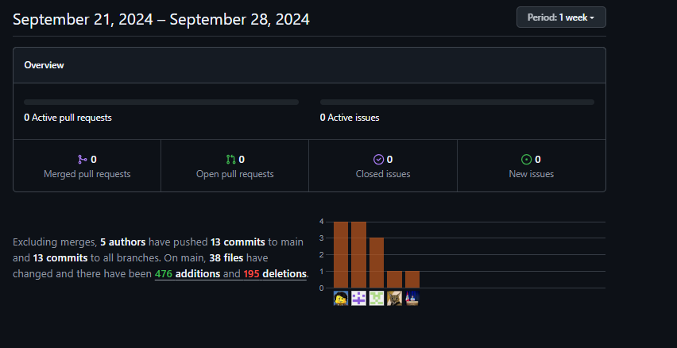


La imagen a continuación ofrece una representación visual de las fechas en las que se hicieron los commits en el repositorio de nuestra Aplicación Web Frontend y la página de aterrizaje. Este gráfico es fundamental para entender cómo ha evolucionado el proyecto con el tiempo, destacando las contribuciones de los miembros del equipo durante el Sprint.


Los gráficos presentados también proporcionan una vista general de las clonaciones realizadas en nuestro repositorio y las fechas en que ocurrieron. Además, muestran datos sobre el número de visitantes que ha recibido el repositorio a lo largo del tiempo.

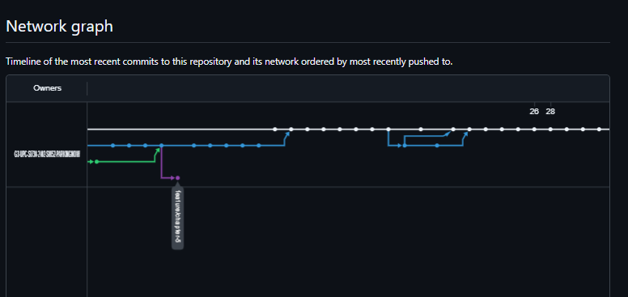


### 5.2.3 Sprint 3

Esta sección describe los elementos clave de la planificación y ejecución del Sprint 3. Durante este sprint, el enfoque principal estará en reforzar el backend de **ParkingNow**, implementando funcionalidades esenciales para garantizar una experiencia de usuario fluida y confiable en la plataforma.

## 5.2.3.1. Planificación del Sprint 3

A continuación, se detallan los aspectos de la reunión de planificación del Sprint, donde se definieron las tareas a realizar durante el período establecido.

| **Sprint #**                      | Sprint 3                                                                                                             |
|-----------------------------------|----------------------------------------------------------------------------------------------------------------------|
| **Antecedentes de la Planificación del Sprint**     |                                                                                                                      |
| **Fecha**                          | 30/10/24                                                                                                             |
| **Hora**                          | 3:00 pm                                                                                                              |
| **Ubicación**                      | Reunión virtual con coordinación adicional por WhatsApp                                                                |
| **Preparado Por**                   | Equipo de ParkingNow                                                                                                           |
| **Asistentes (a la reunión de planificación)** | Todos los miembros del equipo de ParkingNow                                                                      |
| **Resumen de la Revisión del Sprint 3**   | En este sprint, se completaron las funcionalidades principales del backend de ParkingNow, incluyendo la gestión de reservas, notificaciones, consultas, transacciones y usuarios. Se logró un despliegue exitoso dentro del plazo acordado, mejorando la documentación y expandiendo la visión del producto mediante la incorporación de elementos clave.<br><br>En general, el equipo mantuvo una organización y comunicación efectivas, utilizando plataformas como Google Meet para facilitar la coordinación. Sin embargo, se identificó la oportunidad de fortalecer la colaboración y coordinación para alcanzar estándares de calidad aún más altos. |
| **Resumen de la Retrospectiva del Sprint 3** | Para continuar avanzando de manera eficiente, es fundamental optimizar la estimación de tiempo para el desarrollo y la integración del backend con la base de datos. Esto permitirá evitar desajustes en los plazos y asegurar un flujo de trabajo estable.<br><br>También se recomienda un uso más frecuente y organizado del formato Markdown en la documentación y comunicaciones internas, facilitando la comprensión de la información para todo el equipo. |
| **Objetivo del Sprint y Historias de Usuario**    |                                                                                                                      |
| **Velocidad del Sprint 3**             | 20                                                                                                                    |
| **Total de Puntos de Historia**           | 32                                                                                                                   |


### 5.2.3.2. Backlog del Sprint 3

Esta sección muestra las tareas realizadas durante el presente sprint. A continuación, se incluye una captura del tablero de tareas en Trello, junto con el enlace al tablero.


**Enlace al Trello:** https://trello.com/invite/b/6724d8fb0429d3b504591841/ATTIa159b1edae603492dcfd8a0b4b6e79fa96226B0D/sprint-backlog-3
| Sprint # | Sprint 3 |   |   |   |   |   |   |
| :---: | :---: | :---: | :---: | :---: | :---: | :---: | :---: |
| Historia de Usuario |   | Tarea |   |   |   |   |   |
| ID | Título | ID | Título | Descripción | Estimación (Horas) | Asignado a | Estado |
| US34 | Gestión de Clientes en Servicio al Cliente | WT01 | Implementación de Gestión de Clientes | Crear un endpoint para administrar consultas y solicitudes de servicio al cliente. | 4 | Omar Harold | Review |
| US35 | Notificación de Cambios en la Disponibilidad de Espacios | WT02 | Implementación de Notificaciones de Espacios | Desarrollar notificaciones automáticas para actualizaciones en la disponibilidad de espacios. | 5 | Samuel Elias | Done |
| US36 | Historial de Transacciones para Usuarios | WT03 | Implementación de Historial de Transacciones | Crear un endpoint que permita a los usuarios consultar su historial de transacciones. | 3 | Rodrigo Liberato | Done |
| US37 | Gestión de Ocupación de Espacios en Tiempo Real | WT04 | Implementación de Ocupación de Espacios | Implementar una funcionalidad para actualizar la disponibilidad de espacios en tiempo real. | 5 | Javier Aramis Ramos Huamanchumo | Done |
| US38 | Configuración de Alertas de Seguridad | WT05 | Implementación de Configuración de Alertas | Crear un endpoint para que los administradores configuren alertas de seguridad. | 4 | Diego Ulises | Review |
| US40 | Registro de Alertas de Seguridad | WT06 | Implementación de Registro de Alertas | Desarrollar un sistema para registrar todas las alertas de seguridad en la plataforma. | 3 | Omar Harold | Review |
| US41 | Gestión de Datos de Vehículos | WT07 | Implementación de Gestión de Vehículos | Crear un endpoint para almacenar y gestionar la información de los vehículos registrados. | 3 | Samuel Elias | Review |
| US45 | Integración con el Sistema de Pago | WT08 | Implementación de Sistema de Pago | Crear un endpoint para procesar pagos y verificar transacciones. | 5 | Mateo Italo Loechle Arias | Review |

##### 5.2.3.3. Development Evidence for Sprint Review
**Frontend**

| Repository   | ID       | Commit Message                  | Date       |
|--------------|----------|---------------------------------|------------|
|   | 276fedef75433f42d049ecf512d120433563908c   | Add payment page and deploy to Firebase            | 2024-11-05 |
| [https://github.com/G3-UPC-SI730-2402-SW52-PARKINGNOW/Frontend.git](https://github.com/G3-UPC-SI730-2402-SW52-PARKINGNOW/Frontend.git)   | ce1afb7ca8250cf24e909deec2a47798d6e44b49   | Update payment page and language toggle feature               | 2024-11-05 |
|   | 63afe991fd3c618be6ef0bd0319d202c29e01fb3   | Short and precise commit message in English    | 2024-11-05 |

**Backend**

| Repository   | ID       | Commit Message                  | Date       |
|--------------|----------|---------------------------------|------------|
|   | 2a2443fba245d1c6201cdba688199d91181d0661   | update            | 2024-11-04 |
| [https://github.com/G3-UPC-SI730-2402-SW52-PARKINGNOW/Backend.git](https://github.com/G3-UPC-SI730-2402-SW52-PARKINGNOW/Backend.git)   |    |         |  |


##### 5.2.3.4. Testing Suite Evidence for Sprint Review

Pruebas Unitarias 

Configuración de Pruebas
Archivo: appsettings.json
En este archivo se configura la conexión a la base de datos del backend y los niveles de registro de la aplicación, necesarios para la correcta ejecución de las pruebas unitarias. Esta configuración permite simular el entorno de producción y obtener logs detallados durante la ejecución de las pruebas.

ConnectionStrings: Define la cadena de conexión a la base de datos para el entorno de pruebas.
Logging: Configura el nivel de registro, siendo "Information" para la aplicación y "Warning" para ASP.NET Core.

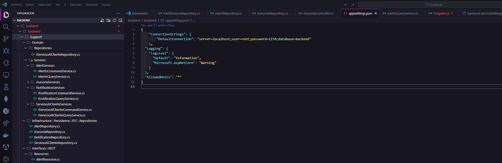

Servicio de Consulta de Alertas
Archivo: AlertsQueryService.cs
Este archivo implementa el servicio de consultas para las alertas (AlertsQueryService). Los métodos Handle permiten obtener una alerta específica por su ID (GetAlertByIdQuery) y todas las alertas (GetAllAlertsQuery). Estos métodos interactúan con el repositorio de alertas (IAlertRepository), proporcionando acceso a los datos necesarios para las pruebas unitarias de las funcionalidades de alerta.

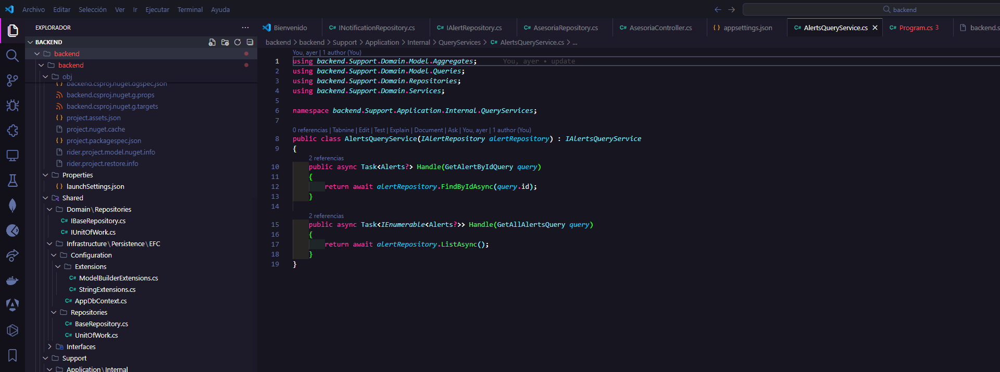

| Repository          | Branch                 | Commit  | Author          | Message                   | Date         |
|---------------------|------------------------|---------|-----------------|---------------------------|--------------|
| Web-Application-AF  | feature/acceptance_test | 71084fd | Rodrigo Liberato | doc: add acceptance tests | 30/10/2024   |


##### 5.2.3.5. Execution Evidence for Sprint Review

En este entregable tenemos los siguientes avances, mejorando la interfaz del usuario para los conductores y duenos de estacionamientos. Asimismo como la principal funcionalidad de nuestro usuario, que es el reservar un espacio.

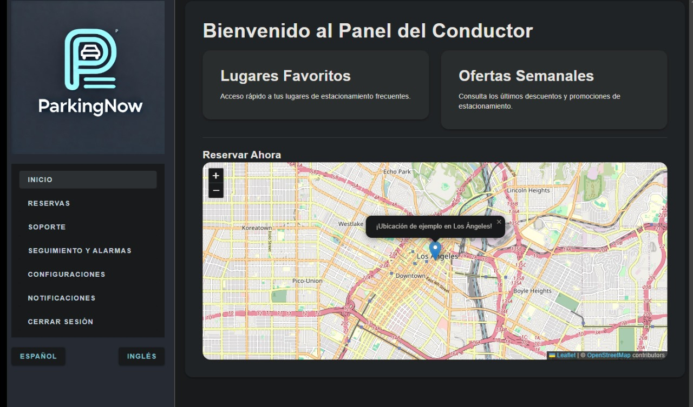

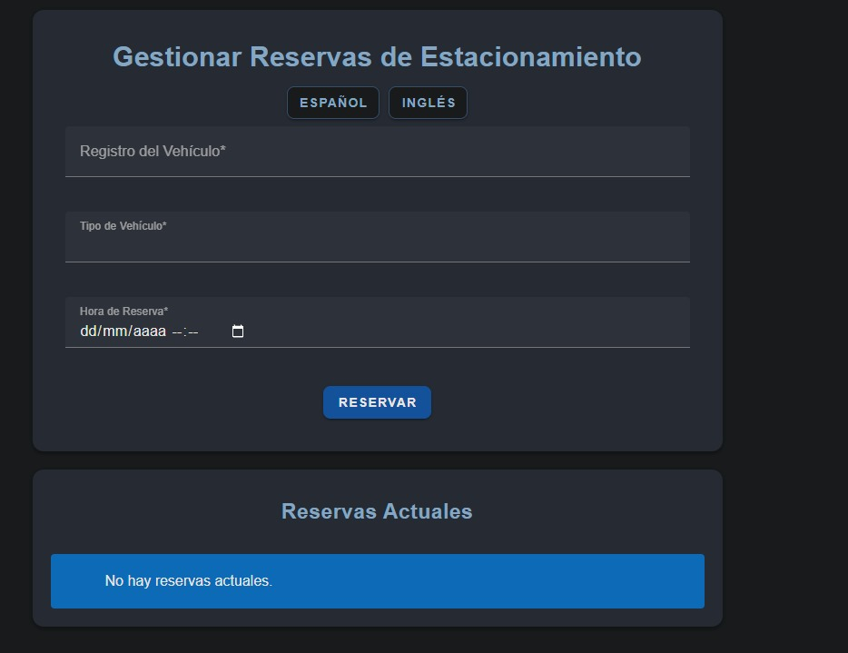

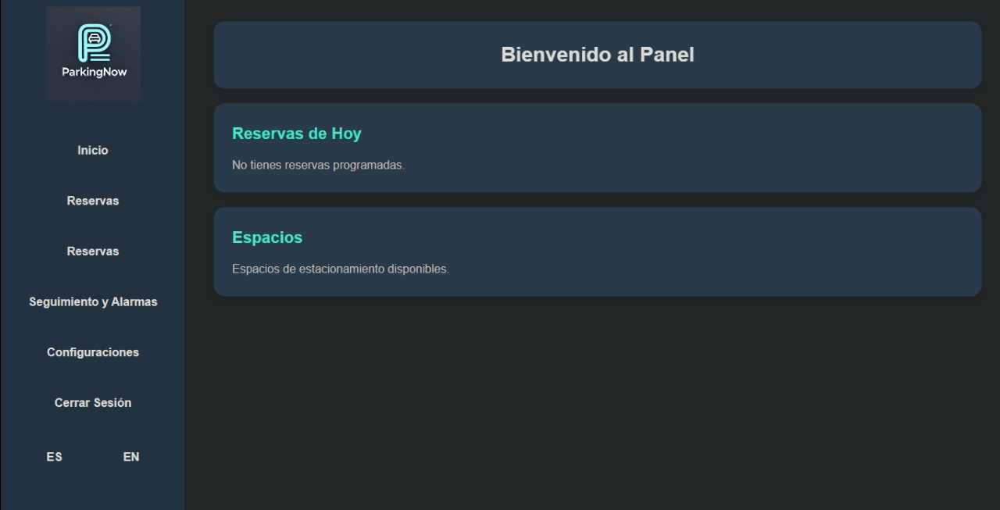

Ademas, incluimos la funcion de cambiar la contrasena
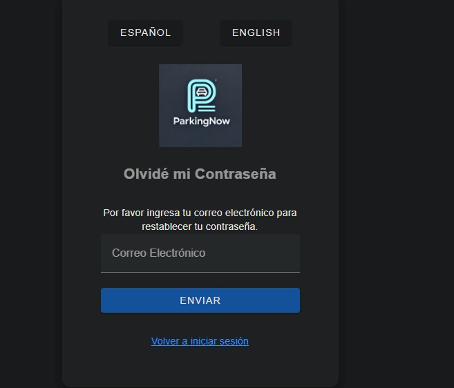

##### 5.2.3.6. Services Documentation Evidence for Sprint Review
Esta sección detalla los Endpoints documentados con OpenAPI que se desarrollaron como parte del alcance del Sprint, acompañada de una breve introducción sobre los logros obtenidos en la documentación de Web Services.

Durante este Sprint, se completó la documentación de los principales Endpoints necesarios para la interacción con nuestra API. Cada uno cuenta con especificaciones claras que facilitan su comprensión y uso para los desarrolladores que deseen integrar estos servicios.

| Endpoint                     | Acción Implementada            | Verbo HTTP | Sintaxis de Llamada              | URL EndPoint                      | URL JSON                                                                                                              |
|------------------------------|--------------------------------|------------|----------------------------------|-----------------------------------|-----------------------------------------------------------------------------------------------------------------------|
| `/api/v1/conductores`        | Obtener todos los conductores | GET        | `GET /api/v1/conductores`        | [EndPoint](/Assets/conductores.yaml) | https://raw.githubusercontent.com/G3-UPC-SI730-2402-SW52-PARKINGNOW/Backend/main/public/conductores.json       |
| `/api/v1/conductores`        | Crear un nuevo conductor       | POST       | `POST /api/v1/conductores`       | [EndPoint](/Assets/conductores.yaml) | https://raw.githubusercontent.com/G3-UPC-SI730-2402-SW52-PARKINGNOW/Backend/main/public/conductores.json       |
| `/api/v1/reservas`           | Obtener todas las reservas     | GET        | `GET /api/v1/reservas`           | [EndPoint](/Assets/reservas.yaml)    | https://raw.githubusercontent.com/G3-UPC-SI730-2402-SW52-PARKINGNOW/Backend/main/public/reservas.json         |
| `/api/v1/reservas`           | Crear una nueva reserva        | POST       | `POST /api/v1/reservas`          | [EndPoint](/Assets/reservas.yaml)    | https://raw.githubusercontent.com/G3-UPC-SI730-2402-SW52-PARKINGNOW/Backend/main/public/reservas.json         |
| `/api/v1/espacios`           | Obtener todos los espacios     | GET        | `GET /api/v1/espacios`           | [EndPoint](/Assets/espacios.yaml)    | https://raw.githubusercontent.com/G3-UPC-SI730-2402-SW52-PARKINGNOW/Backend/main/public/espacios.json         |
| `/api/v1/locales`            | Obtener todos los locales      | GET        | `GET /api/v1/locales`            | [EndPoint](/Assets/locales.yaml)     | https://raw.githubusercontent.com/G3-UPC-SI730-2402-SW52-PARKINGNOW/Backend/main/public/locales.json          |

Repositorio: https://github.com/G3-UPC-SI730-2402-SW52-PARKINGNOW/Backend

Commit de los Endpoints: [Ver Commit](hG3-UPC-SI730-2402-SW52-PARKINGNOW/Backend/main/public/)

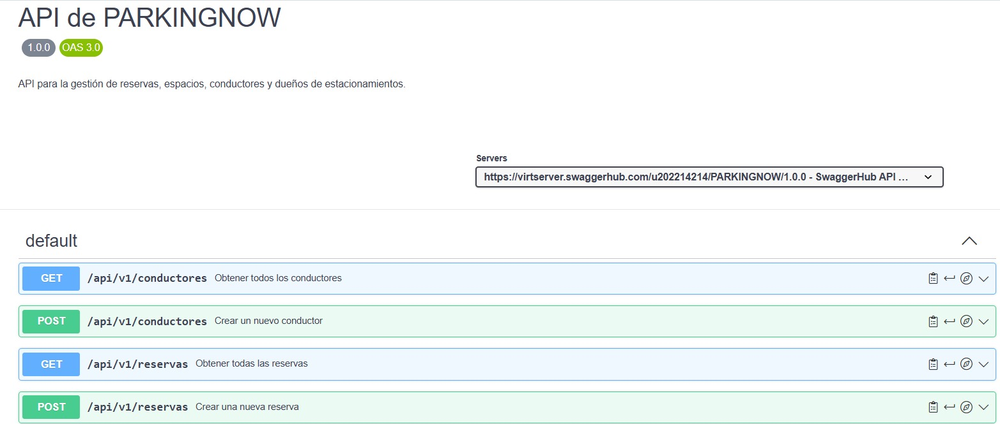

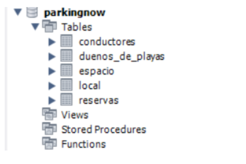

##### 5.2.3.7. Software Deployment Evidence for Sprint Review
Durante este sprint, se ha completado el desarrollo del backend para la aplicación web "ParkingNow" utilizando diversas herramientas y tecnologías. Cabe destacar que el despliegue del backend de la API no se encuentra dentro del alcance de este sprint.

- **Git**: Utilizamos este sistema de control de versiones para facilitar el trabajo colaborativo y el seguimiento de las versiones del backend en un repositorio remoto.

- **Gitflow**: Un flujo de trabajo colaborativo que nos ayudó a organizar el desarrollo en ramas dentro del repositorio, facilitando la contribución en equipo al backend.

- **GitHub**: Plataforma en la que alojamos el repositorio del backend del proyecto, permitiendo almacenar y gestionar sus distintas versiones.

- **Swagger UI**: Empleamos esta herramienta para documentar y probar la API, asegurando que los endpoints sean accesibles y estén definidos adecuadamente.

- **Spring Boot**: Este framework fue clave para desarrollar el backend, permitiéndonos implementar la lógica del negocio e integrar la base de datos utilizando JPA y Hibernate.

- **Firebase**: Plataforma de Google para desarrollo de aplicaciones web y móviles. En "ParkingNow," se usa Firebase para la autenticación de usuarios y almacenamiento de datos, optimizando la calidad del servicio y la entrega de contenido.

##### 5.2.3.8. Team Collaboration Insights during Sprint

**Backend**

En esta entrega, nuestro principal objetivo fue avanzar en la implementación parcial del backend. Para ello, utilizamos varias herramientas como GitHub, IntelliJ y C#. A continuación, se presentan diagramas de flujo que muestran los commits realizados por cada miembro del equipo CodeMondonguito.

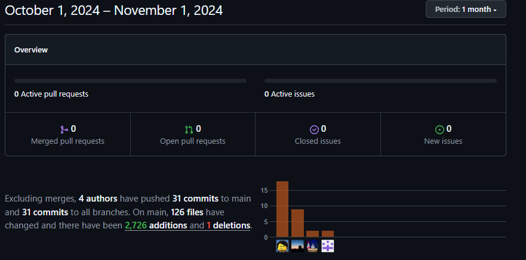

El gráfico de barras muestra la cantidad de commits realizados por cada integrante del equipo.

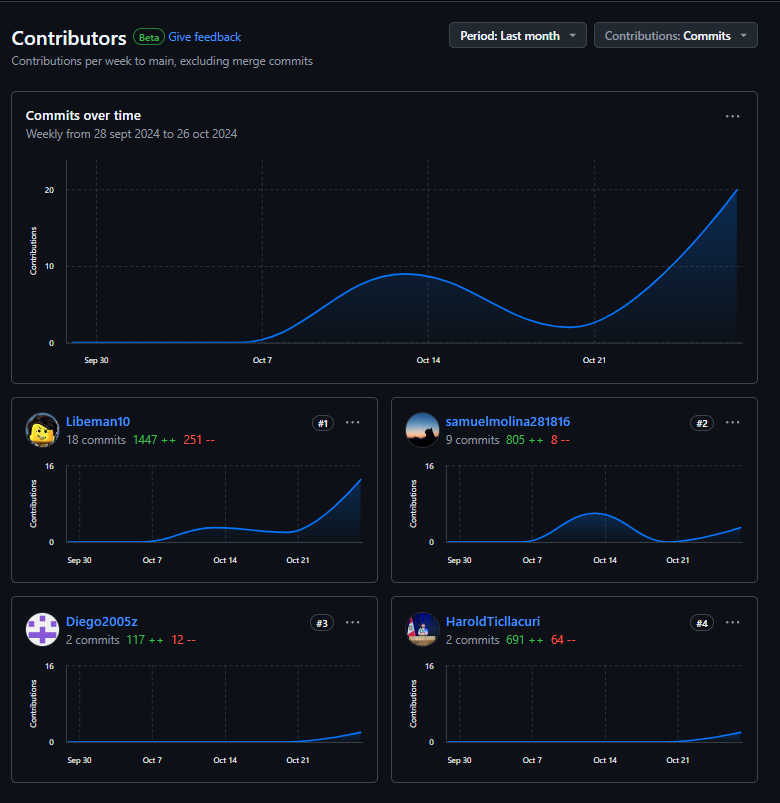

Esta imagen visualiza las fechas en que se realizaron cambios en el repositorio de la Landing Page y la cantidad de modificaciones en cada commit, ayudando a entender la evolución e intensidad del proyecto en distintos períodos.

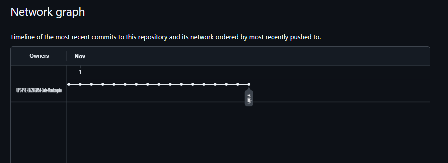

La imagen muestra las ramas creadas para el desarrollo del backend de la aplicación web, destacando el progreso del desarrollo en esta área.

**Frontend**

En esta entrega, nuestro segundo objetivo fue completar la implementación del frontend. Para ello, empleamos herramientas como GitHub y WebStorm. A continuación, presentamos los diagramas de flujo que representan los commits de cada miembro del equipo CodeMondonguito:


El gráfico de barras ilustra la cantidad de commits realizados por cada integrante del equipo.

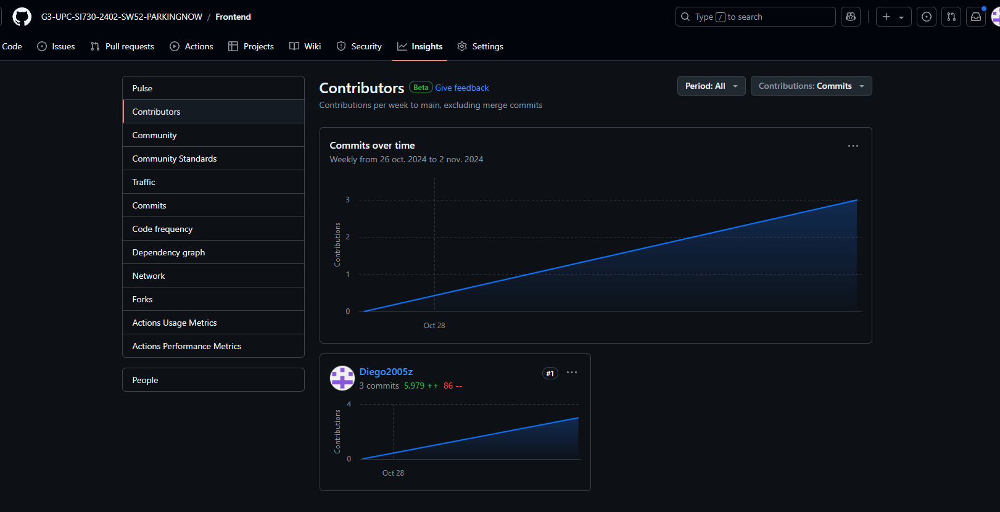

Esta imagen presenta las fechas en que se realizaron cambios en el repositorio de la Landing Page y el número de modificaciones en cada commit, ofreciendo una visión sobre la evolución e intensidad del desarrollo.


**Landing Page**

Finalmente, esta sección se enfocó en el desarrollo de la Landing Page. Utilizando herramientas como GitHub, WebStorm y Figma, diseñamos una interfaz atractiva y funcional que brinda una primera impresión a los usuarios. A continuación, se presentan los diagramas de flujo de los commits realizados en esta parte del proyecto:

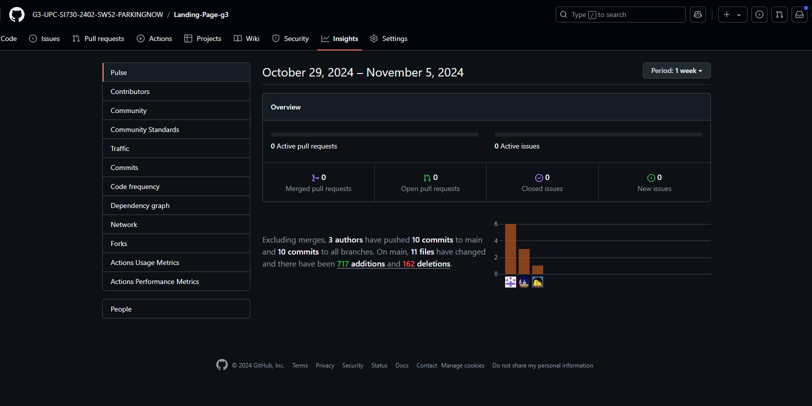

Este gráfico ilustra el progreso de los commits relacionados con la Landing Page, destacando la colaboración del equipo en esta fase.

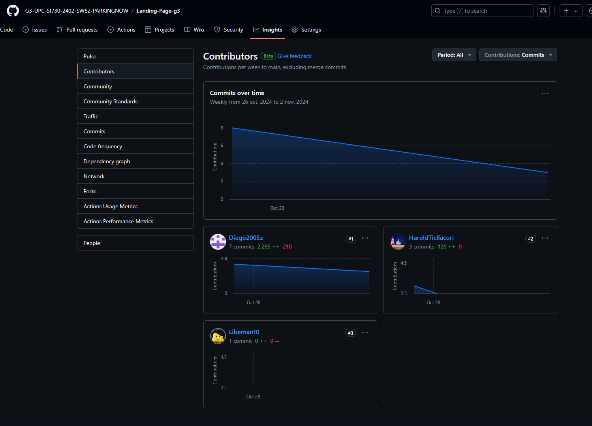

Esta imagen proporciona un análisis temporal de las modificaciones en la Landing Page, permitiendo observar cómo han evolucionado el diseño y funcionalidad a lo largo del desarrollo, lo que es esencial para evaluar el rendimiento del equipo y la efectividad en las estrategias de diseño.

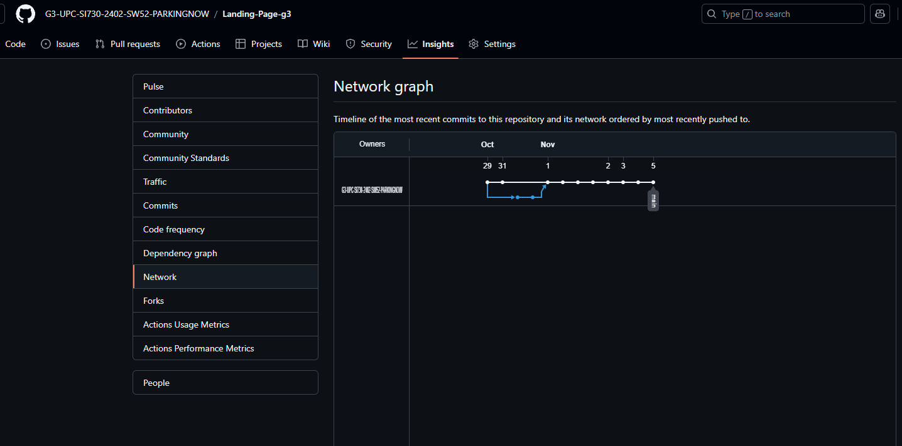

### 5.3 Validation Interviews

#### 5.3.1 Diseño de entrevistas

### Con el objetivo de obtener un mejor entendimiento de nuestros usuarios, realizamos una serie de entrevistas para verificar el rendimiento de nuestra página web.

**Segmento objetivo \#1: Conductores Urbanos Frecuentes**

**Preguntas personales:**

* ¿Cual es tu nombre?  
* ¿Cuántos años tienes?

**Preguntas principales:**

* ¿Sientes que lograste navegar por la página sin complicaciones?  
* ¿Qué opinas acerca del diseño que presenta la página web?  
* ¿Tuviste algún problema al navegar por la página web utilizando tu navegador de preferencia?  
* ¿Consideras que la traducción a Inglés de la página web funciona correctamente?  
* ¿Tuviste algún problema al realizar los pagos para las reservas?  
* ¿Tienes alguna sugerencia o comentario que desees compartir?

**Segmento objetivo \#2: Dueños de playas de estacionamientos**

**Preguntas personales:**

* ¿Cual es tu nombre?  
* ¿Cuántos años tienes?

**Preguntas principales:**

* ¿Sientes que lograste navegar por la página sin complicaciones?  
* ¿Qué opinas acerca del diseño que presenta la página web?  
* ¿Tuviste algún problema al navegar por la página web utilizando tu navegador de preferencia?  
* ¿Consideras que la traducción a Inglés de la página web funciona correctamente?  
* ¿Tuviste algún problema al registrar tu local en la página?  
* ¿Crees que la información estadística que te brinda la página es suficiente?  
* ¿Tienes alguna sugerencia o comentario que desees compartir?

#### 5.3.2 Registro de entrevistas

Video completo con las entrevistas: https://upcedupe-my.sharepoint.com/:v:/g/personal/u202214477_upc_edu_pe/EcHAXaW6lgNDmJkuTPV0N5oB_OYUU0U80FdDPoKGw9qqdQ?e=oSIXPD&nav=eyJyZWZlcnJhbEluZm8iOnsicmVmZXJyYWxBcHAiOiJTdHJlYW1XZWJBcHAiLCJyZWZlcnJhbFZpZXciOiJTaGFyZURpYWxvZy1MaW5rIiwicmVmZXJyYWxBcHBQbGF0Zm9ybSI6IldlYiIsInJlZmVycmFsTW9kZSI6InZpZXcifX0%3D

**Segmento objetivo \#1: Conductores Urbanos Frecuentes**

Entrevistado N°1: Bárbara Eliana Seminario León

* Sexo: Femenino  
* Edad: 50  
* Ubicación en la que vive: Surco, Lima, Perú.

Acerca de la entrevista:

* Link: https://youtu.be/Fg9fIl8Di3c
* Instante en el que inicia: 3:50  
* Duración: 5:12

Resumen:

Para Bárbara, el desarrollo de la página web la deja bastante satisfecha, considera que esta presenta lo necesario para realizar las reservas y cree que las opciones de lenguaje extra podrían ayudar bastante.

Captura de pantalla:

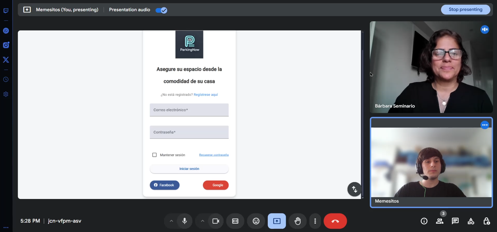

Entrevistado N°2: Mario Andre Cacho Seminario

* Sexo: Masculino  
* Edad: 21  
* Ubicación en la que vive: Surco

Acerca de la entrevista:

* Link: https://youtu.be/IVxXsnByDhA
* Instante en el que inicia: 3:41  
* Duración: 4:46

Resumen:

Para Mario el diseño de la página web le permite realizar las reservas sin ningún problema, considera que la organización de esta funciona de manera correcta, además indica que, dentro de una futura actualización, le gustaría que hubieran más lenguajes disponibles para la traducción.

Captura de Pantalla:

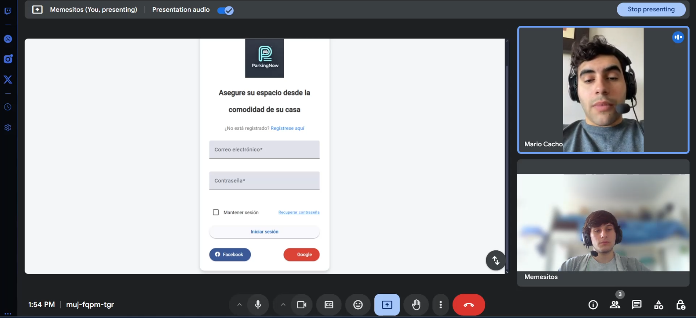

Entrevistado N°3: Jean Pierre Arroyo

* Sexo: Masculino  
* Edad: 20  
* Ubicación en la que vive: Surco

Acerca de la entrevista:

* Link: https://youtu.be/QqaDMAeRi8s
* Instante en el que inicia: 6:40  
* Duración: 8:53

Resumen:

Para Jean, la navegación por la página web fue bastante intuitiva y piensa que el diseño funciona correctamente. Considera que los colores usados para la página son atractivos, sin embargo, indica que también son un poco oscuros para su gusto. Le gustaría ver una funcionalidad que le permitiera verificar cuales son los estacionamientos más baratos.

Captura de Pantalla:

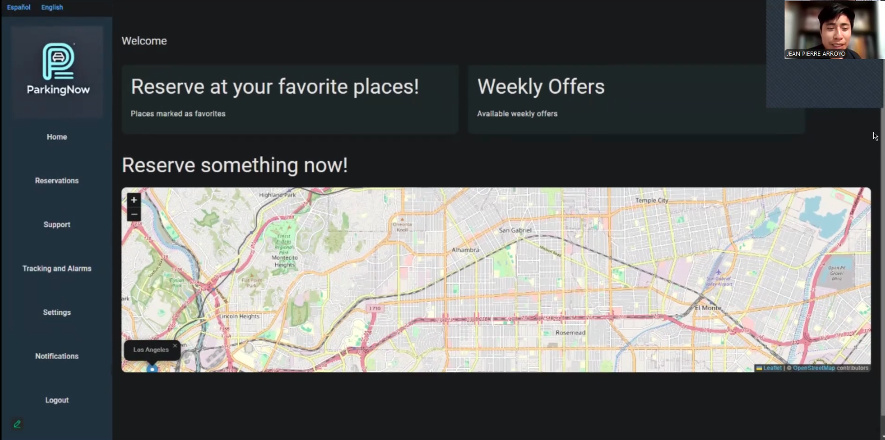

**Segmento objetivo \#2: Dueños de playas de estacionamientos**

Entrevistado N°1: Johan Bottger Salazar

* Sexo: Masculino  
* Edad: 21  
* Ubicación en la que vive: San Borja

Acerca de la entrevista:

* Link: https://youtu.be/ZcN99SBKxuo  
* Instante en el que inicia: 3:20  
* Duración: 5:15

Resumen:

Para Johan, la vista de dueños de playas de estacionamiento es perfecta, cumple con las expectativas que tenía en las entrevistas pasadas y considera que la sección de las estadísticas le podrían ser bastante útil cuando tenga que verificar cómo le está yendo a su negocio.

Captura de pantalla:

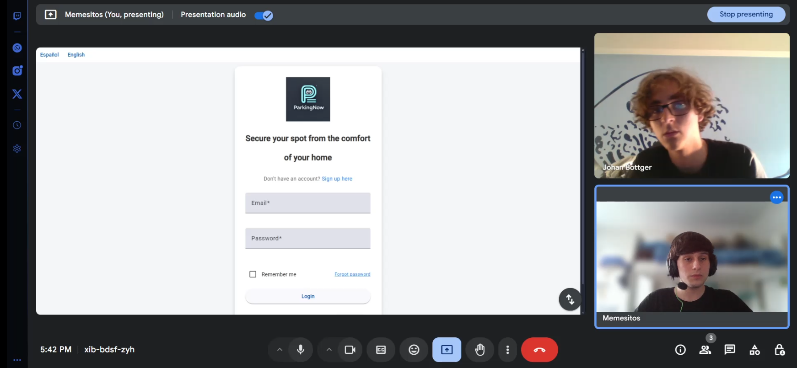

Entrevistado N°2: Sebastián de las Casas Latour

* Sexo: Masculino  
* Edad: 20  
* Ubicación en la que vive: San Borja

Acerca de la entrevista: 

* Link: https://youtu.be/lcb6KS_wIr0  
* Instante en el que inicia:  3:16  
* Duración: 5:23

Resumen:

Para Sebastián, la página web presenta la información de una manera sencilla e intuitiva, considera que las sección de reservas y estadísticas le ayudarían bastante al organizar ciertos aspectos en su playa de estacionamiento.

Captura de pantalla:

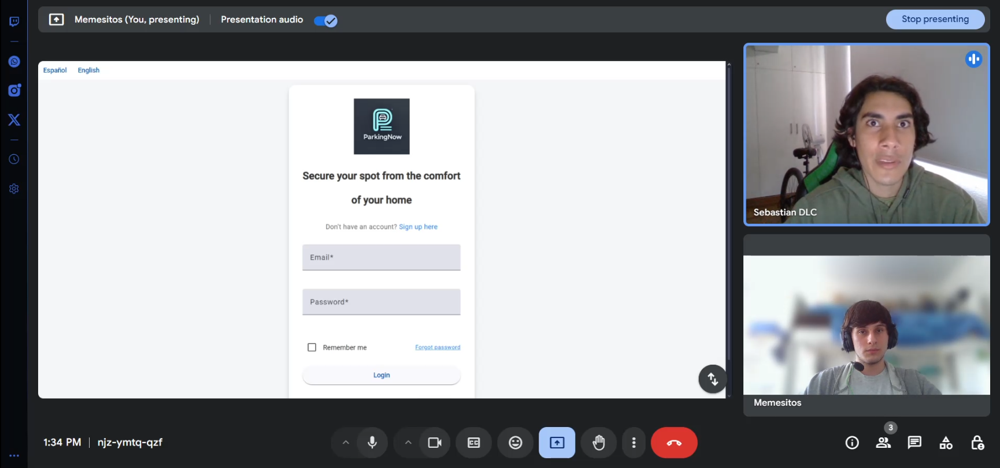

#### 5.3.3 Evaluaciones según heurísticas

SITE o APP A EVALUAR: PARKINGNOW

TAREAS A EVALUAR:

El alcance de esta evaluación incluye la revisión de la usabilidad de las siguientes tareas:

1. Inicio de sesión  
2. Registro de nuevo usuario  
3. Navegación de usuario  
4. Detalles de reservas  
5. Pestaña de inicio

No están incluidas en esta versión de la evaluación las siguientes tareas:

1. Métodos de pago  
2. Soporte  
3. Sección de notificaciones

ESCALA DE SEVERIDAD:

Los errores serán puntuados tomando en cuenta la siguiente escala de severidad

| Nivel | Descripción |
| ----- | :---- |
| 1 | Problema superficial: puede ser fácilmente superado por el usuario ó ocurre con muy poco frecuencia. No necesita ser arreglado a no ser que exista disponibilidad de tiempo. |
| 2 | Problema menor: puede ocurrir un poco más frecuentemente o es un poco más difícil de superar para el usuario. Se le debería asignar una prioridad baja resolverlo de cara al siguiente reléase |
| 3 | Problema mayor: ocurre frecuentemente o los usuarios no son capaces de resolverlos. Es importante que sean corregidos y se les debe asignar una prioridad alta. |
| 4 | Problema muy grave: un error de gran impacto que impide al usuario continuar con el uso de la herramienta. Es imperativo que sea corregido antes del lanzamiento. |

**TABLA RESUMEN:**

| \# | Problema | Escala de severidad | Heurística/Principio violado(o) |
| :---: | ----- | :---: | ----- |
| 1 | En la página de inicio de sesión, al seleccionar los botones de “Google” y “Facebook” la aplicación no permite iniciar sesión por esos medios | 2 | Information Architecture: Is it usable? |
| 2 | En la página de inicio de sesión, al presionar el botón de “Iniciar sesión”, no se dirige a una página en concreto | 4 | Information Architecture: Is it usable? |
| 3 | En la sección de registro de usuario, los campos para rellenar no verifican que los datos presenten el formato dado | 1 | Information Architecture: Is it usable? |
| 4 | La sección de “Seguimiento y alarmas” en la vista de conductores frecuentes presenta un botón con texto que no está completo | 1 | Information Architecture: Is it usable? |
| 5 | La sección de “Configuración” presenta varias formas para cambiar el idioma | 1 | Usability: Consistencia y estándares |
| 6 | En la sección de inicio de la vista de dueños de playas de estacionamiento, existen dos botones con el mismo nombre de “Reservas” | 1 | Usability: Consistencia y estándares |
| 7 | En la sección de inicio de la vista de dueños de playas de estacionamiento, el primer botón de Reserva no permite interactuar con los datos que se presentan | 2 | Information Architecture: Is it usable? |

**DESCRIPCIÓN DE PROBLEMAS:**

PROBLEMA \#1: En la página de inicio de sesión, al seleccionar los botones de “Google” y “Facebook” la aplicación no permite iniciar sesión por esos medios

Severidad: 2

Heurística violada: Information Architecture: Is it usable?

Problema:

Al ingresar a la página de inicio de sesión, cuando se selecciona el botón de iniciar sesión con Google o Facebook, estos no brindan un menú para rellenar los datos de nuestra cuenta de respectivamente.


Recomendación:

Permitir al usuario iniciar sesión con los servicios disponibles que se indican.

PROBLEMA \#2: En la página de inicio de sesión, al presionar el botón de “Iniciar sesión”, no se dirige a una página en concreto

Severidad: 4

Heurística violada: Information Architecture: Is it usable?

Problema:

Al ingresar a la página de inicio de sesión, cuando se presiona el botón “Iniciar sesión” nos dirige hacia la página “Page Not Found”, evitando el inicio de sesión correcto.

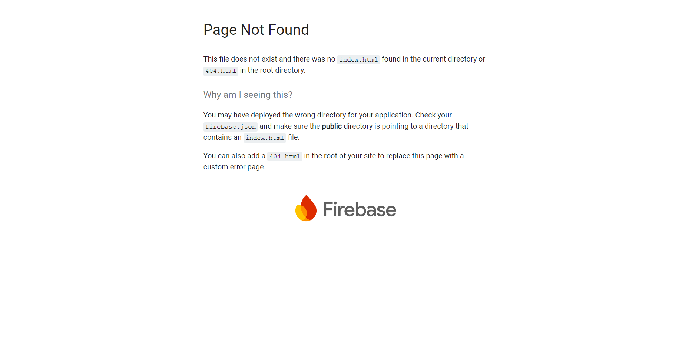

Recomendación:

Permitir al usuario iniciar sesión al presionar el botón correspondiente.

PROBLEMA \#3: En la sección de registro de usuario, los campos para rellenar no verifican que los datos presenten el formato dado

Severidad: 1

Heurística violada: Information Architecture: Is it usable?

Problema:

Al rellenar los datos de registro de cuenta, la aplicación web requiere de que ciertos campos cumplan con los requisitos necesarios para verificar el uso correcto de datos ingresados, sin embargo, solo la sección de correo emplea esta verificación. 

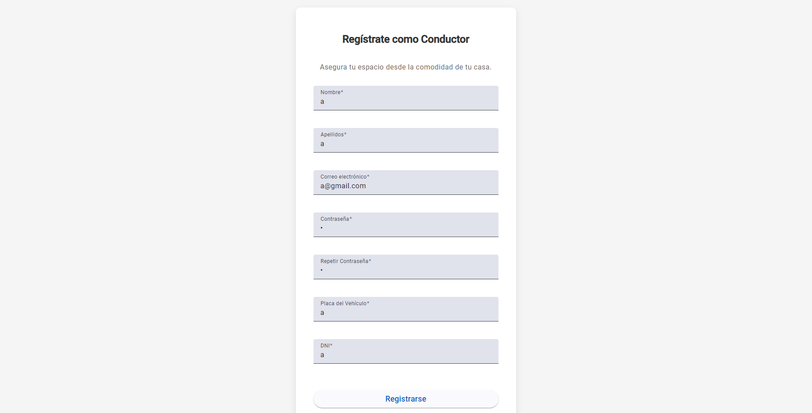

Recomendación:

No permitir al usuario ingresar con datos incorrectos.

PROBLEMA \#4: La sección de “Seguimiento y alarmas” en la vista de conductores frecuentes presenta un botón con texto que no está completo

Severidad: 1

Heurística violada: Information Architecture: Is it usable?

Problema:

Al ingresar a la sección de “Seguimiento y alarmas” en la vista de conductores frecuentes, existen ciertos botones que, debido al tamaño de la fuente utilizada, no se logra visualizar de manera correcta el contenido del botón.

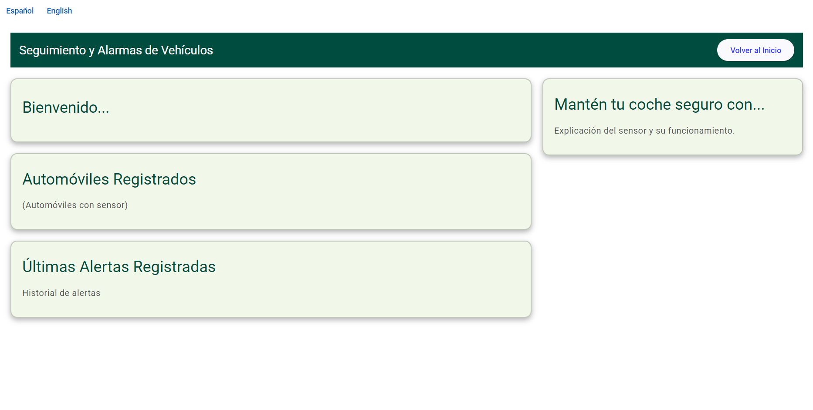

Recomendación:

Reducir el tamaño de la fuente utilizada para el texto de los botones, reducir el tamaño de los mismos botones o mostrar los datos requeridos en forma de un solo cuadro de texto.

PROBLEMA \#5: La sección de “Configuración” presenta varias formas para cambiar el idioma

Severidad: 1

Heurística violada: Usability: Consistencia y estándares

Problema:

Al ingresar a la sección de “Configuración” en ambas vistas, existen varias maneras de cambiar el idioma correspondiente, primero la barra superior que se encuentra en todas las otras secciones de la página web y la segunda encontrada en forma de cuadro a la derecha en la sección de “Idioma”


Recomendación:

Uniformizar la manera de cambiar el idioma de la página para evitar redundancias.

PROBLEMA \#6: En la sección de inicio de la vista de dueños de playas de estacionamiento, existen dos botones con el mismo nombre de “Reservas”

Severidad: 1

Heurística violada: Usability: Consistencia y estándares

Problema:

Dentro de la sección Inicio de la página web en la vista de dueños de playas de estacionamiento existen dos botones que presentan el nombre de “Reservas”, sin embargo, cada uno presenta información distinta.


Recomendación:

Realizar el cambio de nombre a uno de los botones o juntar la información que se tiene en ambas secciones.

PROBLEMA \#7: En la sección de inicio de la vista de dueños de playas de estacionamiento, el primer botón de Reserva no permite interactuar con los datos que se presentan

Severidad: 2

Heurística violada: Information Architecture: Is it usable?

Problema:

Dentro de la primera sección “Reserva” en el inicio de la página web en la vista de dueños de playas de estacionamiento al presionar los botones ninguno realiza alguna acción. 


Recomendación:

Brindar algún cambio de página o interfaz al presionar los botones dentro de esta sección o indicar la información de cada uno en un solo bloque de texto.

# 5.4. Video About-the-Product

En esta sección se encuentra el Video About the Product, donde promocionamos ParkingNow, mostrando sus principales características: introducción, modelo de negocio, funcionalidades, beneficios, y testimonios de usuarios clave de la app, dirigida a optimizar y facilitar la gestión de reservas de estacionamiento. El video destaca cómo ParkingNow ayuda a los usuarios a encontrar estacionamientos disponibles, realizar reservas en tiempo real y acceder a recomendaciones personalizadas.

Link: https://upcedupe-my.sharepoint.com/:v:/g/personal/u202214477_upc_edu_pe/ERsAgPJmxQ9ElMjzvwOEjEEBQ3Nm3jPeJY6XEwjtB10ghQ?e=lvZx0W&nav=eyJyZWZlcnJhbEluZm8iOnsicmVmZXJyYWxBcHAiOiJTdHJlYW1XZWJBcHAiLCJyZWZlcnJhbFZpZXciOiJTaGFyZURpYWxvZy1MaW5rIiwicmVmZXJyYWxBcHBQbGF0Zm9ybSI6IldlYiIsInJlZmVycmFsTW9kZSI6InZpZXcifX0%3D

Youtube: https://youtu.be/iiqdHlbm_0Y

### Conclusiones y recomendaciones

El proyecto PARKINGNOW ha logrado avances significativos al desarrollar una solución tecnológica integral para abordar los problemas de estacionamiento en las ciudades. Al combinar sensores infrarrojos que detectan en tiempo real con una plataforma intuitiva para los usuarios, PARKINGNOW no solo optimiza la ocupación de los espacios, sino que también simplifica la vida de los conductores urbanos. Esta solución ha demostrado su efectividad al reducir los tiempos de búsqueda de estacionamiento y aumentar la rentabilidad para los propietarios de estos espacios, creando un balance adecuado entre tecnología y experiencia del usuario.

Durante todo el desarrollo, se ha priorizado la automatización, lo que ha permitido una integración fluida con los sistemas de gestión de estacionamientos ya existentes. Las entrevistas con usuarios y las pruebas en campo han confirmado que la solución no solo cumple con las expectativas iniciales, sino que va más allá al satisfacer las necesidades de los principales interesados. La aplicación no solo aborda la problemática de encontrar estacionamiento, sino que también contribuye a reducir el tráfico y a una gestión más eficiente de los recursos, alineándose con objetivos de sostenibilidad a largo plazo.

PARKINGNOW tiene un gran potencial para convertirse en un referente en la gestión de estacionamientos urbanos, especialmente en grandes ciudades donde los problemas de tráfico y falta de espacios de estacionamiento son desafíos constantes. La plataforma ha demostrado ser escalable y adaptable a diversos contextos, tanto geográficos como tecnológicos.

**Recomendaciones:**

1. **Ampliación de funcionalidades:** Es recomendable que PARKINGNOW siga invirtiendo en el desarrollo de nuevas características que aporten más valor a los usuarios y propietarios de estacionamientos. Esto podría incluir la integración de pagos automatizados, notificaciones en tiempo real sobre la disponibilidad de espacios y una mayor personalización de la experiencia del usuario a través de análisis predictivos de comportamiento. Además, el uso de tecnologías avanzadas como la inteligencia artificial para predecir ocupaciones podría posicionar aún más a PARKINGNOW como un líder en el sector.

2. **Expansión geográfica y sectorial:** Con los buenos resultados obtenidos en los mercados iniciales, PARKINGNOW debería explorar su expansión a otras ciudades con una alta demanda de estacionamiento y problemas recurrentes de tráfico. Además, la plataforma podría buscar oportunidades en sectores específicos como aeropuertos, centros comerciales y eventos masivos para ampliar aún más su mercado.

3. **Estrategia de marketing y educación:** Para aumentar la adopción de la plataforma, se recomienda desarrollar una estrategia de marketing digital dirigida tanto a conductores como a propietarios de estacionamientos. Utilizar testimonios de usuarios satisfechos y estudios de caso que demuestren reducciones en el tiempo de búsqueda y los costos asociados puede ser una herramienta poderosa para atraer nuevos usuarios. También es importante educar al público objetivo sobre los beneficios de PARKINGNOW en la reducción del tráfico y el impulso de la sostenibilidad urbana.

4. **Monitoreo y análisis constante:** A medida que la plataforma crece, es vital implementar un sistema de análisis continuo de los datos generados por los usuarios y los espacios de estacionamiento. El análisis de grandes volúmenes de datos permitirá detectar problemas tempranamente y adaptarse rápidamente a las necesidades del mercado. Este enfoque garantizará que la experiencia del usuario se mantenga optimizada y que el servicio siga siendo competitivo.

5. **Sostenibilidad y responsabilidad social:** Conforme crece el impacto de PARKINGNOW, es aconsejable centrarse aún más en su papel dentro del ecosistema de movilidad sostenible. Iniciativas como reducir la huella de carbono de los conductores al disminuir el tiempo de búsqueda de estacionamiento y colaborar con proyectos de ciudades inteligentes, posicionarán a PARKINGNOW no solo como una empresa rentable, sino también como un actor clave en la sostenibilidad urbana.

### Video About-the-Team

En esta sección se encuentra el video About the Team, donde presentamos al equipo de desarrollo de ParkingNow. El video incluye una introducción sobre el proceso de trabajo colaborativo, las metodologías utilizadas, y las contribuciones individuales de cada miembro del equipo. Cada integrante comparte su experiencia, destacando las actividades realizadas, los logros alcanzados, y el desarrollo de competencias a lo largo del proyecto.

El video ilustra cómo el equipo de ParkingNow ha trabajado para crear una solución eficiente y fácil de usar para la gestión de reservas de estacionamiento, mostrando el compromiso y el esfuerzo detrás del producto.

Link: https://upcedupe-my.sharepoint.com/:v:/g/personal/u202214477_upc_edu_pe/EbgZQUGjiFtHjxkosuMMjLcB3dQbjZA0Rn8-w3etH7sfdw?e=Grathd&nav=eyJyZWZlcnJhbEluZm8iOnsicmVmZXJyYWxBcHAiOiJTdHJlYW1XZWJBcHAiLCJyZWZlcnJhbFZpZXciOiJTaGFyZURpYWxvZy1MaW5rIiwicmVmZXJyYWxBcHBQbGF0Zm9ybSI6IldlYiIsInJlZmVycmFsTW9kZSI6InZpZXcifX0%3D

Youtube:https://youtu.be/STqD3UXmT2s

# Bibliografía

1. **ICCSI**. (2023, 12 de marzo). *Estacionamiento inteligente con sensores: Revolución en estacionamientos*. ICCSI. Recuperado el 6 de septiembre de 2024, de [https://iccsi.com.ar/estacionamiento-inteligente-con-sensores](https://iccsi.com.ar/estacionamiento-inteligente-con-sensores)

2. **Conducimos contigo**. (s.f.). *Elparking.com*. Recuperado el 1 de septiembre de 2024, de [https://elparking.com/](https://elparking.com/)

3. **InnovaTech**. (2023, 15 de junio). *Smart Parking IoT: Descubre cómo funciona*. InnovaTech. Recuperado el 6 de septiembre de 2024, de [https://www.innova-tech.mx/smart-parking-iot](https://www.innova-tech.mx/smart-parking-iot)

4. **People, S.**. (s.f.). *App Aparcados*. Apk2gestion.com. Recuperado el 2 de septiembre de 2024, de [https://apk2gestion.com/es/servicios/conoce-nuestra-app](https://apk2gestion.com/es/servicios/conoce-nuestra-app)

5. **Reserva de parking - Parkimeter**. (s.f.). *Parkimeter.com*. Recuperado el 3 de septiembre de 2024, de [https://parkimeter.com/es?srsltid=AfmBOoqJCDlJN_hdtP3dMuF6fXWF8B1PytqQ2hWnVsgR7rEAH4a00y3P](https://parkimeter.com/es?srsltid=AfmBOoqJCDlJN_hdtP3dMuF6fXWF8B1PytqQ2hWnVsgR7rEAH4a00y3P)

6. **Sernauto**. (s.f.). *Tipos de sensores de los vehículos: Qué función cumplen*. Sernauto. Recuperado el 6 de septiembre de 2024, de [https://www.sernauto.es/blog/tipos-de-sensores-de-losvehiculos-que-funcion-cumplen/](https://www.sernauto.es/blog/tipos-de-sensores-de-losvehiculos-que-funcion-cumplen/)

7. **Propuesta País**. (2023, 22 de julio). *La necesidad de una política de estacionamiento vehicular en Lima Metropolitana*. Propuesta País. Recuperado el 6 de septiembre de 2024, de [https://propuestapais.pe/noticia/la-necesidad-de-una-politica-de-estacionamiento-vehicular-en-lima-metropolitana/](https://propuestapais.pe/noticia/la-necesidad-de-una-politica-de-estacionamiento-vehicular-en-lima-metropolitana/)

8. **Intertraffic**. (2023, 28 de junio). *Revolucionando las experiencias de estacionamiento: Las últimas soluciones inteligentes para un estacionamiento eficiente*. Intertraffic. Recuperado el 6 de septiembre de 2024, de [https://www.intertraffic.com/news/espanol/revolucionando-las-experiencias-de-estacionamiento](https://www.intertraffic.com/news/espanol/revolucionando-las-experiencias-de-estacionamiento)


## Anexos

| Sección                                                   | Enlace                                                                                                                                                             |
|-----------------------------------------------------------|--------------------------------------------------------------------------------------------------------------------------------------------------------------------|
| Reporte                                                   | https://github.com/G3-UPC-SI730-2402-SW52-PARKINGNOW/Report                                                                                                        |
| Landing page                                              | https://github.com/G3-UPC-SI730-2402-SW52-PARKINGNOW/Landing-Page-g3                                                                                                |
| Frontend                                                  | https://github.com/G3-UPC-SI730-2402-SW52-PARKINGNOW/Frontend                                                                                                       |
| Backend                                                   | https://github.com/G3-UPC-SI730-2402-SW52-PARKINGNOW/Backend                                                                                                        |
| Lean UX Canvas                                            | https://www.canva.com/design/DAGOyaW6z7E/ub8lVBXsKH3Em5YVQb223g/edit?utm_content=DAGOyaW6z7E&utm_campaign=designshare&utm_medium=link2&utm_source=sharebutton       |
| To be Scenario Mapping - Dueños de playa de estacionamiento | https://miro.com/app/board/uXjVKmNkzqc=/?share_link_id=307784420338                                                           | 
| To be Scenario Mapping - Conductores Urbanos Frecuentes    | https://miro.com/app/board/uXjVKmOWBhk=/?share_link_id=425124811159                                                           | 
| Dueños de playas de estacionamientos                      | https://miro.com/app/board/uXjVKwEdZl=/?share_link_id=724391040067                                                           | 
| Conductores Urbanos Frecuentes                            | https://miro.com/app/board/uXjVKIATTNc=/?share_link_id=958948485500                                                           | 
| Figma                                                     | https://www.figma.com/design/qb02D1snVoDtoLfT0qdkRV/Parking-now?node-id=0-1&t=32cD1vUOTgXzKlv9-1                               | 
| Vertabelo                                                 | https://my.vertabelo.com/doc/pYDPCowUTtVaVuDmakCr4QlOKjdT1o1o                                                                   | 
| Entrevistas en general - Segmento 1 y 2                   | https://upcedupe-my.sharepoint.com/:v:/g/personal/u202223990_upc_edu_pe/EbIvmu-9HRFItJu_A2zbRx0BPfLCx2uRJnBarh-nlbO95A?nav=eyJyZWZlcnJhbEluZm8iOnsicmVmZXJyYWxBcHAiOiJTdHJlYW1XZWJBcHAiLCJyZWZlcnJhbFZpZXciOiJTaGFyZURpYWxvZy1MaW5rIiwicmVmZXJyYWxBcHBQbGF0Zm9ybSI6IldlYiIsInJlZmVycmFsTW9kZSI6InZpZXcifX0%3D&e=jlmpb3 |
| Entrevistas completo                                      | https://upcedupe-my.sharepoint.com/:v:/g/personal/u202214477_upc_edu_pe/EcHAXaW6lgNDmJkuTPV0N5oB_OYUU0U80FdDPoKGw9qqdQ?e=oSIXPD&nav=eyJyZWZlcnJhbEluZm8iOnsicmVmZXJyYWxBcHAiOiJTdHJlYW1XZWJBcHAiLCJyZWZlcnJhbFZpZXciOiJTaGFyZURpYWxvZy1MaW5rIiwicmVmZXJyYWxBcHBQbGF0Zm9ybSI6IldlYiIsInJlZmVycmFsTW9kZSI6InZpZXcifX0%3D |
| About the Team                                            | https://upcedupe-my.sharepoint.com/:v:/g/personal/u202214477_upc_edu_pe/EbgZQUGjiFtHjxkosuMMjLcB3dQbjZA0Rn8-w3etH7sfdw?e=Grathd&nav=eyJyZWZlcnJhbEluZm8iOnsicmVmZXJyYWxBcHAiOiJTdHJlYW1XZWJBcHAiLCJyZWZlcnJhbFZpZXciOiJTaGFyZURpYWxvZy1MaW5rIiwicmVmZXJyYWxBcHBQbGF0Zm9ybSI6IldlYiIsInJlZmVycmFsTW9kZSI6InZpZXcifX0%3D |
| Video About the Product                                   | https://upcedupe-my.sharepoint.com/:v:/g/personal/u202214477_upc_edu_pe/ERsAgPJmxQ9ElMjzvwOEjEEBQ3Nm3jPeJY6XEwjtB10ghQ?e=lvZx0W&nav=eyJyZWZlcnJhbEluZm8iOnsicmVmZXJyYWxBcHAiOiJTdHJlYW1XZWJBcHAiLCJyZWZlcnJhbFZpZXciOiJTaGFyZURpYWxvZy1MaW5rIiwicmVmZXJyYWxBcHBQbGF0Zm9ybSI6IldlYiIsInJlZmVycmFsTW9kZSI6InZpZXcifX0%3D |
| Video de Exposición TB2                                   | https://upcedupe-my.sharepoint.com/:v:/g/personal/u202214477_upc_edu_pe/EXa9qZCZ3vZFvQ65XKo7w_UBug-jsB_8WyO1CY5GI4g0Jw?e=e0vOLU&nav=eyJyZWZlcnJhbEluZm8iOnsicmVmZXJyYWxBcHAiOiJTdHJlYW1XZWJBcHAiLCJyZWZlcnJhbFZpZXciOiJTaGFyZURpYWxvZy1MaW5rIiwicmVmZXJyYWxBcHBQbGF0Zm9ybSI6IldlYiIsInJlZmVycmFsTW9kZSI6InZpZXcifX0%3D |
| Link del Trello - Sprint 2                                | https://trello.com/invite/b/66e9b5b8f40799cfcf6b00d3/ATTIa96971e39f8a6c5827fd4d56f290181a384AD640/sprint-backlog-2            |
| Link del Trello - Sprint 3                                | https://trello.com/invite/b/6724d8fb0429d3b504591841/ATTIa159b1edae603492dcfd8a0b4b6e79fa96226B0D/sprint-backlog-3            |
| Link del Trello - Sprint 1                                | https://trello.com/invite/b/66e8592fa7463897e6009305/ATTI40cdd58c92843377c1bb36efe058ba4f83EFDA35/open-source-parkingnow       |
| Link de la landing page desplegada                        | https://g3-upc-si730-2402-sw52-parkingnow.github.io/Landing-Page-g3/                                                          |
| Frontend desplegado                                       | https://aplicaciones-web-42482.web.app                                                                                         |
